# دليل مستخدم ليجال مصر

برنامج مكتبي للمحامي المصري الفردي: الموكلون والقضايا والتوكيلات والجلسات والمهام والمستندات والمالية على جهازك. لا يحتاج الاستخدام اليومي إلى الإنترنت أو حساب. هذا الدليل يشرح الإصدار 0.1.0 قبل التجريبي. جميع الأسماء والملفات في الصور خيالية.

الأرقام داخل العلامات الحمراء تقابل الشرح أسفل كل صورة. الصفحات الطويلة مقسمة إلى صور متتابعة. افتح الصور بالحجم الكامل من صفحة HTML أو ملف الصور. خطوات الدليل تصف الواجهة الحالية؛ لا تعد وعدًا بميزات مستقبلية.

**مسار يومي مقترح:** أضف الموكل ← سجل التوكيل عند الحاجة ← أنشئ القضية وحدد موكليها ← سجل الجلسة والمهام ← أرفق المستندات ← سجل الأتعاب والدفعات ← أنشئ نسخة احتياطية.

## البداية وحماية الوصول

### الإعداد لأول مرة

أدخل اسم المحامي وكلمة مرور لا تقل عن 12 حرفًا ثم أكدها واضغط بدء الاستخدام. لا تحتاج إلى حساب على الإنترنت. الاسم قابل للتعديل لاحقًا. احتفظ بكلمة المرور في مكان آمن.

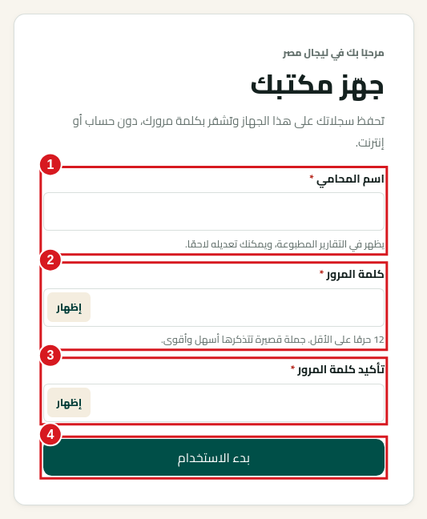

1. اسم المحامي: راجع القيمة أو أدخل البيانات المناسبة لهذا الحقل ثم احفظ النموذج.
2. كلمة المرور: استخدم 12 حرفًا على الأقل واحفظها بأمان.
3. تأكيد كلمة المرور: استخدم 12 حرفًا على الأقل واحفظها بأمان.
4. أزرار الإجراء: احفظ أو أكد عند اكتمال البيانات؛ إلغاء يحتفظ بالحالة السابقة.

### تصحيح بيانات الإعداد

إذا تركت الحقول المطلوبة فارغة، تظهر رسائل بجوارها. أكمل الاسم وكلمة المرور وتأكيدها ثم أعد المحاولة؛ لا تُنشأ مساحة بيانات حتى ينجح الإعداد.

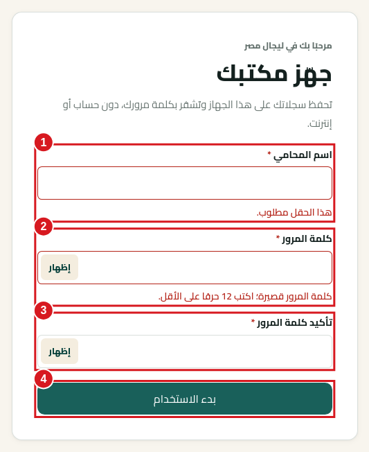

1. اسم المحامي: راجع القيمة أو أدخل البيانات المناسبة لهذا الحقل ثم احفظ النموذج.
2. كلمة المرور: استخدم 12 حرفًا على الأقل واحفظها بأمان.
3. تأكيد كلمة المرور: استخدم 12 حرفًا على الأقل واحفظها بأمان.
4. أزرار الإجراء: احفظ أو أكد عند اكتمال البيانات؛ إلغاء يحتفظ بالحالة السابقة.

### حفظ مفتاح الاسترداد

يظهر مفتاح الاسترداد مرة واحدة بعد الإعداد. اكتبه واحفظه منفصلًا عن الجهاز؛ لا ترسله إلى الدعم. المفتاح في هذه الصورة محجوب عمدًا. ضع علامة حفظ المفتاح ثم تابع. مفتاح الاسترداد يعيد الوصول إلى هذه المساحة؛ النسخة الاحتياطية تحفظ السجلات والملفات.

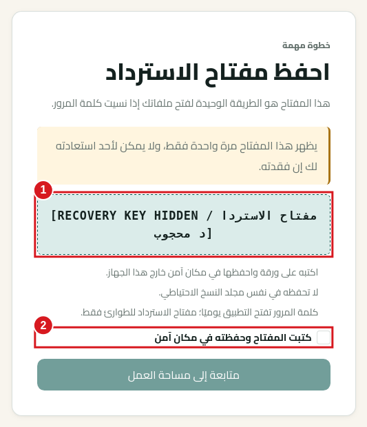

1. مفتاح الاسترداد: القيمة محجوبة في الدليل؛ احفظ مفتاحك الحقيقي خارج الجهاز.
2. تأكيد الحفظ: تابع فقط بعد حفظ مفتاحك بأمان.

### فتح مساحة البيانات

أدخل كلمة المرور واضغط فتح. تظهر هذه الشاشة بعد قفل التطبيق أو إعادة تشغيله. زر إظهار كلمة المرور اختياري؛ استخدمه فقط حين لا يستطيع أحد رؤية الشاشة.

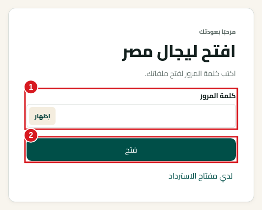

1. كلمة المرور: استخدم 12 حرفًا على الأقل واحفظها بأمان.
2. أزرار الإجراء: احفظ أو أكد عند اكتمال البيانات؛ إلغاء يحتفظ بالحالة السابقة.

### كلمة مرور غير صحيحة

تُرفض كلمة المرور غير الصحيحة وتبقى السجلات مقفلة. تحقق من لغة لوحة المفاتيح وحالة الأحرف وأعد المحاولة. إذا نسيتها، استخدم رابط مفتاح الاسترداد.

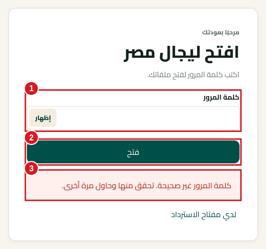

1. كلمة المرور: استخدم 12 حرفًا على الأقل واحفظها بأمان.
2. أزرار الإجراء: احفظ أو أكد عند اكتمال البيانات؛ إلغاء يحتفظ بالحالة السابقة.
3. رسالة الخطأ: صحح السبب الموضح ثم أعد المحاولة.

### استرداد الوصول

من شاشة الفتح اختر رابط مفتاح الاسترداد. أدخل المفتاح المحفوظ وكلمة مرور جديدة لا تقل عن 12 حرفًا وأكدها ثم اضغط استعادة الوصول. الرجوع يعيدك إلى شاشة الفتح. لا يوجد استرداد عبر البريد الإلكتروني.

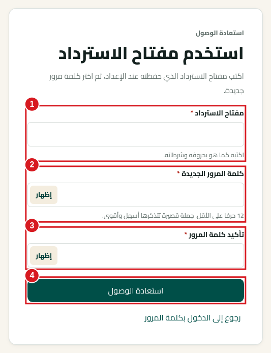

1. مفتاح الاسترداد: راجع القيمة أو أدخل البيانات المناسبة لهذا الحقل ثم احفظ النموذج.
2. كلمة المرور الجديدة: استخدم 12 حرفًا على الأقل واحفظها بأمان.
3. تأكيد كلمة المرور: استخدم 12 حرفًا على الأقل واحفظها بأمان.
4. أزرار الإجراء: احفظ أو أكد عند اكتمال البيانات؛ إلغاء يحتفظ بالحالة السابقة.

## مساحة العمل ويومك

### التنقل والبحث والقفل

اختر القسم من الشريط الجانبي. البحث أعلى الشاشة يجمع الموكلين والقضايا والتوكيلات. قائمة إضافة تختصر الوصول إلى موكل أو قضية أو جلسة أو مهمة جديدة. زر القفل يخفي السجلات فورًا؛ العودة تتطلب كلمة المرور. العربية وEnglish يبدلان لغة الواجهة.

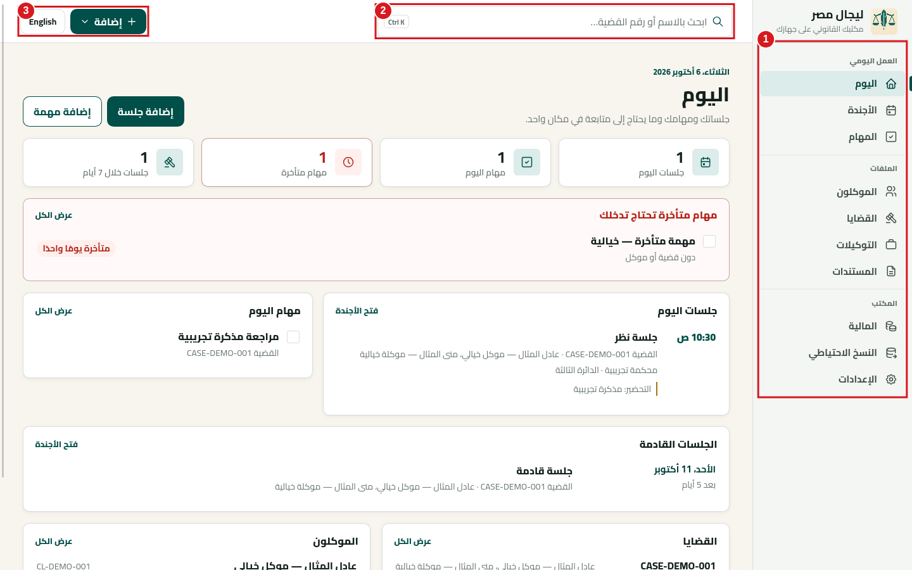

1. الأقسام: اختر القسم المطلوب لفتح صفحته.
2. البحث: اكتب اسمًا أو رقمًا واختر النتيجة.
3. الإضافة واللغة والقفل: اختصارات مساحة العمل.

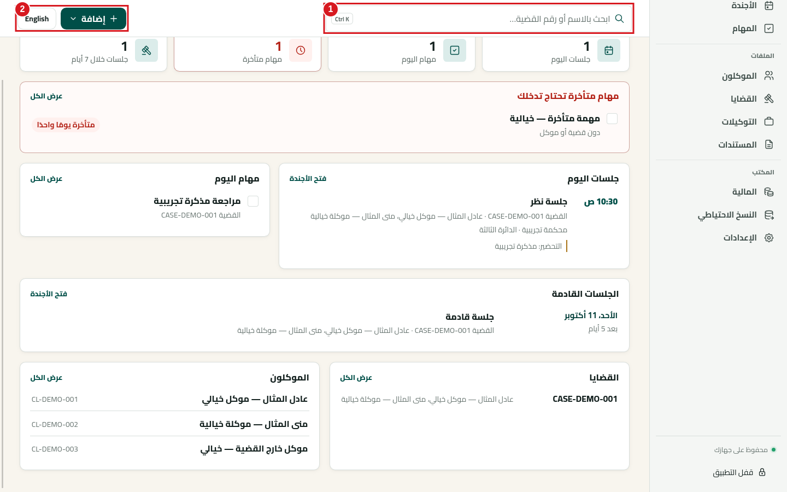

1. البحث: اكتب اسمًا أو رقمًا واختر النتيجة.
2. الإضافة واللغة والقفل: اختصارات مساحة العمل.

### قائمة الإضافة السريعة

افتح إضافة ثم اختر نوع السجل. ينتقل التطبيق إلى النموذج المناسب؛ لا يحفظ سجلًا بمجرد اختيار الاختصار. إضافة المستند تتم من ملف مالكه.

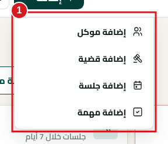

1. السجلات والإجراءات: افتح السجل أو استخدم الإجراء بجواره.

### شاشة اليوم

ابدأ يومك بمراجعة جلسات اليوم ثم المهام المستحقة والمتأخرة والجلسات القادمة. افتح السجل المرتبط لمعرفة التفاصيل أو تسجيل قرار الجلسة. إعدادات اللغة والتاريخ تؤثر في العرض؛ التاريخ القانوني لا يتغير بسبب المنطقة الزمنية.

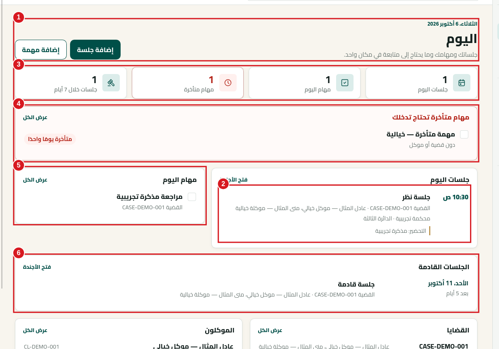

1. هوية الصفحة وإجراءاتها: راجع العنوان قبل الإضافة أو التعديل.
2. المواعيد: راجع اليوم والروابط والتفاصيل المطلوبة.
3. التفاصيل: اقرأ بيانات هذا القسم واتبع الخطوات أعلاه.
4. المواعيد: راجع اليوم والروابط والتفاصيل المطلوبة.
5. المواعيد: راجع اليوم والروابط والتفاصيل المطلوبة.
6. المواعيد: راجع اليوم والروابط والتفاصيل المطلوبة.

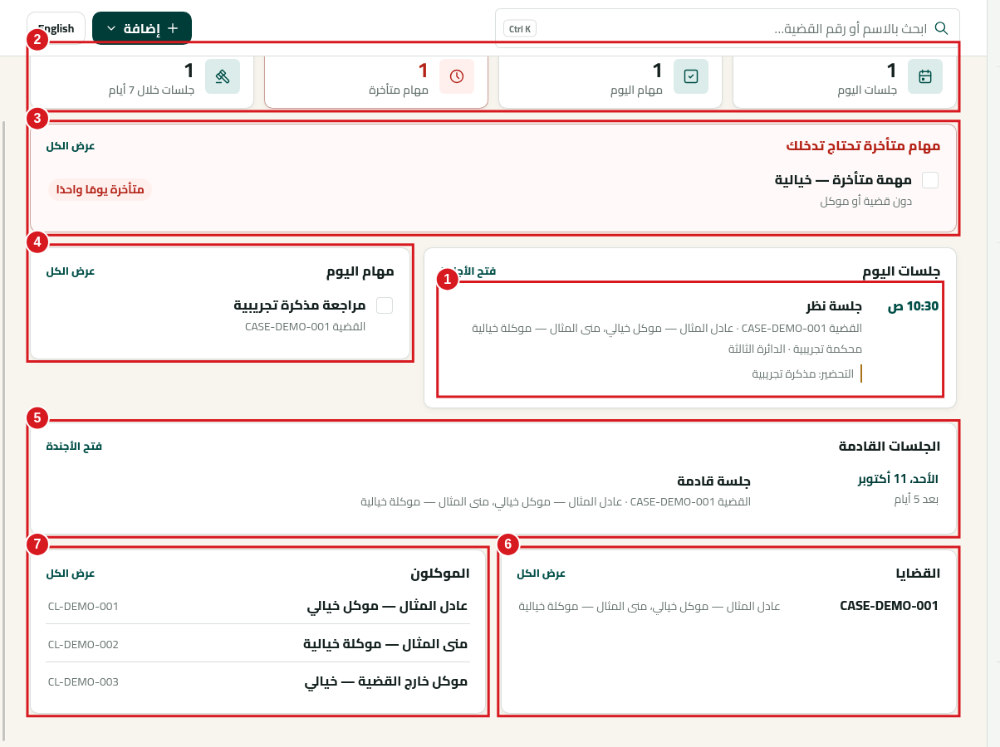

1. المواعيد: راجع اليوم والروابط والتفاصيل المطلوبة.
2. التفاصيل: اقرأ بيانات هذا القسم واتبع الخطوات أعلاه.
3. المواعيد: راجع اليوم والروابط والتفاصيل المطلوبة.
4. المواعيد: راجع اليوم والروابط والتفاصيل المطلوبة.
5. المواعيد: راجع اليوم والروابط والتفاصيل المطلوبة.
6. المواعيد: راجع اليوم والروابط والتفاصيل المطلوبة.
7. المواعيد: راجع اليوم والروابط والتفاصيل المطلوبة.

### نتائج البحث الشامل

اكتب اسمًا أو رقمًا في البحث. تظهر النتائج حسب نوع السجل. اضغط النتيجة لفتح الملف مباشرة. البحث يدعم تطبيع الحروف والأرقام العربية؛ لا يبحث داخل نصوص المستندات.

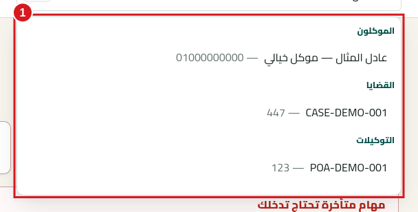

1. السجلات والإجراءات: افتح السجل أو استخدم الإجراء بجواره.

### البحث بلوحة المفاتيح

اضغط Ctrl+K أو Command+K لفتح البحث. اكتب الاستعلام ثم استخدم السهمين لأعلى ولأسفل وEnter لاختيار نتيجة. Escape يغلق النافذة.

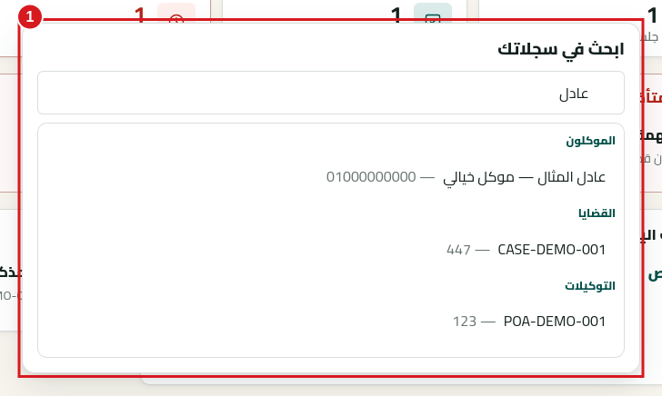

1. السجلات والإجراءات: افتح السجل أو استخدم الإجراء بجواره.

## الموكلون

### قائمة الموكلين

استخدم البحث بالاسم أو الرقم ثم افتح الملف من الصف. إظهار المؤرشف يضم الموكلين المؤرشفين. اختر إضافة موكل لبدء سجل جديد.

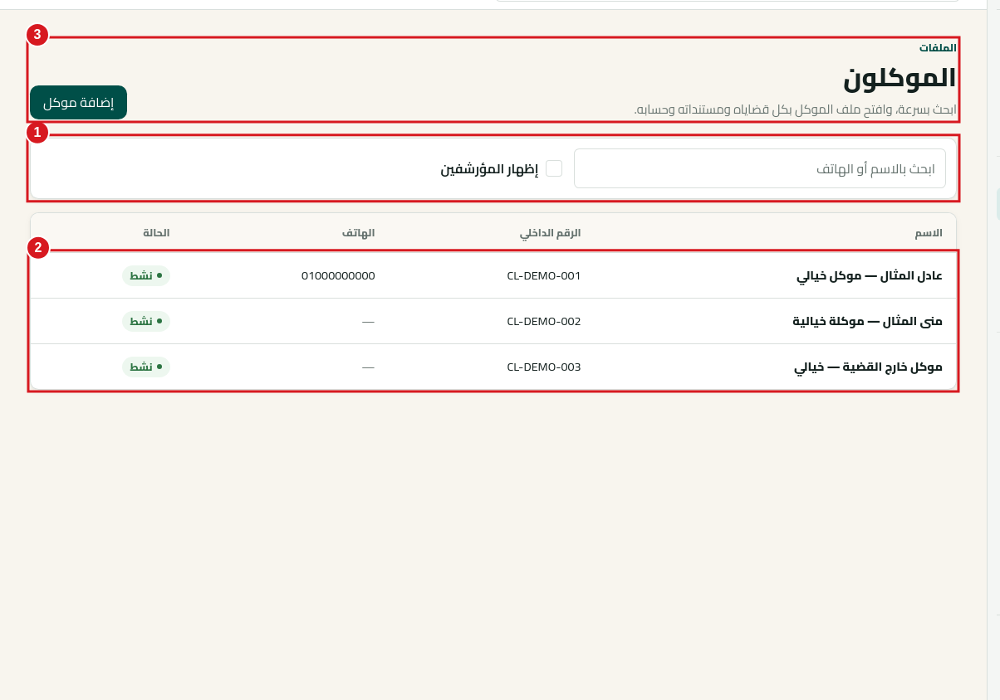

1. الترشيح: حدد شروط العرض؛ الفلاتر لا تغير السجلات.
2. السجلات والإجراءات: افتح السجل أو استخدم الإجراء بجواره.
3. هوية الصفحة وإجراءاتها: راجع العنوان قبل الإضافة أو التعديل.

### إضافة موكل

رقم الموكل الداخلي والاسم مطلوبان. أدخل الهاتف والبريد والعنوان والرقم القومي والملاحظات عند الحاجة. استخدم رقمًا داخليًا فريدًا ثم احفظ الموكل؛ يفتح ملفه بعد الحفظ.

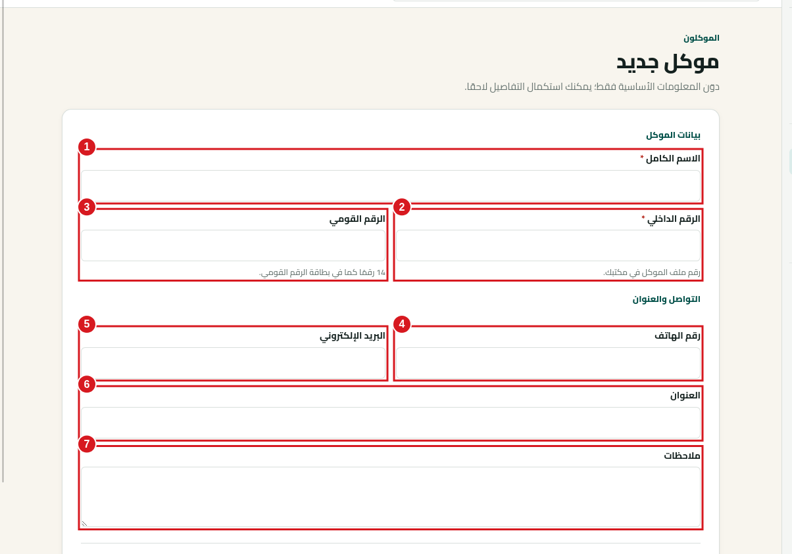

1. الاسم الكامل: اكتب الاسم الكامل حتى يمكن العثور على السجل.
2. الرقم الداخلي: معرف فريد داخل مكتبك؛ لا يلزم أن يطابق الرقم الرسمي.
3. الرقم القومي: راجع القيمة أو أدخل البيانات المناسبة لهذا الحقل ثم احفظ النموذج.
4. رقم الهاتف: راجع القيمة أو أدخل البيانات المناسبة لهذا الحقل ثم احفظ النموذج.
5. البريد الإلكتروني: راجع القيمة أو أدخل البيانات المناسبة لهذا الحقل ثم احفظ النموذج.
6. العنوان: راجع القيمة أو أدخل البيانات المناسبة لهذا الحقل ثم احفظ النموذج.
7. ملاحظات: راجع القيمة أو أدخل البيانات المناسبة لهذا الحقل ثم احفظ النموذج.

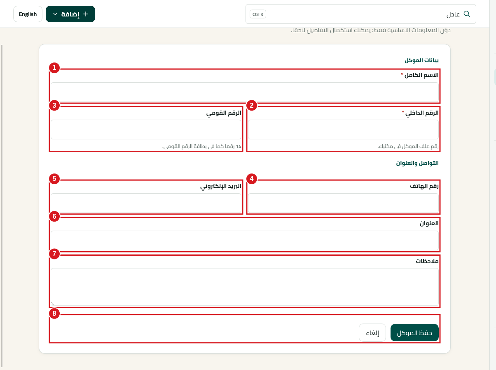

1. الاسم الكامل: اكتب الاسم الكامل حتى يمكن العثور على السجل.
2. الرقم الداخلي: معرف فريد داخل مكتبك؛ لا يلزم أن يطابق الرقم الرسمي.
3. الرقم القومي: راجع القيمة أو أدخل البيانات المناسبة لهذا الحقل ثم احفظ النموذج.
4. رقم الهاتف: راجع القيمة أو أدخل البيانات المناسبة لهذا الحقل ثم احفظ النموذج.
5. البريد الإلكتروني: راجع القيمة أو أدخل البيانات المناسبة لهذا الحقل ثم احفظ النموذج.
6. العنوان: راجع القيمة أو أدخل البيانات المناسبة لهذا الحقل ثم احفظ النموذج.
7. ملاحظات: راجع القيمة أو أدخل البيانات المناسبة لهذا الحقل ثم احفظ النموذج.
8. أزرار الإجراء: احفظ أو أكد عند اكتمال البيانات؛ إلغاء يحتفظ بالحالة السابقة.

### الحقول المطلوبة للموكل

عند محاولة حفظ نموذج فارغ، تظهر أخطاء الحقول المطلوبة. صحح الرقم الداخلي والاسم ثم احفظ. لا تضف رقمًا وهميًا لتجاوز الخطأ في سجلاتك الحقيقية.

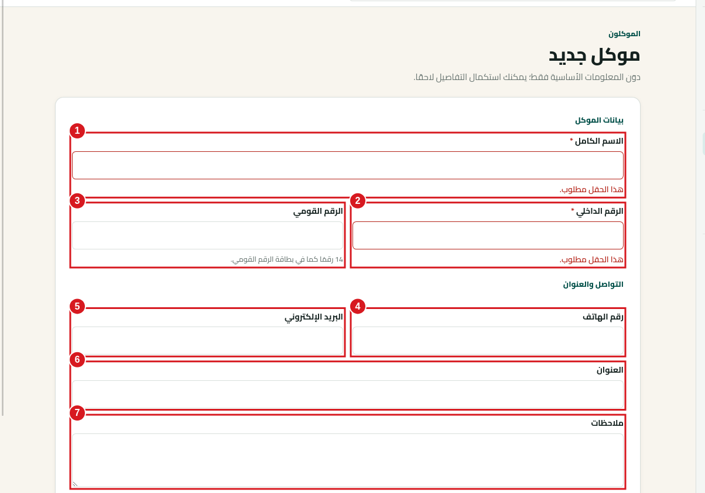

1. الاسم الكامل: اكتب الاسم الكامل حتى يمكن العثور على السجل.
2. الرقم الداخلي: معرف فريد داخل مكتبك؛ لا يلزم أن يطابق الرقم الرسمي.
3. الرقم القومي: راجع القيمة أو أدخل البيانات المناسبة لهذا الحقل ثم احفظ النموذج.
4. رقم الهاتف: راجع القيمة أو أدخل البيانات المناسبة لهذا الحقل ثم احفظ النموذج.
5. البريد الإلكتروني: راجع القيمة أو أدخل البيانات المناسبة لهذا الحقل ثم احفظ النموذج.
6. العنوان: راجع القيمة أو أدخل البيانات المناسبة لهذا الحقل ثم احفظ النموذج.
7. ملاحظات: راجع القيمة أو أدخل البيانات المناسبة لهذا الحقل ثم احفظ النموذج.

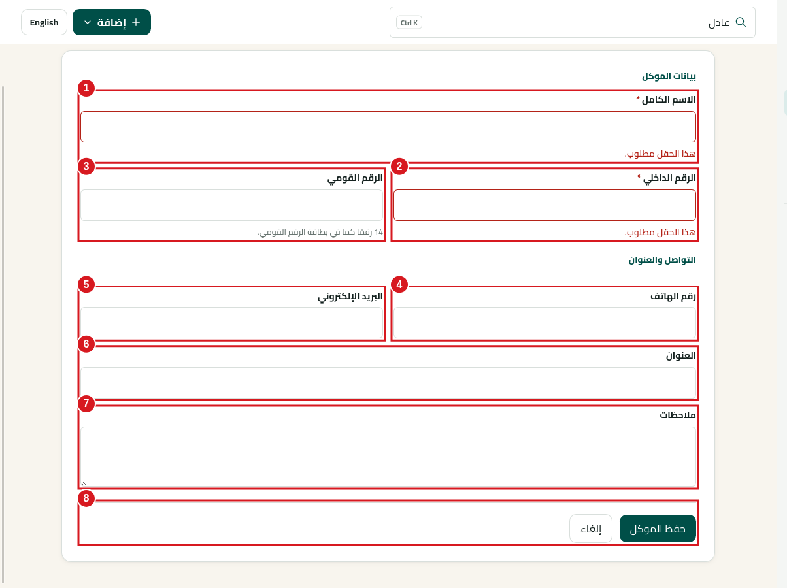

1. الاسم الكامل: اكتب الاسم الكامل حتى يمكن العثور على السجل.
2. الرقم الداخلي: معرف فريد داخل مكتبك؛ لا يلزم أن يطابق الرقم الرسمي.
3. الرقم القومي: راجع القيمة أو أدخل البيانات المناسبة لهذا الحقل ثم احفظ النموذج.
4. رقم الهاتف: راجع القيمة أو أدخل البيانات المناسبة لهذا الحقل ثم احفظ النموذج.
5. البريد الإلكتروني: راجع القيمة أو أدخل البيانات المناسبة لهذا الحقل ثم احفظ النموذج.
6. العنوان: راجع القيمة أو أدخل البيانات المناسبة لهذا الحقل ثم احفظ النموذج.
7. ملاحظات: راجع القيمة أو أدخل البيانات المناسبة لهذا الحقل ثم احفظ النموذج.
8. أزرار الإجراء: احفظ أو أكد عند اكتمال البيانات؛ إلغاء يحتفظ بالحالة السابقة.

### تحذير التشابه

عندما تتشابه بيانات الموكل مع سجل موجود، راجع الأسماء المعروضة أولًا. عدّل البيانات أو افتح السجل الموجود؛ أكد إنشاء موكل منفصل فقط إذا كان شخصًا مختلفًا. التحذير لا يعني دمج السجلات تلقائيًا.

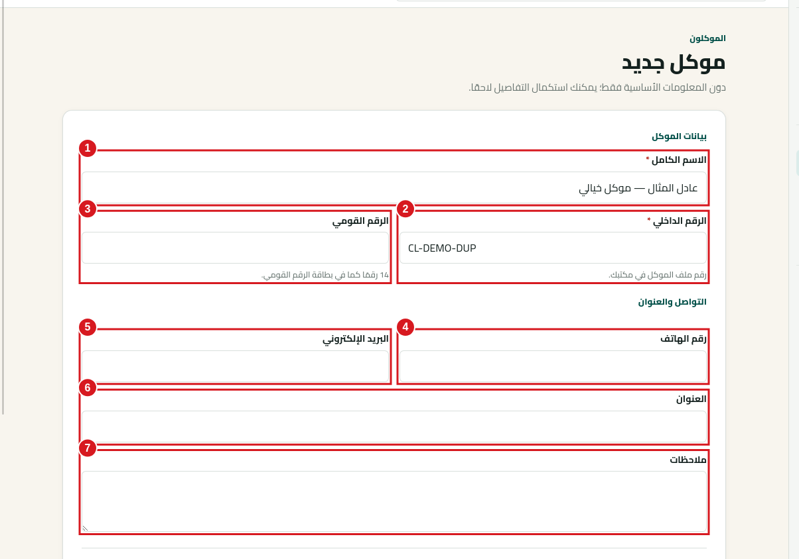

1. الاسم الكامل: اكتب الاسم الكامل حتى يمكن العثور على السجل.
2. الرقم الداخلي: معرف فريد داخل مكتبك؛ لا يلزم أن يطابق الرقم الرسمي.
3. الرقم القومي: راجع القيمة أو أدخل البيانات المناسبة لهذا الحقل ثم احفظ النموذج.
4. رقم الهاتف: راجع القيمة أو أدخل البيانات المناسبة لهذا الحقل ثم احفظ النموذج.
5. البريد الإلكتروني: راجع القيمة أو أدخل البيانات المناسبة لهذا الحقل ثم احفظ النموذج.
6. العنوان: راجع القيمة أو أدخل البيانات المناسبة لهذا الحقل ثم احفظ النموذج.
7. ملاحظات: راجع القيمة أو أدخل البيانات المناسبة لهذا الحقل ثم احفظ النموذج.

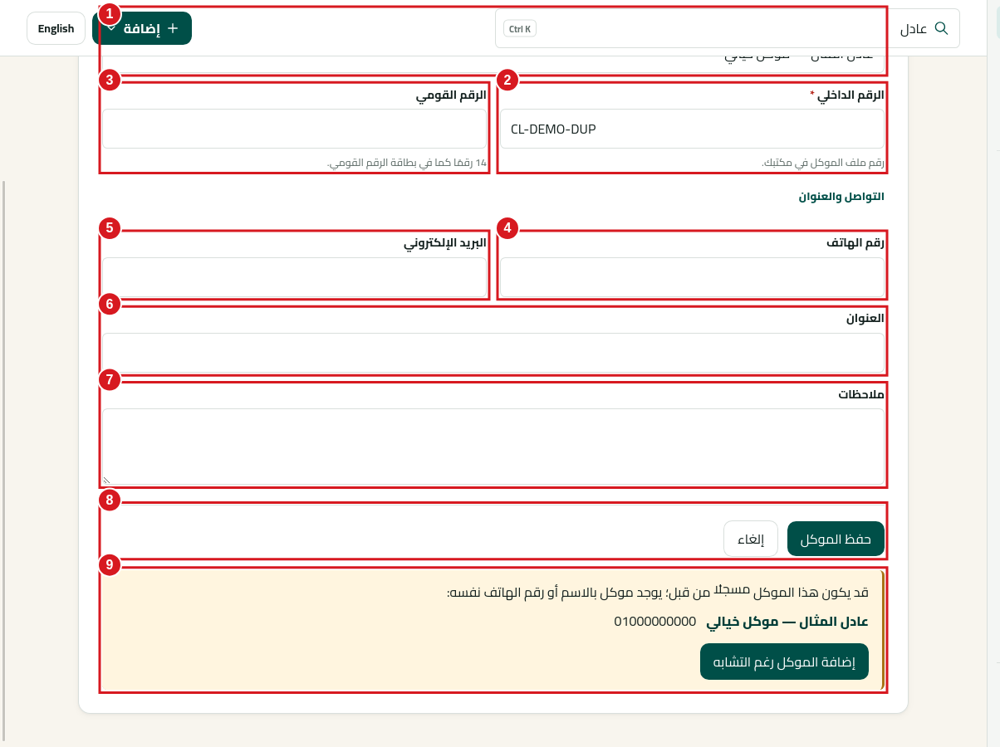

1. الاسم الكامل: اكتب الاسم الكامل حتى يمكن العثور على السجل.
2. الرقم الداخلي: معرف فريد داخل مكتبك؛ لا يلزم أن يطابق الرقم الرسمي.
3. الرقم القومي: راجع القيمة أو أدخل البيانات المناسبة لهذا الحقل ثم احفظ النموذج.
4. رقم الهاتف: راجع القيمة أو أدخل البيانات المناسبة لهذا الحقل ثم احفظ النموذج.
5. البريد الإلكتروني: راجع القيمة أو أدخل البيانات المناسبة لهذا الحقل ثم احفظ النموذج.
6. العنوان: راجع القيمة أو أدخل البيانات المناسبة لهذا الحقل ثم احفظ النموذج.
7. ملاحظات: راجع القيمة أو أدخل البيانات المناسبة لهذا الحقل ثم احفظ النموذج.
8. أزرار الإجراء: احفظ أو أكد عند اكتمال البيانات؛ إلغاء يحتفظ بالحالة السابقة.
9. رسالة الخطأ: صحح السبب الموضح ثم أعد المحاولة.

### ملخص الموكل

راجع بيانات الاتصال والرقم الداخلي والقضايا المرتبطة. شرطة بدل قيمة تعني أن الحقل لم يُسجل.

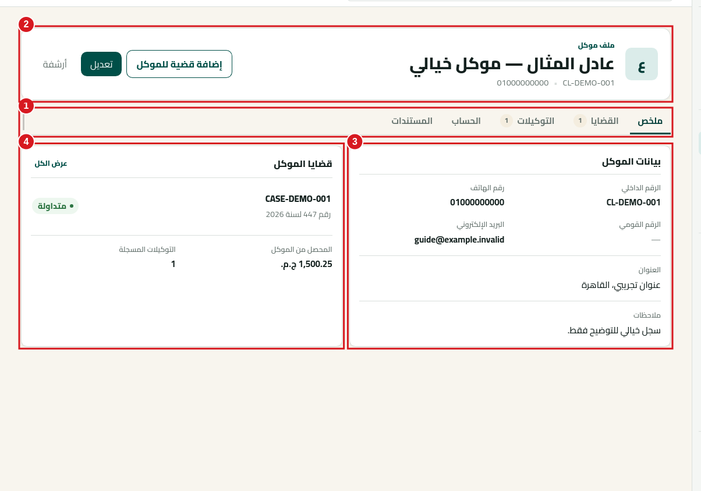

1. التبويبات والعرض: انتقل إلى القسم الذي تريد مراجعته.
2. هوية الصفحة وإجراءاتها: راجع العنوان قبل الإضافة أو التعديل.
3. التفاصيل: اقرأ بيانات هذا القسم واتبع الخطوات أعلاه.
4. التفاصيل: اقرأ بيانات هذا القسم واتبع الخطوات أعلاه.

### قضايا الموكل

افتح قضية مرتبطة أو اختر إضافة قضية للموكل لإنشاء قضية يكون هذا الموكل محددًا فيها.

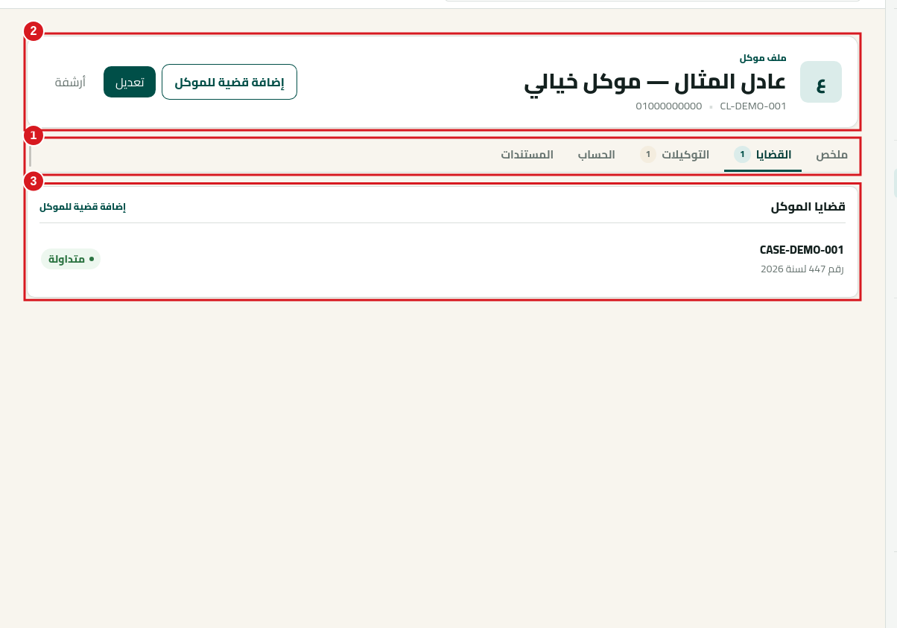

1. التبويبات والعرض: انتقل إلى القسم الذي تريد مراجعته.
2. هوية الصفحة وإجراءاتها: راجع العنوان قبل الإضافة أو التعديل.
3. التفاصيل: اقرأ بيانات هذا القسم واتبع الخطوات أعلاه.

### توكيلات الموكل

افتح التوكيل المرتبط لمراجعة بياناته. إدارة التوكيلات تعيدك إلى قائمة التوكيلات.

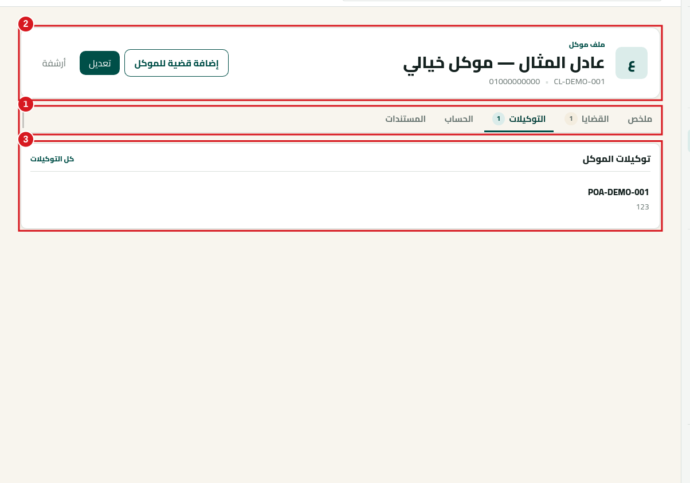

1. التبويبات والعرض: انتقل إلى القسم الذي تريد مراجعته.
2. هوية الصفحة وإجراءاتها: راجع العنوان قبل الإضافة أو التعديل.
3. التفاصيل: اقرأ بيانات هذا القسم واتبع الخطوات أعلاه.

### حساب الموكل

راجع الدفعات المحصلة والمصروفات المرتبطة وصافي النقد. افتح دفتر المالية لمراجعة الحركات. هذا العرض لا يوزع الأتعاب المشتركة بين موكلي القضية.

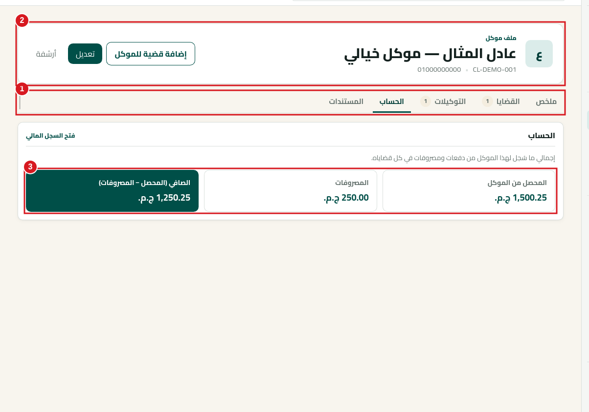

1. التبويبات والعرض: انتقل إلى القسم الذي تريد مراجعته.
2. هوية الصفحة وإجراءاتها: راجع العنوان قبل الإضافة أو التعديل.
3. الحساب: راجع الأرقام؛ المبالغ بالجنيه المصري.

### مستندات الموكل

أضف نسخًا من إثبات الهوية أو المستندات الأخرى من هذا التبويب. كل مستند هنا يخص هذا الموكل وحده.

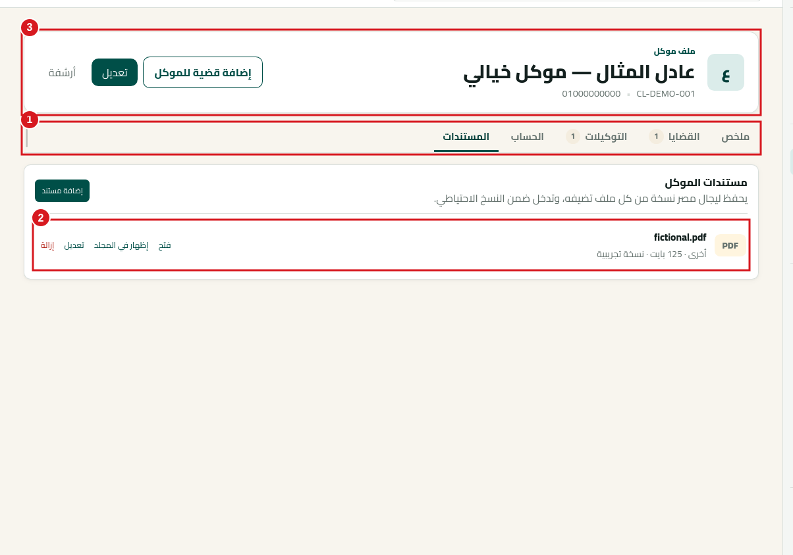

1. التبويبات والعرض: انتقل إلى القسم الذي تريد مراجعته.
2. السجلات والإجراءات: افتح السجل أو استخدم الإجراء بجواره.
3. هوية الصفحة وإجراءاتها: راجع العنوان قبل الإضافة أو التعديل.

### تعديل الموكل

من الملف اضغط تعديل، غيّر البيانات ثم احفظ التعديلات. إلغاء يغلق النموذج دون حفظ المسودة.

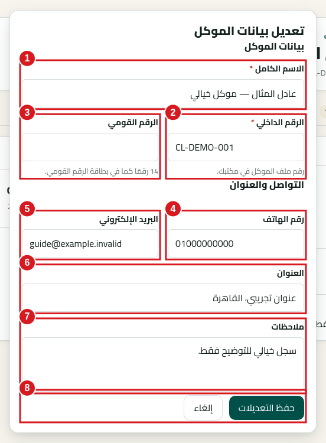

1. الاسم الكامل: اكتب الاسم الكامل حتى يمكن العثور على السجل.
2. الرقم الداخلي: معرف فريد داخل مكتبك؛ لا يلزم أن يطابق الرقم الرسمي.
3. الرقم القومي: راجع القيمة أو أدخل البيانات المناسبة لهذا الحقل ثم احفظ النموذج.
4. رقم الهاتف: راجع القيمة أو أدخل البيانات المناسبة لهذا الحقل ثم احفظ النموذج.
5. البريد الإلكتروني: راجع القيمة أو أدخل البيانات المناسبة لهذا الحقل ثم احفظ النموذج.
6. العنوان: راجع القيمة أو أدخل البيانات المناسبة لهذا الحقل ثم احفظ النموذج.
7. ملاحظات: راجع القيمة أو أدخل البيانات المناسبة لهذا الحقل ثم احفظ النموذج.
8. أزرار الإجراء: احفظ أو أكد عند اكتمال البيانات؛ إلغاء يحتفظ بالحالة السابقة.

### تأكيد أرشفة الموكل

اختر أرشفة ثم راجع التأكيد. الأرشفة تخفي الموكل من القائمة المعتادة ولا تحذف ملفاته. لإعادته: أظهر المؤرشف، افتح الملف واضغط استعادة.

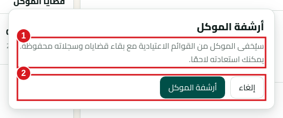

1. التأكيد: اقرأ ما سيحدث قبل الموافقة.
2. أزرار الإجراء: احفظ أو أكد عند اكتمال البيانات؛ إلغاء يحتفظ بالحالة السابقة.

### إعادة الموكل من الأرشيف

افتح الموكل المؤرشف واضغط استعادة ليظهر مجددًا في القوائم النشطة. لا يوجد حذف نهائي للموكل من الواجهة.

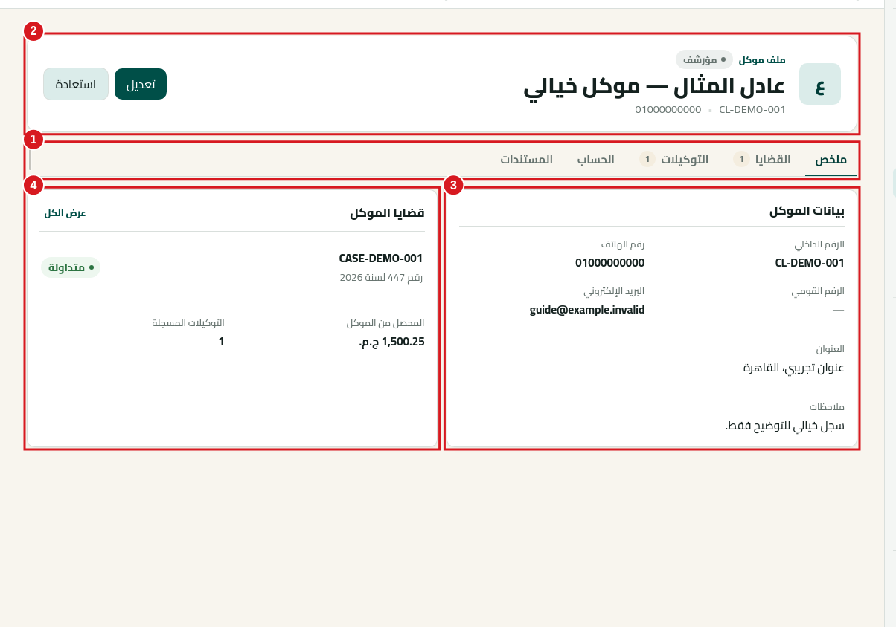

1. التبويبات والعرض: انتقل إلى القسم الذي تريد مراجعته.
2. هوية الصفحة وإجراءاتها: راجع العنوان قبل الإضافة أو التعديل.
3. التفاصيل: اقرأ بيانات هذا القسم واتبع الخطوات أعلاه.
4. التفاصيل: اقرأ بيانات هذا القسم واتبع الخطوات أعلاه.

## التوكيلات

### قائمة التوكيلات

ابحث برقم التوكيل أو بياناته، وافتحه من الصف. إظهار المؤرشف يضم التوكيلات المؤرشفة. الرقم الرسمي قد يتكرر؛ الرقم الداخلي يجب أن يكون فريدًا.

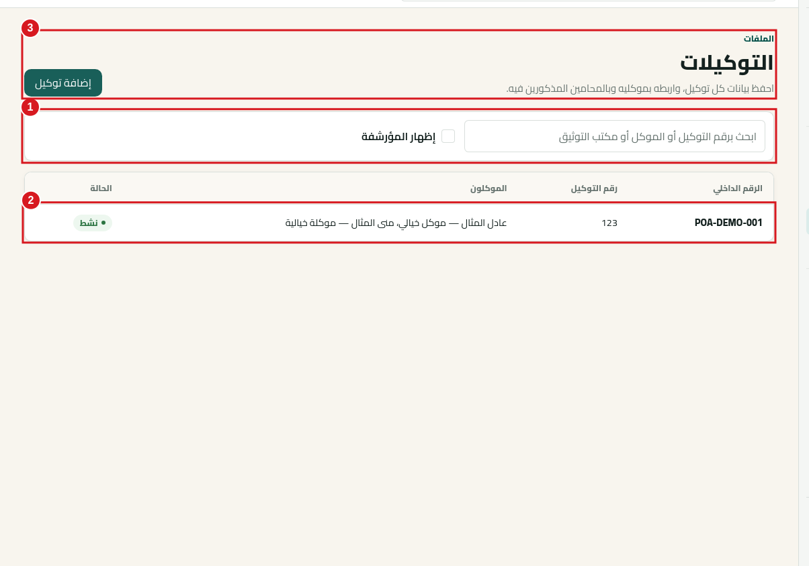

1. الترشيح: حدد شروط العرض؛ الفلاتر لا تغير السجلات.
2. السجلات والإجراءات: افتح السجل أو استخدم الإجراء بجواره.
3. هوية الصفحة وإجراءاتها: راجع العنوان قبل الإضافة أو التعديل.

### إضافة توكيل

أدخل الرقم الداخلي والرقم الرسمي وتاريخ الإصدار ومكتب التوثيق. حدد الموكلين وأضف أسماء المحامين وأرقام القيد عند الحاجة. زر إضافة محام يضيف الاسم إلى المسودة؛ حفظ التوكيل يحفظ السجل كله.

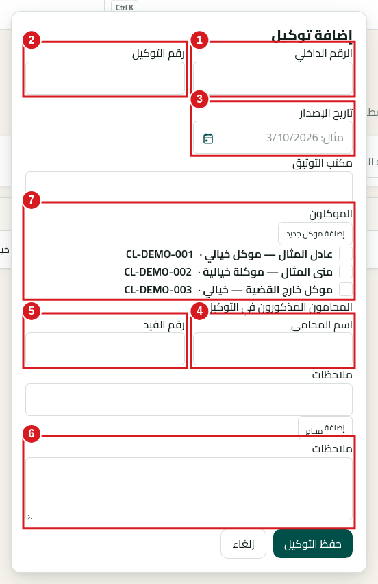

1. الرقم الداخلي: معرف فريد داخل مكتبك؛ لا يلزم أن يطابق الرقم الرسمي.
2. رقم التوكيل: راجع القيمة أو أدخل البيانات المناسبة لهذا الحقل ثم احفظ النموذج.
3. تاريخ الإصدار: راجع القيمة أو أدخل البيانات المناسبة لهذا الحقل ثم احفظ النموذج.
4. اسم المحامي: راجع القيمة أو أدخل البيانات المناسبة لهذا الحقل ثم احفظ النموذج.
5. رقم القيد: راجع القيمة أو أدخل البيانات المناسبة لهذا الحقل ثم احفظ النموذج.
6. ملاحظات: راجع القيمة أو أدخل البيانات المناسبة لهذا الحقل ثم احفظ النموذج.
7. الموكلون: اختر موكلًا موجودًا؛ دافع الدفعة يجب أن ينتمي للقضية.

### إضافة موكل أثناء التوكيل

داخل نموذج التوكيل اختر إضافة موكل. احفظ بيانات الموكل الجديد؛ يُحدد تلقائيًا في مسودة التوكيل. حفظ الموكل لا يغني عن حفظ التوكيل.

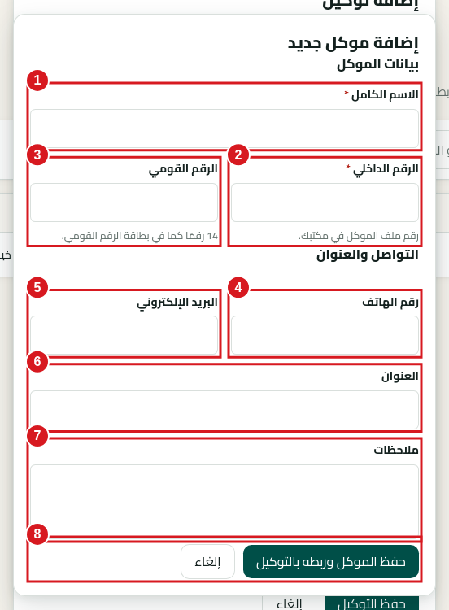

1. الاسم الكامل: اكتب الاسم الكامل حتى يمكن العثور على السجل.
2. الرقم الداخلي: معرف فريد داخل مكتبك؛ لا يلزم أن يطابق الرقم الرسمي.
3. الرقم القومي: راجع القيمة أو أدخل البيانات المناسبة لهذا الحقل ثم احفظ النموذج.
4. رقم الهاتف: راجع القيمة أو أدخل البيانات المناسبة لهذا الحقل ثم احفظ النموذج.
5. البريد الإلكتروني: راجع القيمة أو أدخل البيانات المناسبة لهذا الحقل ثم احفظ النموذج.
6. العنوان: راجع القيمة أو أدخل البيانات المناسبة لهذا الحقل ثم احفظ النموذج.
7. ملاحظات: راجع القيمة أو أدخل البيانات المناسبة لهذا الحقل ثم احفظ النموذج.
8. أزرار الإجراء: احفظ أو أكد عند اكتمال البيانات؛ إلغاء يحتفظ بالحالة السابقة.

### ملخص التوكيل

راجع الرقم الرسمي وتاريخ الإصدار ومكتب التوثيق والموكلين.

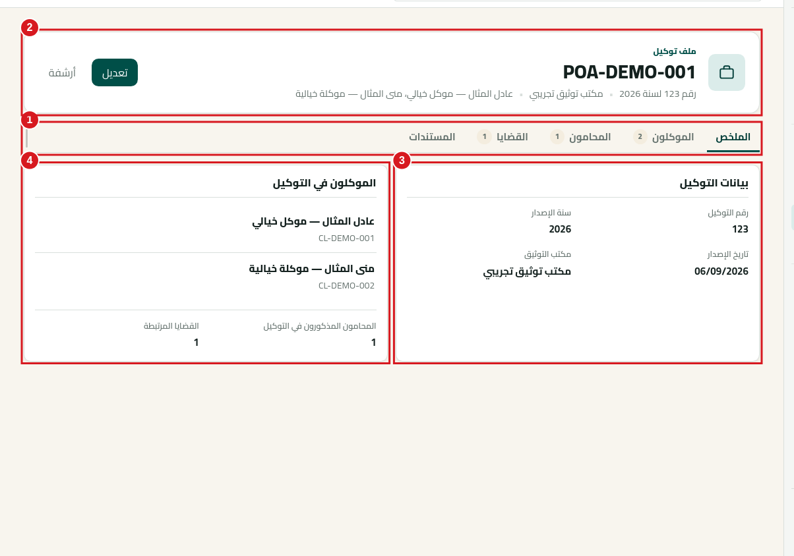

1. التبويبات والعرض: انتقل إلى القسم الذي تريد مراجعته.
2. هوية الصفحة وإجراءاتها: راجع العنوان قبل الإضافة أو التعديل.
3. التفاصيل: اقرأ بيانات هذا القسم واتبع الخطوات أعلاه.
4. التفاصيل: اقرأ بيانات هذا القسم واتبع الخطوات أعلاه.

### موكلو التوكيل

افتح ملفات الموكلين المرتبطين. تعديل التوكيل يتيح تغيير الاختيارات.

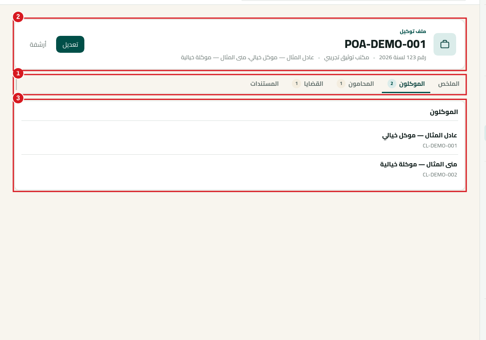

1. التبويبات والعرض: انتقل إلى القسم الذي تريد مراجعته.
2. هوية الصفحة وإجراءاتها: راجع العنوان قبل الإضافة أو التعديل.
3. التفاصيل: اقرأ بيانات هذا القسم واتبع الخطوات أعلاه.

### المحامون المذكورون

تعرض القائمة المحامين المذكورين وأرقام قيدهم وملاحظاتهم. هذه بيانات وصفية وليست حسابات مستخدمين أو صلاحيات.

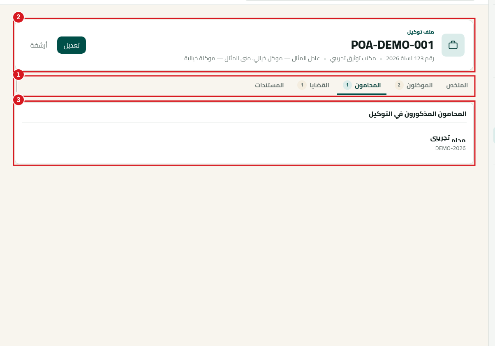

1. التبويبات والعرض: انتقل إلى القسم الذي تريد مراجعته.
2. هوية الصفحة وإجراءاتها: راجع العنوان قبل الإضافة أو التعديل.
3. التفاصيل: اقرأ بيانات هذا القسم واتبع الخطوات أعلاه.

### القضايا المرتبطة بالتوكيل

تظهر القضايا ذات روابط التوكيل المسجلة. يمكنك فتح القضية من هنا، لكن إنشاء أو تغيير هذه الروابط غير متاح في الواجهة الحالية.

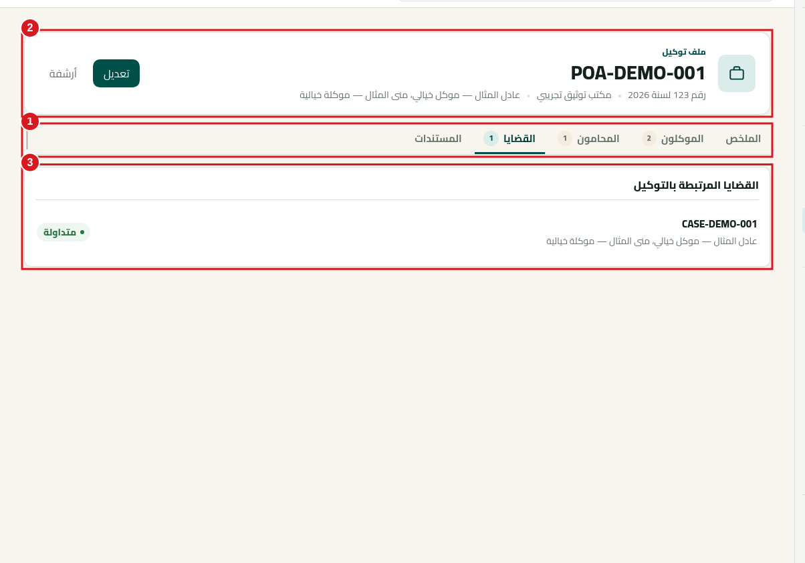

1. التبويبات والعرض: انتقل إلى القسم الذي تريد مراجعته.
2. هوية الصفحة وإجراءاتها: راجع العنوان قبل الإضافة أو التعديل.
3. التفاصيل: اقرأ بيانات هذا القسم واتبع الخطوات أعلاه.

### مستندات التوكيل

أضف نسخة التوكيل من هذا التبويب، ثم افتحها أو عدل وصفها عند الحاجة.

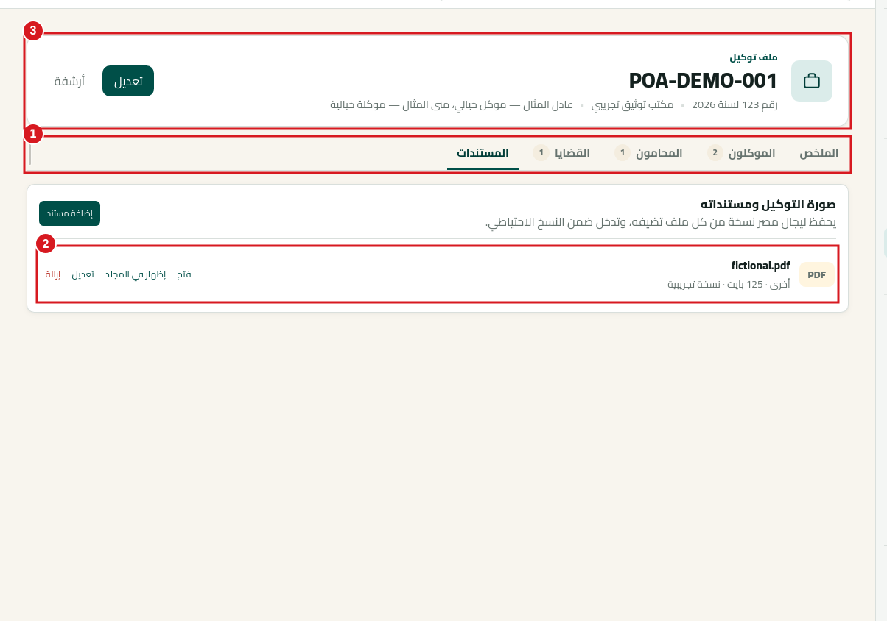

1. التبويبات والعرض: انتقل إلى القسم الذي تريد مراجعته.
2. السجلات والإجراءات: افتح السجل أو استخدم الإجراء بجواره.
3. هوية الصفحة وإجراءاتها: راجع العنوان قبل الإضافة أو التعديل.

### تعديل التوكيل

اضغط تعديل ثم غيّر بيانات التوكيل والموكلين والمحامين واحفظ. السنة تُشتق من تاريخ الإصدار في النموذج.

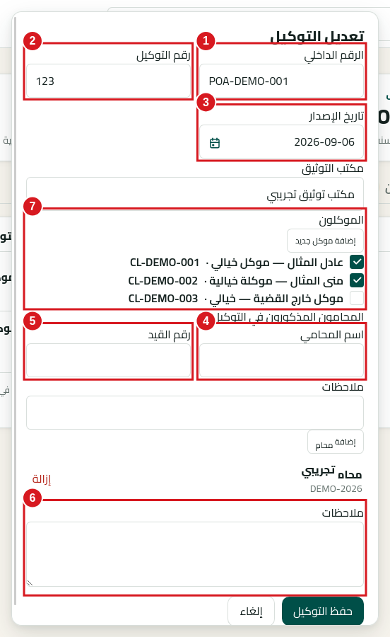

1. الرقم الداخلي: معرف فريد داخل مكتبك؛ لا يلزم أن يطابق الرقم الرسمي.
2. رقم التوكيل: راجع القيمة أو أدخل البيانات المناسبة لهذا الحقل ثم احفظ النموذج.
3. تاريخ الإصدار: راجع القيمة أو أدخل البيانات المناسبة لهذا الحقل ثم احفظ النموذج.
4. اسم المحامي: راجع القيمة أو أدخل البيانات المناسبة لهذا الحقل ثم احفظ النموذج.
5. رقم القيد: راجع القيمة أو أدخل البيانات المناسبة لهذا الحقل ثم احفظ النموذج.
6. ملاحظات: راجع القيمة أو أدخل البيانات المناسبة لهذا الحقل ثم احفظ النموذج.
7. الموكلون: اختر موكلًا موجودًا؛ دافع الدفعة يجب أن ينتمي للقضية.

### أرشفة التوكيل

راجع رسالة التأكيد قبل الأرشفة. لإعادة التوكيل، أظهر المؤرشف في القائمة ثم افتحه واضغط استعادة.

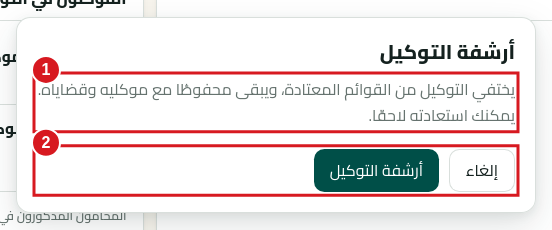

1. التأكيد: اقرأ ما سيحدث قبل الموافقة.
2. أزرار الإجراء: احفظ أو أكد عند اكتمال البيانات؛ إلغاء يحتفظ بالحالة السابقة.

### استعادة التوكيل المؤرشف

زر استعادة يعيد التوكيل إلى القائمة النشطة. الأرشفة لا تمحو المستندات المرتبطة.

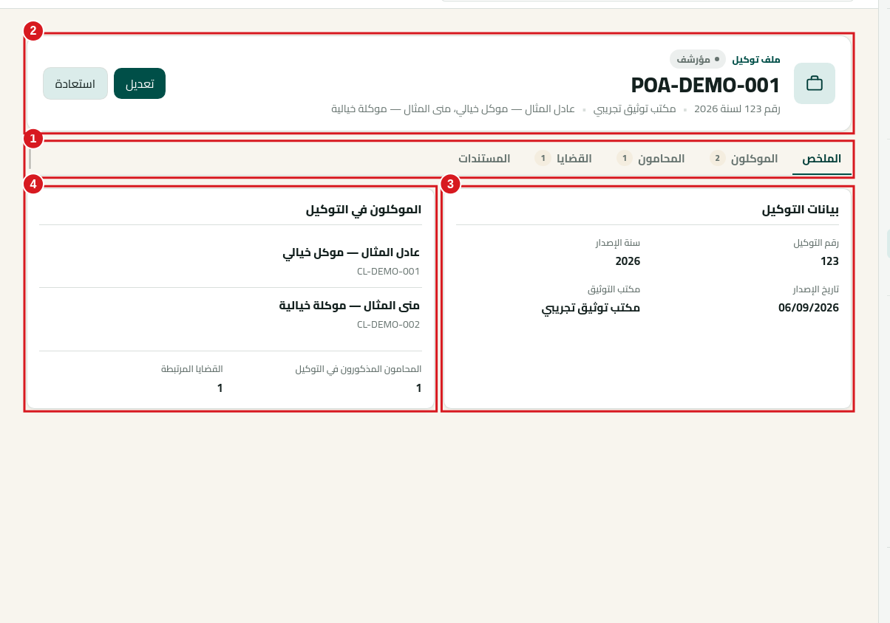

1. التبويبات والعرض: انتقل إلى القسم الذي تريد مراجعته.
2. هوية الصفحة وإجراءاتها: راجع العنوان قبل الإضافة أو التعديل.
3. التفاصيل: اقرأ بيانات هذا القسم واتبع الخطوات أعلاه.
4. التفاصيل: اقرأ بيانات هذا القسم واتبع الخطوات أعلاه.

## القضايا

### قائمة القضايا

ابحث بالرقم أو بيانات القضية، أو رشح بالحالة. افتح الصف للاطلاع على الملف. إظهار المؤرشف يضم الملفات المؤرشفة.

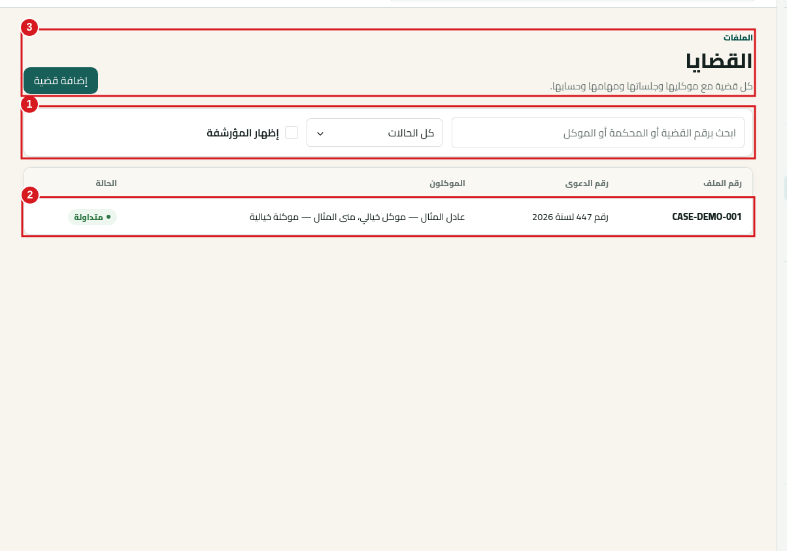

1. الترشيح: حدد شروط العرض؛ الفلاتر لا تغير السجلات.
2. السجلات والإجراءات: افتح السجل أو استخدم الإجراء بجواره.
3. هوية الصفحة وإجراءاتها: راجع العنوان قبل الإضافة أو التعديل.

### إضافة قضية

الرقم الداخلي وموكل واحد على الأقل مطلوبان. الرقم الرسمي وسنته منفصلان عن رقم ملفك. سجل المحكمة والدائرة والنوع ودرجة التقاضي والحالة والتواريخ والموضوع. اختر الموكلين ثم احفظ.

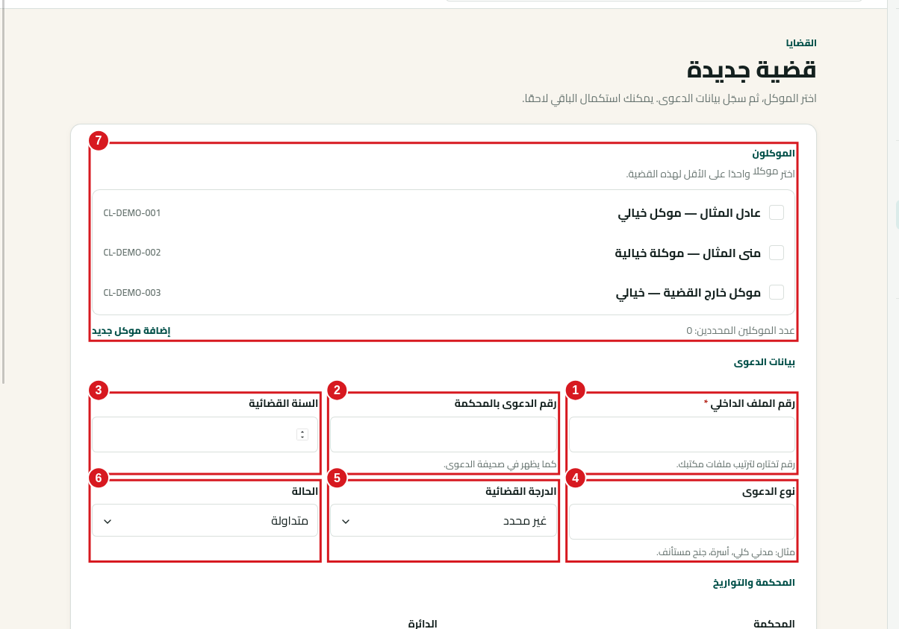

1. رقم الملف الداخلي: راجع القيمة أو أدخل البيانات المناسبة لهذا الحقل ثم احفظ النموذج.
2. رقم الدعوى بالمحكمة: راجع القيمة أو أدخل البيانات المناسبة لهذا الحقل ثم احفظ النموذج.
3. السنة القضائية: راجع القيمة أو أدخل البيانات المناسبة لهذا الحقل ثم احفظ النموذج.
4. نوع الدعوى: راجع القيمة أو أدخل البيانات المناسبة لهذا الحقل ثم احفظ النموذج.
5. الدرجة القضائية: راجع القيمة أو أدخل البيانات المناسبة لهذا الحقل ثم احفظ النموذج.
6. الحالة: راجع القيمة أو أدخل البيانات المناسبة لهذا الحقل ثم احفظ النموذج.
7. الموكلون: اختر موكلًا موجودًا؛ دافع الدفعة يجب أن ينتمي للقضية.

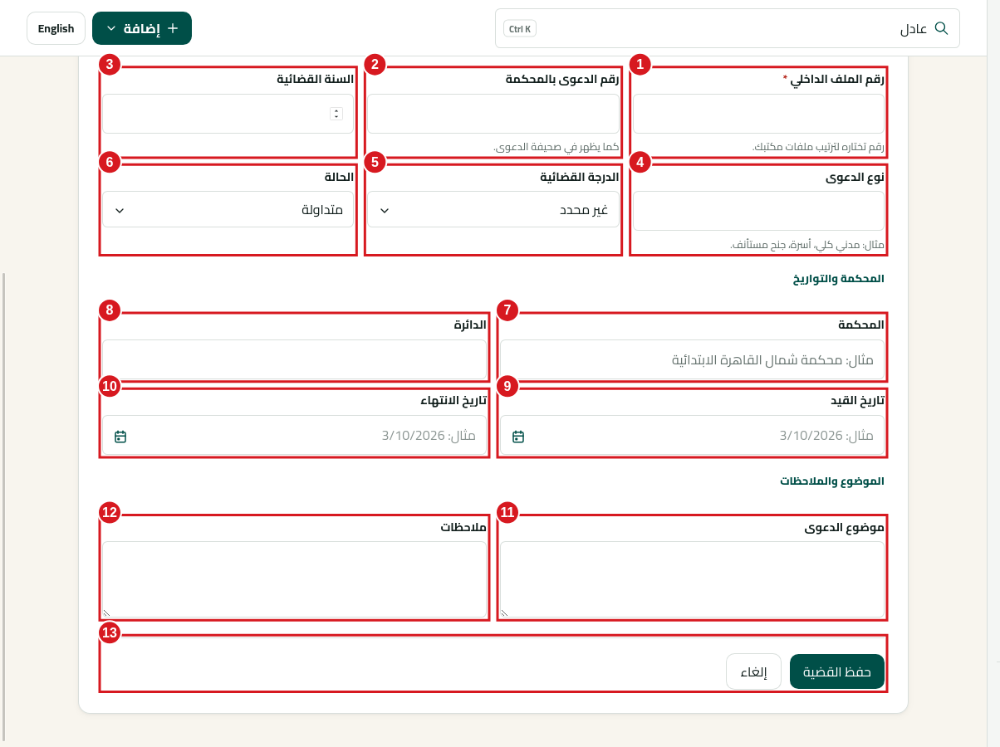

1. رقم الملف الداخلي: راجع القيمة أو أدخل البيانات المناسبة لهذا الحقل ثم احفظ النموذج.
2. رقم الدعوى بالمحكمة: راجع القيمة أو أدخل البيانات المناسبة لهذا الحقل ثم احفظ النموذج.
3. السنة القضائية: راجع القيمة أو أدخل البيانات المناسبة لهذا الحقل ثم احفظ النموذج.
4. نوع الدعوى: راجع القيمة أو أدخل البيانات المناسبة لهذا الحقل ثم احفظ النموذج.
5. الدرجة القضائية: راجع القيمة أو أدخل البيانات المناسبة لهذا الحقل ثم احفظ النموذج.
6. الحالة: راجع القيمة أو أدخل البيانات المناسبة لهذا الحقل ثم احفظ النموذج.
7. المحكمة: راجع القيمة أو أدخل البيانات المناسبة لهذا الحقل ثم احفظ النموذج.
8. الدائرة: راجع القيمة أو أدخل البيانات المناسبة لهذا الحقل ثم احفظ النموذج.
9. تاريخ القيد: راجع القيمة أو أدخل البيانات المناسبة لهذا الحقل ثم احفظ النموذج.
10. تاريخ الانتهاء: راجع القيمة أو أدخل البيانات المناسبة لهذا الحقل ثم احفظ النموذج.
11. موضوع الدعوى: راجع القيمة أو أدخل البيانات المناسبة لهذا الحقل ثم احفظ النموذج.
12. ملاحظات: راجع القيمة أو أدخل البيانات المناسبة لهذا الحقل ثم احفظ النموذج.
13. أزرار الإجراء: احفظ أو أكد عند اكتمال البيانات؛ إلغاء يحتفظ بالحالة السابقة.

### ملخص القضية

راجع هوية القضية والجلسة القادمة وآخر قرار والمهام المفتوحة. روابط التفاصيل تنقلك إلى التبويب المختص.

1. التبويبات والعرض: انتقل إلى القسم الذي تريد مراجعته.
2. هوية الصفحة وإجراءاتها: راجع العنوان قبل الإضافة أو التعديل.
3. التفاصيل: اقرأ بيانات هذا القسم واتبع الخطوات أعلاه.
4. التفاصيل: اقرأ بيانات هذا القسم واتبع الخطوات أعلاه.
5. التفاصيل: اقرأ بيانات هذا القسم واتبع الخطوات أعلاه.

### الموكلون والخصوم

يعرض القسم موكلي القضية وصفاتهم وروابط التوكيلات إن كانت مسجلة. هذه العلاقات للعرض فقط حاليًا؛ لا يتيح نموذج التعديل تغيير الموكلين أو الصفات أو التوكيلات. يمكنك إضافة الخصوم وتعديل بياناتهم.

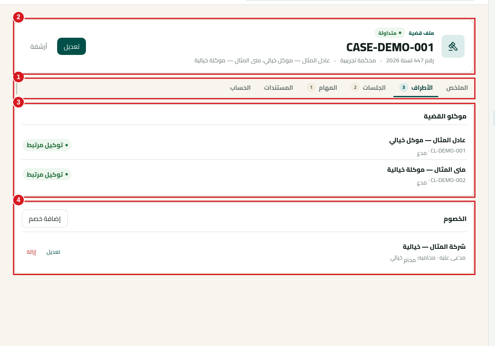

1. التبويبات والعرض: انتقل إلى القسم الذي تريد مراجعته.
2. هوية الصفحة وإجراءاتها: راجع العنوان قبل الإضافة أو التعديل.
3. التفاصيل: اقرأ بيانات هذا القسم واتبع الخطوات أعلاه.
4. التفاصيل: اقرأ بيانات هذا القسم واتبع الخطوات أعلاه.

### جلسات القضية

أضف جلسة أو افتح جلسة موجودة لتعديلها. تسجيل القرار يمكن أن ينشئ جلسة تالية مرتبطة في خطوة واحدة.

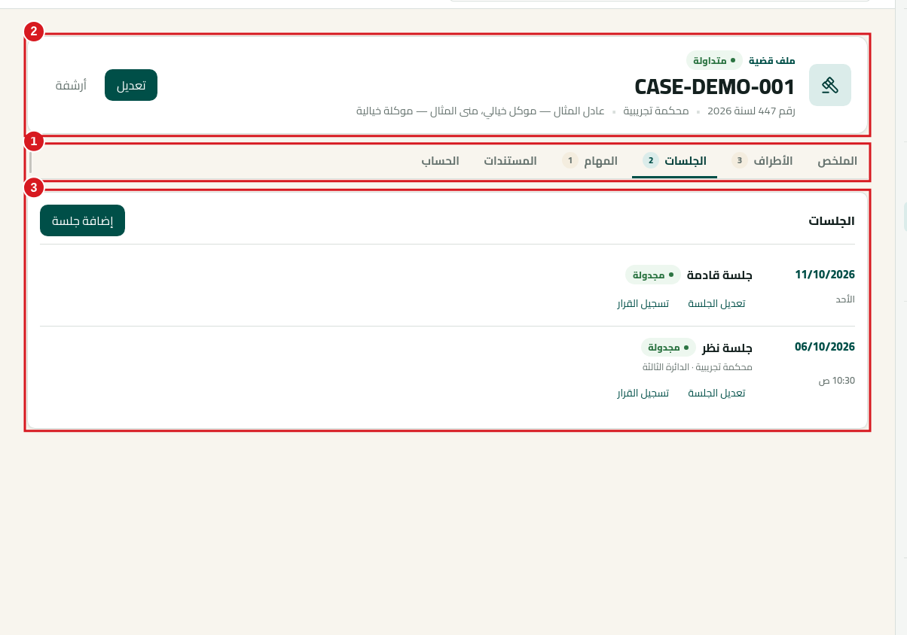

1. التبويبات والعرض: انتقل إلى القسم الذي تريد مراجعته.
2. هوية الصفحة وإجراءاتها: راجع العنوان قبل الإضافة أو التعديل.
3. التفاصيل: اقرأ بيانات هذا القسم واتبع الخطوات أعلاه.

### مهام القضية

أضف مهمة للقضية أو افتحها لتعديل التفاصيل. مربع الإنجاز يكمل المهمة؛ يمكنك إعادة فتحها.

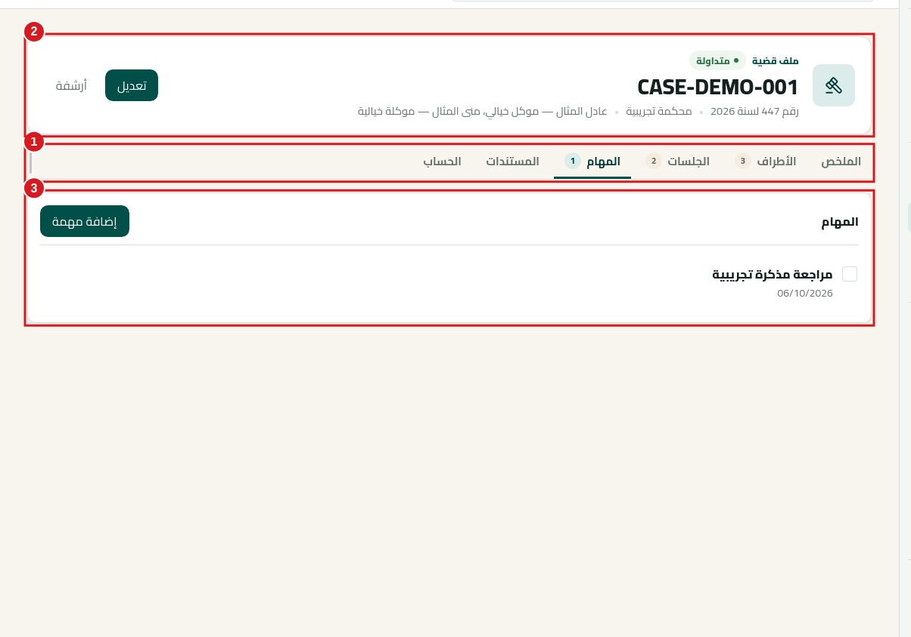

1. التبويبات والعرض: انتقل إلى القسم الذي تريد مراجعته.
2. هوية الصفحة وإجراءاتها: راجع العنوان قبل الإضافة أو التعديل.
3. التفاصيل: اقرأ بيانات هذا القسم واتبع الخطوات أعلاه.

### مستندات القضية

أضف المذكرات والأحكام والأدلة إلى ملف القضية. المستند نسخة يديرها التطبيق وليس رابطًا إلى الملف الأصلي.

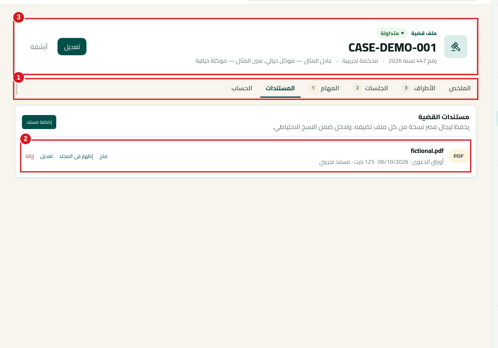

1. التبويبات والعرض: انتقل إلى القسم الذي تريد مراجعته.
2. السجلات والإجراءات: افتح السجل أو استخدم الإجراء بجواره.
3. هوية الصفحة وإجراءاتها: راجع العنوان قبل الإضافة أو التعديل.

### حساب القضية والأتعاب

أدخل الأتعاب المتفق عليها واحفظها. يعرض الحساب المتفق عليه والمحصّل والمتبقي والمصروفات وصافي النقد. الدفعات مستقلة عن المصروفات، وكل المبالغ بالجنيه المصري.

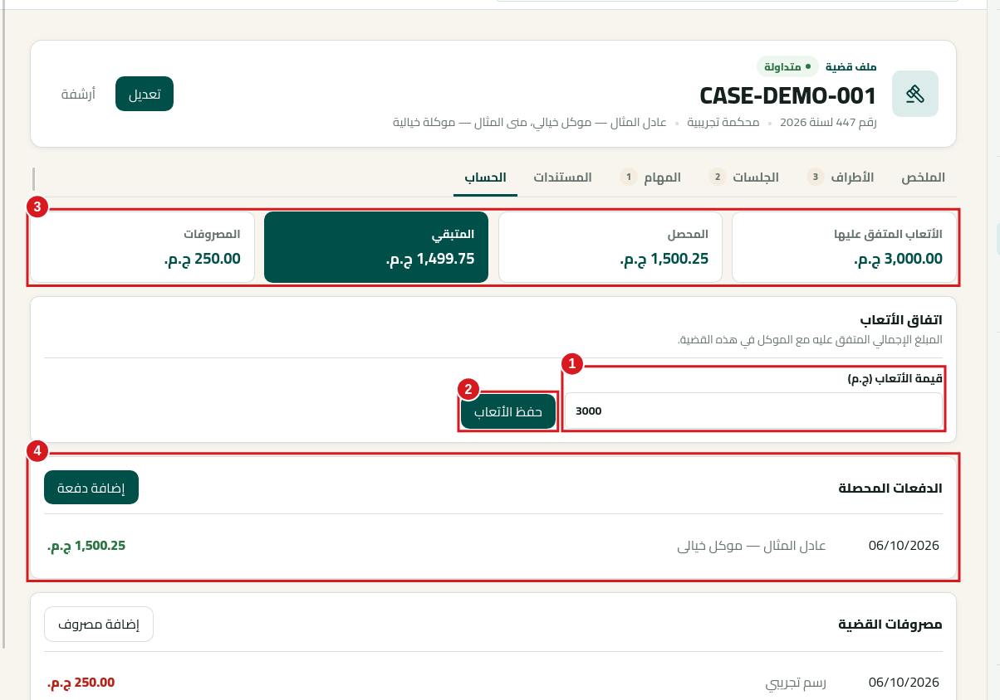

1. قيمة الأتعاب (ج.م): راجع القيمة أو أدخل البيانات المناسبة لهذا الحقل ثم احفظ النموذج.
2. أزرار الإجراء: احفظ أو أكد عند اكتمال البيانات؛ إلغاء يحتفظ بالحالة السابقة.
3. الحساب: راجع الأرقام؛ المبالغ بالجنيه المصري.
4. التفاصيل: اقرأ بيانات هذا القسم واتبع الخطوات أعلاه.

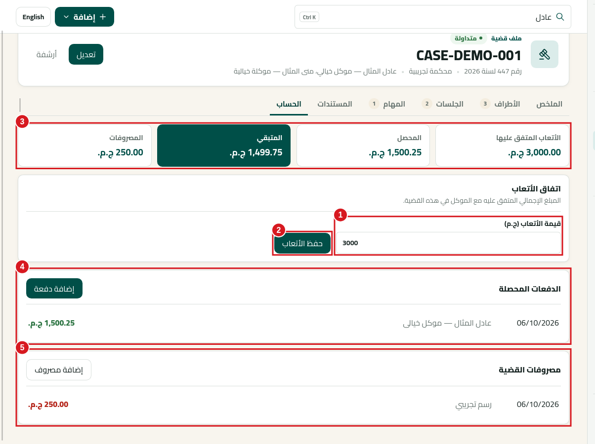

1. قيمة الأتعاب (ج.م): راجع القيمة أو أدخل البيانات المناسبة لهذا الحقل ثم احفظ النموذج.
2. أزرار الإجراء: احفظ أو أكد عند اكتمال البيانات؛ إلغاء يحتفظ بالحالة السابقة.
3. الحساب: راجع الأرقام؛ المبالغ بالجنيه المصري.
4. التفاصيل: اقرأ بيانات هذا القسم واتبع الخطوات أعلاه.
5. التفاصيل: اقرأ بيانات هذا القسم واتبع الخطوات أعلاه.

### تعديل القضية وروابط الموكلين

عدل بيانات القضية والمحكمة والحالة والتواريخ والموضوع ثم احفظ. روابط الموكلين تظل كما هي ولا يمكن تعديلها من هذا النموذج. تاريخ الإغلاق لا يغير الجلسات أو المهام تلقائيًا.

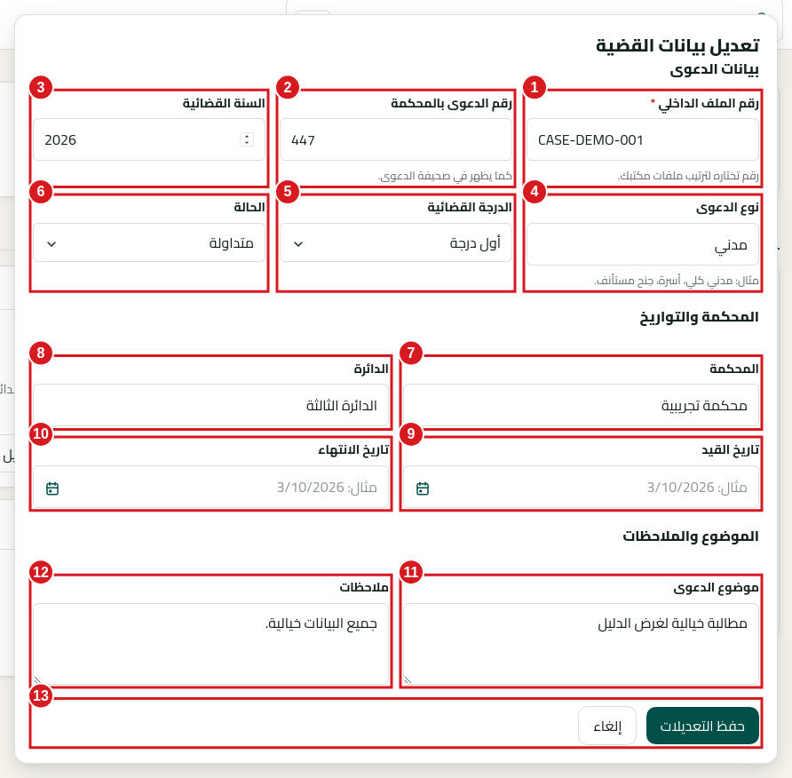

1. رقم الملف الداخلي: راجع القيمة أو أدخل البيانات المناسبة لهذا الحقل ثم احفظ النموذج.
2. رقم الدعوى بالمحكمة: راجع القيمة أو أدخل البيانات المناسبة لهذا الحقل ثم احفظ النموذج.
3. السنة القضائية: راجع القيمة أو أدخل البيانات المناسبة لهذا الحقل ثم احفظ النموذج.
4. نوع الدعوى: راجع القيمة أو أدخل البيانات المناسبة لهذا الحقل ثم احفظ النموذج.
5. الدرجة القضائية: راجع القيمة أو أدخل البيانات المناسبة لهذا الحقل ثم احفظ النموذج.
6. الحالة: راجع القيمة أو أدخل البيانات المناسبة لهذا الحقل ثم احفظ النموذج.
7. المحكمة: راجع القيمة أو أدخل البيانات المناسبة لهذا الحقل ثم احفظ النموذج.
8. الدائرة: راجع القيمة أو أدخل البيانات المناسبة لهذا الحقل ثم احفظ النموذج.
9. تاريخ القيد: راجع القيمة أو أدخل البيانات المناسبة لهذا الحقل ثم احفظ النموذج.
10. تاريخ الانتهاء: راجع القيمة أو أدخل البيانات المناسبة لهذا الحقل ثم احفظ النموذج.
11. موضوع الدعوى: راجع القيمة أو أدخل البيانات المناسبة لهذا الحقل ثم احفظ النموذج.
12. ملاحظات: راجع القيمة أو أدخل البيانات المناسبة لهذا الحقل ثم احفظ النموذج.
13. أزرار الإجراء: احفظ أو أكد عند اكتمال البيانات؛ إلغاء يحتفظ بالحالة السابقة.

### إضافة خصم

من الموكلين والخصوم اختر إضافة خصم. الاسم مطلوب؛ الصفة ومحامي الخصم والهاتف والعنوان والملاحظات اختيارية. احفظ لإضافته إلى هذه القضية.

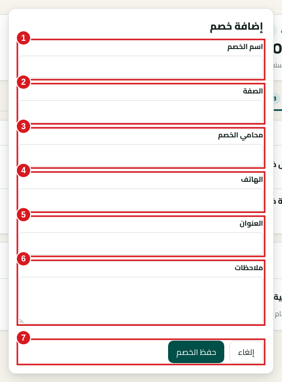

1. اسم الخصم: راجع القيمة أو أدخل البيانات المناسبة لهذا الحقل ثم احفظ النموذج.
2. الصفة: راجع القيمة أو أدخل البيانات المناسبة لهذا الحقل ثم احفظ النموذج.
3. محامي الخصم: راجع القيمة أو أدخل البيانات المناسبة لهذا الحقل ثم احفظ النموذج.
4. الهاتف: راجع القيمة أو أدخل البيانات المناسبة لهذا الحقل ثم احفظ النموذج.
5. العنوان: راجع القيمة أو أدخل البيانات المناسبة لهذا الحقل ثم احفظ النموذج.
6. ملاحظات: راجع القيمة أو أدخل البيانات المناسبة لهذا الحقل ثم احفظ النموذج.
7. أزرار الإجراء: احفظ أو أكد عند اكتمال البيانات؛ إلغاء يحتفظ بالحالة السابقة.

### تعديل خصم

اضغط تعديل بجوار الخصم، غيّر البيانات واحفظ. التعديل يخص خصم هذه القضية.

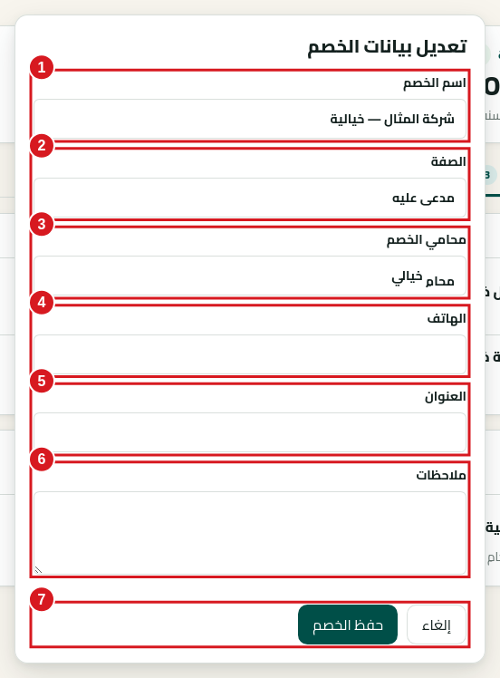

1. اسم الخصم: راجع القيمة أو أدخل البيانات المناسبة لهذا الحقل ثم احفظ النموذج.
2. الصفة: راجع القيمة أو أدخل البيانات المناسبة لهذا الحقل ثم احفظ النموذج.
3. محامي الخصم: راجع القيمة أو أدخل البيانات المناسبة لهذا الحقل ثم احفظ النموذج.
4. الهاتف: راجع القيمة أو أدخل البيانات المناسبة لهذا الحقل ثم احفظ النموذج.
5. العنوان: راجع القيمة أو أدخل البيانات المناسبة لهذا الحقل ثم احفظ النموذج.
6. ملاحظات: راجع القيمة أو أدخل البيانات المناسبة لهذا الحقل ثم احفظ النموذج.
7. أزرار الإجراء: احفظ أو أكد عند اكتمال البيانات؛ إلغاء يحتفظ بالحالة السابقة.

### إزالة خصم

راجع التأكيد قبل إزالة الخصم من القضية. إلغاء يبقي العلاقة كما هي.

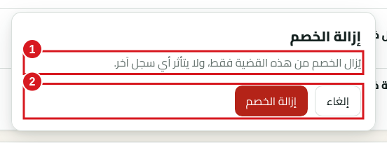

1. التأكيد: اقرأ ما سيحدث قبل الموافقة.
2. أزرار الإجراء: احفظ أو أكد عند اكتمال البيانات؛ إلغاء يحتفظ بالحالة السابقة.

### القضية المؤرشفة

الأرشفة في رأس الملف تخفي القضية من القوائم المعتادة. افتح الملف المؤرشف واضغط استعادة لإعادته. الأرشفة منفصلة عن حالة القضية مغلقة ولا تعني حذفها.

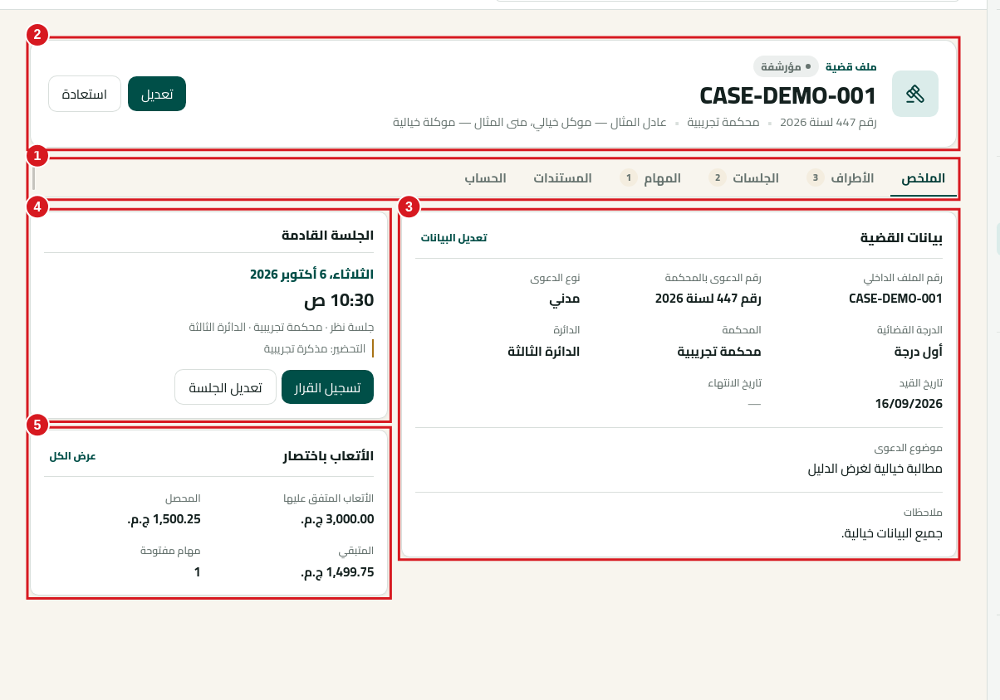

1. التبويبات والعرض: انتقل إلى القسم الذي تريد مراجعته.
2. هوية الصفحة وإجراءاتها: راجع العنوان قبل الإضافة أو التعديل.
3. التفاصيل: اقرأ بيانات هذا القسم واتبع الخطوات أعلاه.
4. التفاصيل: اقرأ بيانات هذا القسم واتبع الخطوات أعلاه.
5. التفاصيل: اقرأ بيانات هذا القسم واتبع الخطوات أعلاه.

## الأجندة والجلسات

### عرض الشهر

اختر نوع العرض ثم تنقل بين التواريخ. الجلسات والمهام تظهر معًا حسب اليوم. اختيار يوم يعرض تفاصيله وأزرار إدارة الجلسات. بداية الأسبوع تتبع الإعدادات.

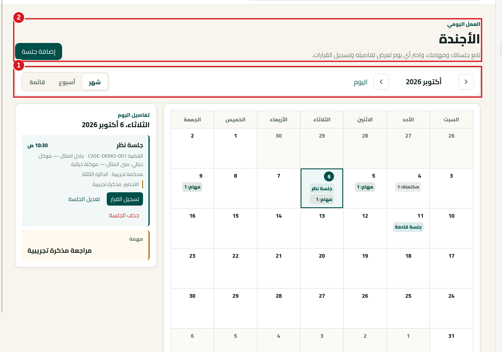

1. التبويبات والعرض: انتقل إلى القسم الذي تريد مراجعته.
2. هوية الصفحة وإجراءاتها: راجع العنوان قبل الإضافة أو التعديل.

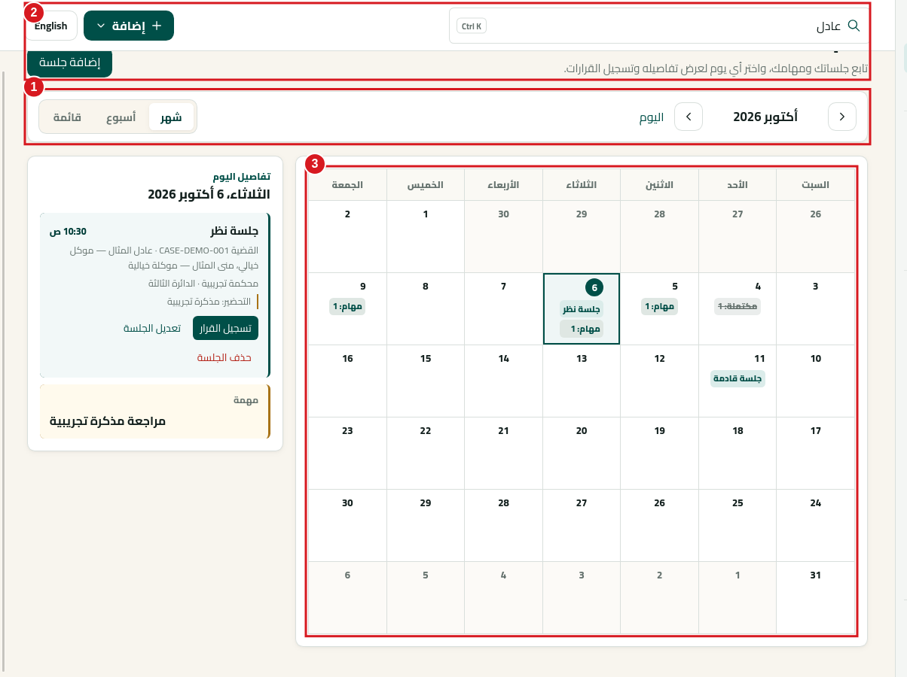

1. التبويبات والعرض: انتقل إلى القسم الذي تريد مراجعته.
2. هوية الصفحة وإجراءاتها: راجع العنوان قبل الإضافة أو التعديل.
3. المواعيد: راجع اليوم والروابط والتفاصيل المطلوبة.

### عرض الأسبوع

اختر نوع العرض ثم تنقل بين التواريخ. الجلسات والمهام تظهر معًا حسب اليوم. اختيار يوم يعرض تفاصيله وأزرار إدارة الجلسات. بداية الأسبوع تتبع الإعدادات.

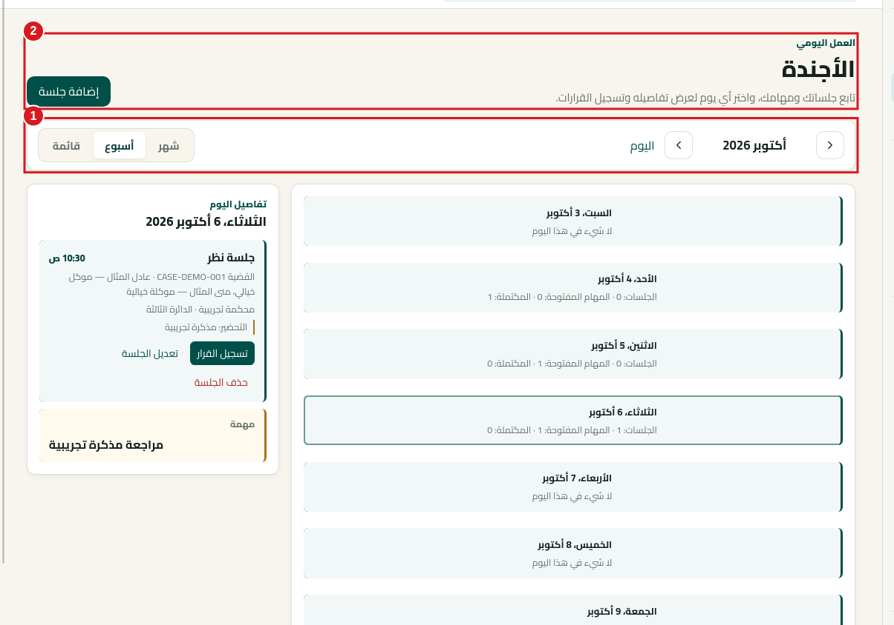

1. التبويبات والعرض: انتقل إلى القسم الذي تريد مراجعته.
2. هوية الصفحة وإجراءاتها: راجع العنوان قبل الإضافة أو التعديل.

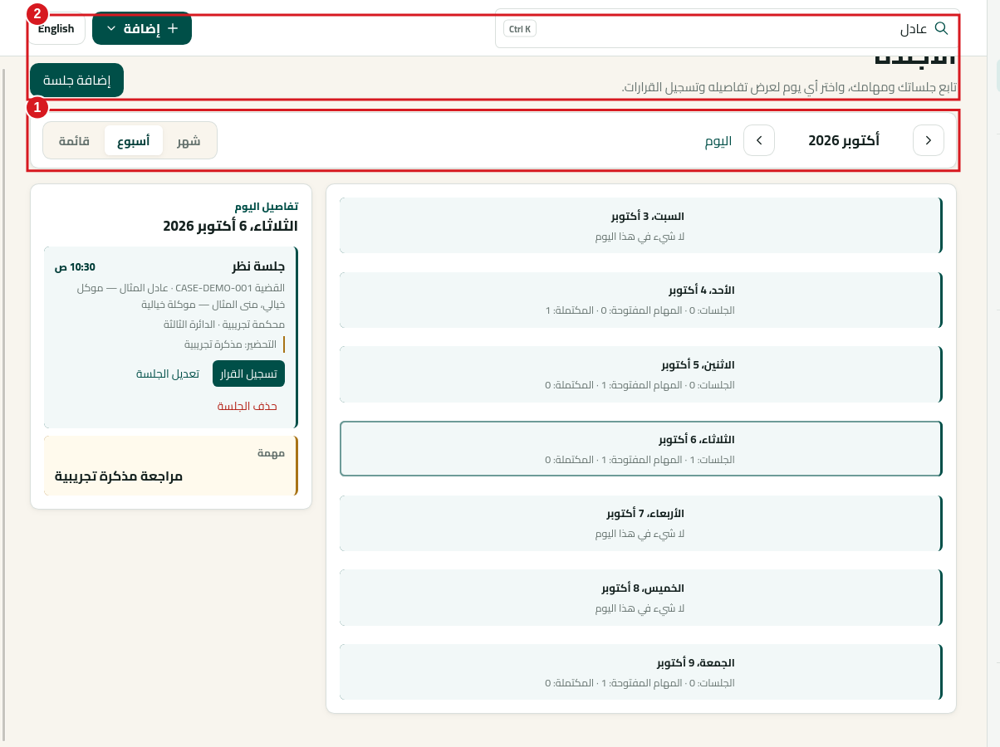

1. التبويبات والعرض: انتقل إلى القسم الذي تريد مراجعته.
2. هوية الصفحة وإجراءاتها: راجع العنوان قبل الإضافة أو التعديل.

### عرض القائمة

اختر نوع العرض ثم تنقل بين التواريخ. الجلسات والمهام تظهر معًا حسب اليوم. اختيار يوم يعرض تفاصيله وأزرار إدارة الجلسات. بداية الأسبوع تتبع الإعدادات.

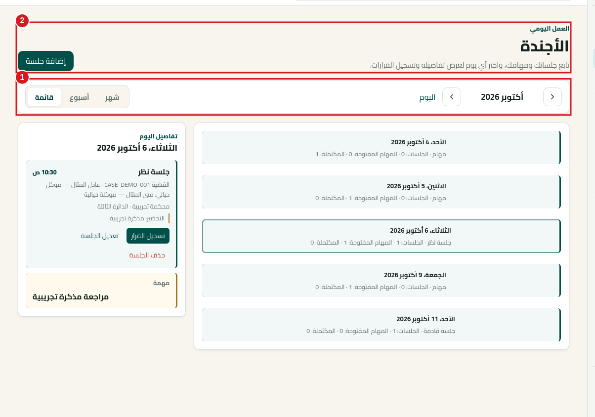

1. التبويبات والعرض: انتقل إلى القسم الذي تريد مراجعته.
2. هوية الصفحة وإجراءاتها: راجع العنوان قبل الإضافة أو التعديل.

### إضافة جلسة

اختر القضية والتاريخ، ثم الوقت والنوع والمكان والدائرة والمستندات المطلوبة والملاحظات عند الحاجة. احفظ لتظهر الجلسة في الأجندة وملف القضية.

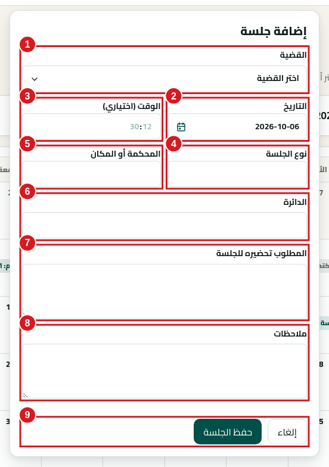

1. القضية: اختر القضية المرتبطة بهذا السجل.
2. التاريخ: اكتب يوم/شهر/سنة أو سنة-شهر-يوم ثم انتقل لحقل آخر، أو اختر اليوم من التقويم.
3. الوقت (اختياري): راجع القيمة أو أدخل البيانات المناسبة لهذا الحقل ثم احفظ النموذج.
4. نوع الجلسة: راجع القيمة أو أدخل البيانات المناسبة لهذا الحقل ثم احفظ النموذج.
5. المحكمة أو المكان: راجع القيمة أو أدخل البيانات المناسبة لهذا الحقل ثم احفظ النموذج.
6. الدائرة: راجع القيمة أو أدخل البيانات المناسبة لهذا الحقل ثم احفظ النموذج.
7. المطلوب تحضيره للجلسة: راجع القيمة أو أدخل البيانات المناسبة لهذا الحقل ثم احفظ النموذج.
8. ملاحظات: راجع القيمة أو أدخل البيانات المناسبة لهذا الحقل ثم احفظ النموذج.
9. أزرار الإجراء: احفظ أو أكد عند اكتمال البيانات؛ إلغاء يحتفظ بالحالة السابقة.

### تعديل جلسة

افتح تفاصيل الجلسة، صحح البيانات واحفظ. تعديل جلسة لاحقة لا يغير بيانات الجلسة السابقة.

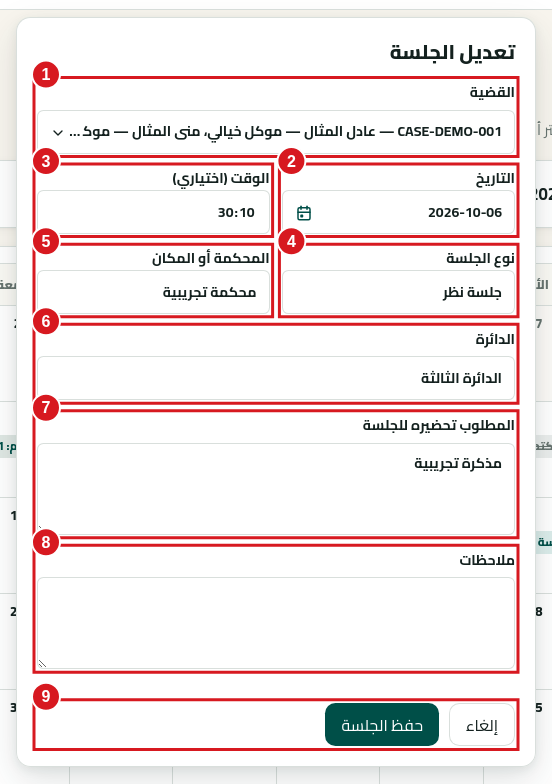

1. القضية: اختر القضية المرتبطة بهذا السجل.
2. التاريخ: اكتب يوم/شهر/سنة أو سنة-شهر-يوم ثم انتقل لحقل آخر، أو اختر اليوم من التقويم.
3. الوقت (اختياري): راجع القيمة أو أدخل البيانات المناسبة لهذا الحقل ثم احفظ النموذج.
4. نوع الجلسة: راجع القيمة أو أدخل البيانات المناسبة لهذا الحقل ثم احفظ النموذج.
5. المحكمة أو المكان: راجع القيمة أو أدخل البيانات المناسبة لهذا الحقل ثم احفظ النموذج.
6. الدائرة: راجع القيمة أو أدخل البيانات المناسبة لهذا الحقل ثم احفظ النموذج.
7. المطلوب تحضيره للجلسة: راجع القيمة أو أدخل البيانات المناسبة لهذا الحقل ثم احفظ النموذج.
8. ملاحظات: راجع القيمة أو أدخل البيانات المناسبة لهذا الحقل ثم احفظ النموذج.
9. أزرار الإجراء: احفظ أو أكد عند اكتمال البيانات؛ إلغاء يحتفظ بالحالة السابقة.

### تسجيل القرار والجلسة التالية

أدخل القرار وحدد تاريخ الجلسة التالية إن وجد ثم احفظ القرار. تكتمل الجلسة الحالية وتُنشأ التالية مرتبطة بها. تترك التاريخ فارغًا إذا لم تُحدد جلسة أخرى؛ يمكنك تعديل التالية لاحقًا.

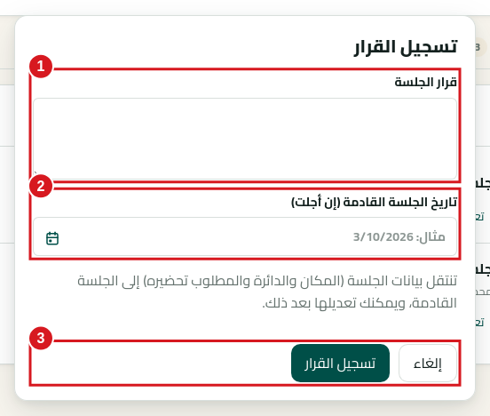

1. قرار الجلسة: راجع القيمة أو أدخل البيانات المناسبة لهذا الحقل ثم احفظ النموذج.
2. تاريخ الجلسة القادمة (إن أُجلت): راجع القيمة أو أدخل البيانات المناسبة لهذا الحقل ثم احفظ النموذج.
3. أزرار الإجراء: احفظ أو أكد عند اكتمال البيانات؛ إلغاء يحتفظ بالحالة السابقة.

### حذف جلسة

من تفاصيل اليوم اختر حذف الجلسة وراجع التأكيد. استخدم إلغاء إذا أردت الاحتفاظ بها. حذف جلسة لا يساوي تسجيل قرارها.

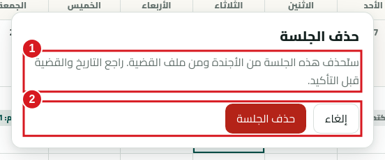

1. التأكيد: اقرأ ما سيحدث قبل الموافقة.
2. أزرار الإجراء: احفظ أو أكد عند اكتمال البيانات؛ إلغاء يحتفظ بالحالة السابقة.

### اختيار التاريخ

اكتب التاريخ مثل 03/10/2026 أو 2026-10-03 ثم انتقل إلى حقل آخر، أو افتح زر التقويم واختر اليوم. يقبل الحقل الأرقام العربية ويعرض القيمة بعد تصحيحها بصيغة سنة-شهر-يوم. تظل القيمة تاريخًا بلا منطقة زمنية.

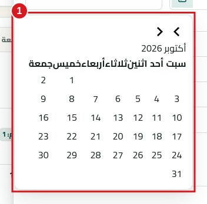

1. المواعيد: راجع اليوم والروابط والتفاصيل المطلوبة.

## المهام والمواعيد النهائية

### مهام اليوم

اختر التبويب المناسب ورشح بالقضية أو الموكل عند الحاجة. افتح عنوان المهمة لتعديلها. مربع الاختيار يغير حالة الإنجاز؛ إزالة الفلاتر يعرض القائمة دون قيود الموكل والقضية.

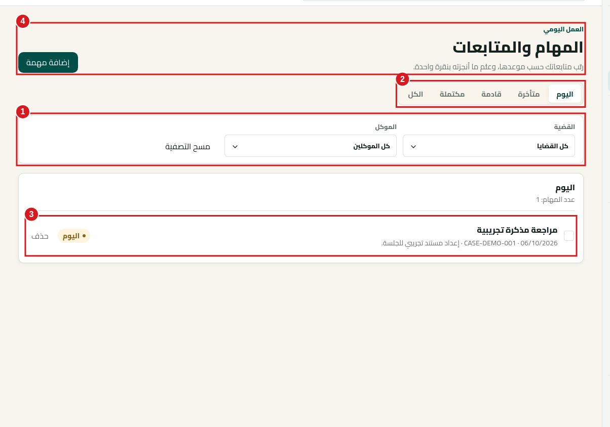

1. الترشيح: حدد شروط العرض؛ الفلاتر لا تغير السجلات.
2. التبويبات والعرض: انتقل إلى القسم الذي تريد مراجعته.
3. السجلات والإجراءات: افتح السجل أو استخدم الإجراء بجواره.
4. هوية الصفحة وإجراءاتها: راجع العنوان قبل الإضافة أو التعديل.

### المهام المتأخرة

اختر التبويب المناسب ورشح بالقضية أو الموكل عند الحاجة. افتح عنوان المهمة لتعديلها. مربع الاختيار يغير حالة الإنجاز؛ إزالة الفلاتر يعرض القائمة دون قيود الموكل والقضية.

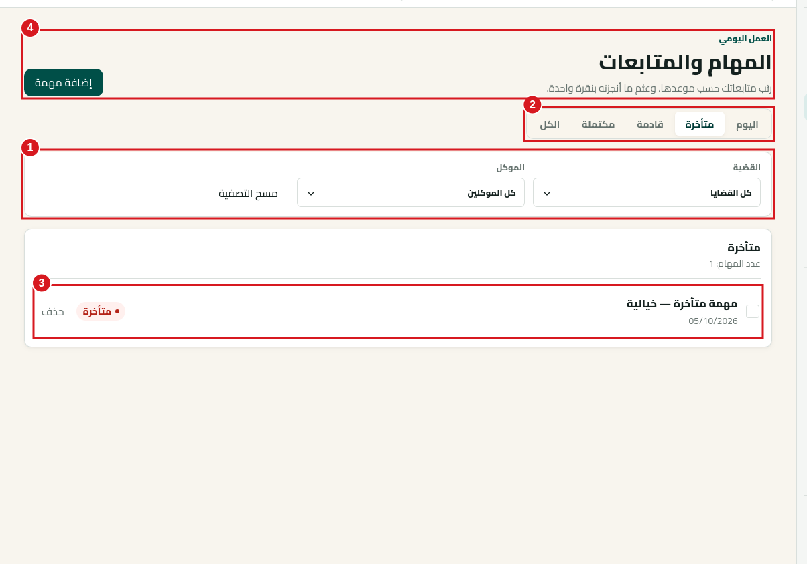

1. الترشيح: حدد شروط العرض؛ الفلاتر لا تغير السجلات.
2. التبويبات والعرض: انتقل إلى القسم الذي تريد مراجعته.
3. السجلات والإجراءات: افتح السجل أو استخدم الإجراء بجواره.
4. هوية الصفحة وإجراءاتها: راجع العنوان قبل الإضافة أو التعديل.

### المهام القادمة

اختر التبويب المناسب ورشح بالقضية أو الموكل عند الحاجة. افتح عنوان المهمة لتعديلها. مربع الاختيار يغير حالة الإنجاز؛ إزالة الفلاتر يعرض القائمة دون قيود الموكل والقضية.

1. الترشيح: حدد شروط العرض؛ الفلاتر لا تغير السجلات.
2. التبويبات والعرض: انتقل إلى القسم الذي تريد مراجعته.
3. السجلات والإجراءات: افتح السجل أو استخدم الإجراء بجواره.
4. هوية الصفحة وإجراءاتها: راجع العنوان قبل الإضافة أو التعديل.

### المهام المكتملة

اختر التبويب المناسب ورشح بالقضية أو الموكل عند الحاجة. افتح عنوان المهمة لتعديلها. مربع الاختيار يغير حالة الإنجاز؛ إزالة الفلاتر يعرض القائمة دون قيود الموكل والقضية.

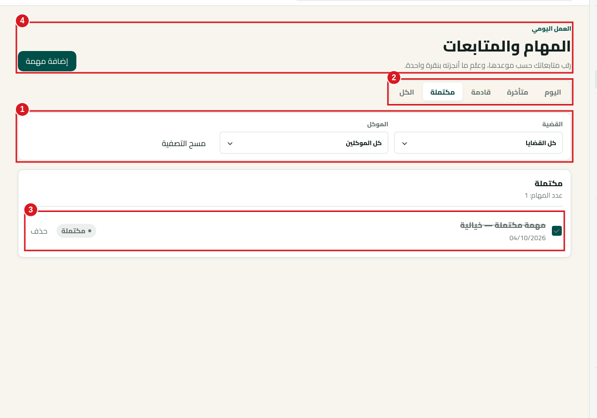

1. الترشيح: حدد شروط العرض؛ الفلاتر لا تغير السجلات.
2. التبويبات والعرض: انتقل إلى القسم الذي تريد مراجعته.
3. السجلات والإجراءات: افتح السجل أو استخدم الإجراء بجواره.
4. هوية الصفحة وإجراءاتها: راجع العنوان قبل الإضافة أو التعديل.

### جميع المهام

اختر التبويب المناسب ورشح بالقضية أو الموكل عند الحاجة. افتح عنوان المهمة لتعديلها. مربع الاختيار يغير حالة الإنجاز؛ إزالة الفلاتر يعرض القائمة دون قيود الموكل والقضية.

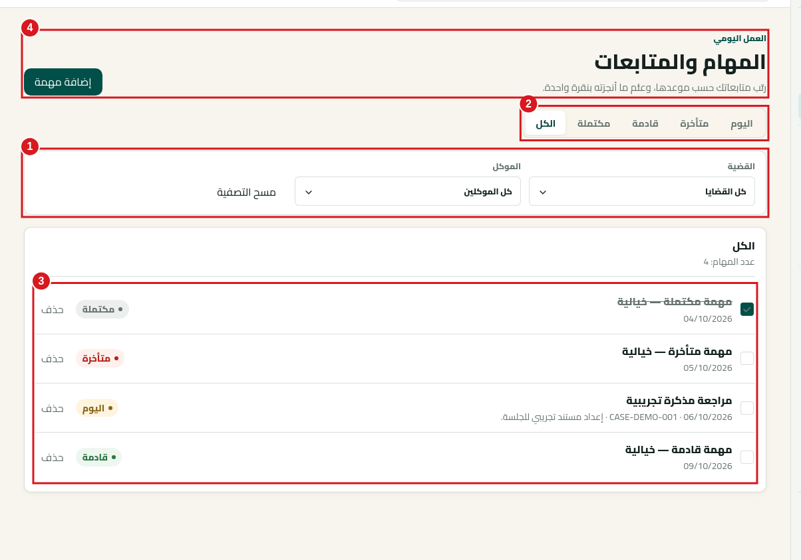

1. الترشيح: حدد شروط العرض؛ الفلاتر لا تغير السجلات.
2. التبويبات والعرض: انتقل إلى القسم الذي تريد مراجعته.
3. السجلات والإجراءات: افتح السجل أو استخدم الإجراء بجواره.
4. هوية الصفحة وإجراءاتها: راجع العنوان قبل الإضافة أو التعديل.

### إضافة مهمة

أدخل عنوان المهمة وتاريخ الاستحقاق. يمكنك ربطها بقضية أو موكل وإضافة التفاصيل والملاحظات. لا توجد أولوية أو إسناد إلى موظف أو وقت استحقاق؛ هذا برنامج لمحامٍ فردي.

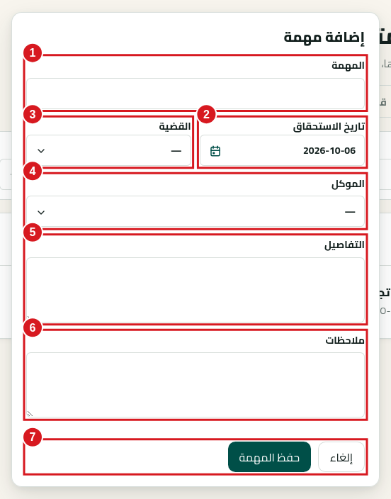

1. المهمة: راجع القيمة أو أدخل البيانات المناسبة لهذا الحقل ثم احفظ النموذج.
2. تاريخ الاستحقاق: راجع القيمة أو أدخل البيانات المناسبة لهذا الحقل ثم احفظ النموذج.
3. القضية: اختر القضية المرتبطة بهذا السجل.
4. الموكل: اختر موكلًا موجودًا؛ دافع الدفعة يجب أن ينتمي للقضية.
5. التفاصيل: راجع القيمة أو أدخل البيانات المناسبة لهذا الحقل ثم احفظ النموذج.
6. ملاحظات: راجع القيمة أو أدخل البيانات المناسبة لهذا الحقل ثم احفظ النموذج.
7. أزرار الإجراء: احفظ أو أكد عند اكتمال البيانات؛ إلغاء يحتفظ بالحالة السابقة.

### تعديل المهمة وإنجازها

افتح المهمة ثم عدل بياناتها واحفظ. زر إكمال المهمة أو إعادة فتحها يغير الحالة مباشرة. لا يلزم تعديل التاريخ لإكمال المهمة.

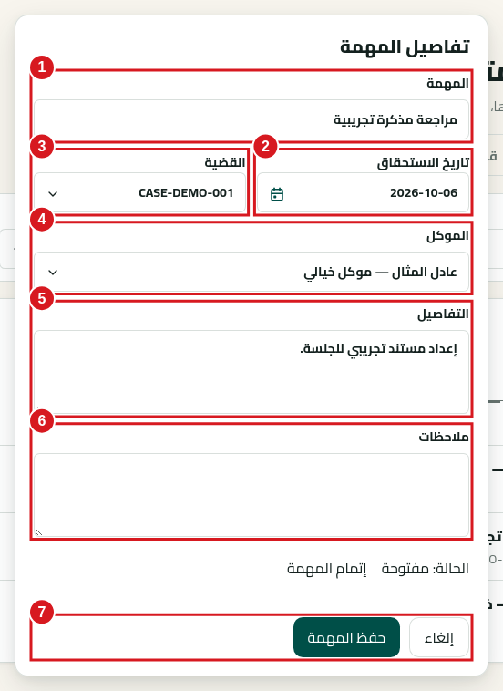

1. المهمة: راجع القيمة أو أدخل البيانات المناسبة لهذا الحقل ثم احفظ النموذج.
2. تاريخ الاستحقاق: راجع القيمة أو أدخل البيانات المناسبة لهذا الحقل ثم احفظ النموذج.
3. القضية: اختر القضية المرتبطة بهذا السجل.
4. الموكل: اختر موكلًا موجودًا؛ دافع الدفعة يجب أن ينتمي للقضية.
5. التفاصيل: راجع القيمة أو أدخل البيانات المناسبة لهذا الحقل ثم احفظ النموذج.
6. ملاحظات: راجع القيمة أو أدخل البيانات المناسبة لهذا الحقل ثم احفظ النموذج.
7. أزرار الإجراء: احفظ أو أكد عند اكتمال البيانات؛ إلغاء يحتفظ بالحالة السابقة.

### حذف المهمة

اختر حذف بجوار المهمة ثم أكد الحذف. إلغاء يحتفظ بالمهمة. استخدم الإنجاز بدل الحذف إذا أردت الاحتفاظ بسجل العمل المكتمل.

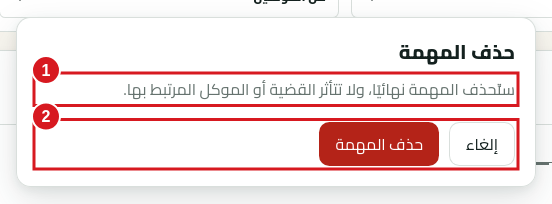

1. التأكيد: اقرأ ما سيحدث قبل الموافقة.
2. أزرار الإجراء: احفظ أو أكد عند اكتمال البيانات؛ إلغاء يحتفظ بالحالة السابقة.

## المستندات

### جميع المستندات

هذه قائمة المستندات العامة. راجع الاسم والتصنيف والتاريخ والمالك. لإضافة مستند جديد، افتح ملف الموكل أو القضية أو التوكيل. الإضافة غير متاحة من القائمة العامة.

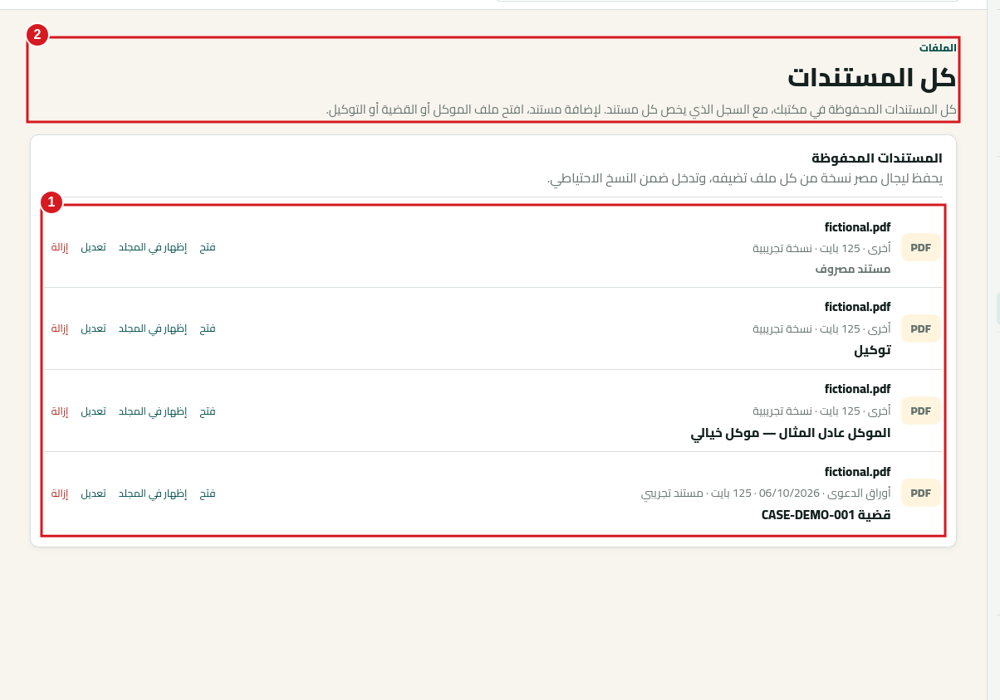

1. السجلات والإجراءات: افتح السجل أو استخدم الإجراء بجواره.
2. هوية الصفحة وإجراءاتها: راجع العنوان قبل الإضافة أو التعديل.

### إضافة نسخة مستند

من تبويب مستندات المالك اضغط إضافة مستند ثم اختيار ملف. اختر الملف في نافذة النظام، ثم التصنيف والوصف والتاريخ واحفظ. يحتفظ التطبيق بنسخة ولا يعدّل المصدر. إلغاء اختيار الملف لا ينشئ مستندًا.

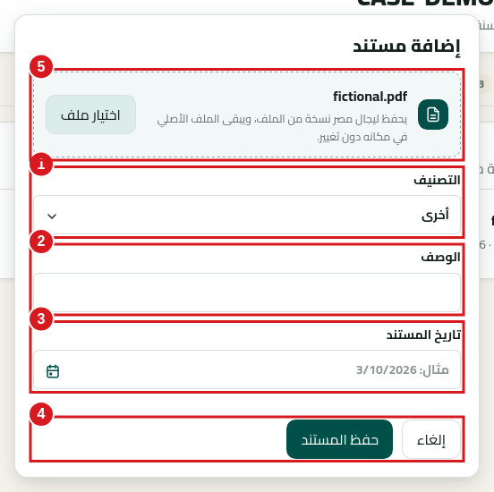

1. التصنيف: راجع القيمة أو أدخل البيانات المناسبة لهذا الحقل ثم احفظ النموذج.
2. الوصف: راجع القيمة أو أدخل البيانات المناسبة لهذا الحقل ثم احفظ النموذج.
3. تاريخ المستند: راجع القيمة أو أدخل البيانات المناسبة لهذا الحقل ثم احفظ النموذج.
4. أزرار الإجراء: احفظ أو أكد عند اكتمال البيانات؛ إلغاء يحتفظ بالحالة السابقة.
5. اختيار الملف: حدد المستند؛ يحفظ التطبيق نسخة مدارة ويبقى الأصل في مكانه.

### تعديل وصف المستند

اضغط تعديل بجوار المستند لتغيير التصنيف والوصف وتاريخ المستند. لا يستبدل هذا النموذج محتوى الملف. فتح يستخدم التطبيق المناسب في النظام، وإظهار يفتح موقع النسخة المدارة.

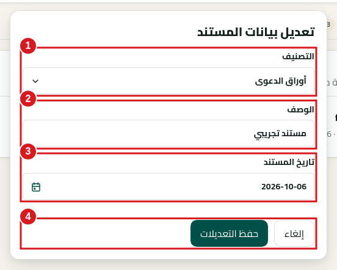

1. التصنيف: راجع القيمة أو أدخل البيانات المناسبة لهذا الحقل ثم احفظ النموذج.
2. الوصف: راجع القيمة أو أدخل البيانات المناسبة لهذا الحقل ثم احفظ النموذج.
3. تاريخ المستند: راجع القيمة أو أدخل البيانات المناسبة لهذا الحقل ثم احفظ النموذج.
4. أزرار الإجراء: احفظ أو أكد عند اكتمال البيانات؛ إلغاء يحتفظ بالحالة السابقة.

### إزالة المستند

راجع التأكيد قبل إزالة النسخة المدارة وبياناتها. الملف الأصلي الذي اخترته لا يُحذف. إلغاء يبقي المستند.

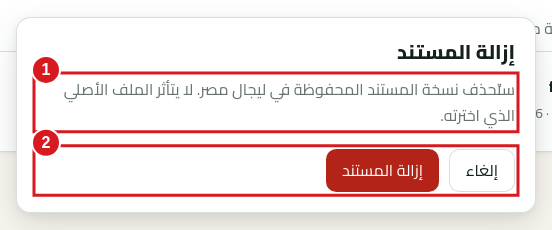

1. التأكيد: اقرأ ما سيحدث قبل الموافقة.
2. أزرار الإجراء: احفظ أو أكد عند اكتمال البيانات؛ إلغاء يحتفظ بالحالة السابقة.

### تعذر فتح مستند

إذا فُقدت النسخة المدارة أو تعذر فتحها، يظهر خطأ. تحقق من وجود الملف ومن إعدادات النظام؛ لا تنقل الملفات داخل مجلد بيانات التطبيق يدويًا. احتفظ بنسخ احتياطية تشمل المستندات.

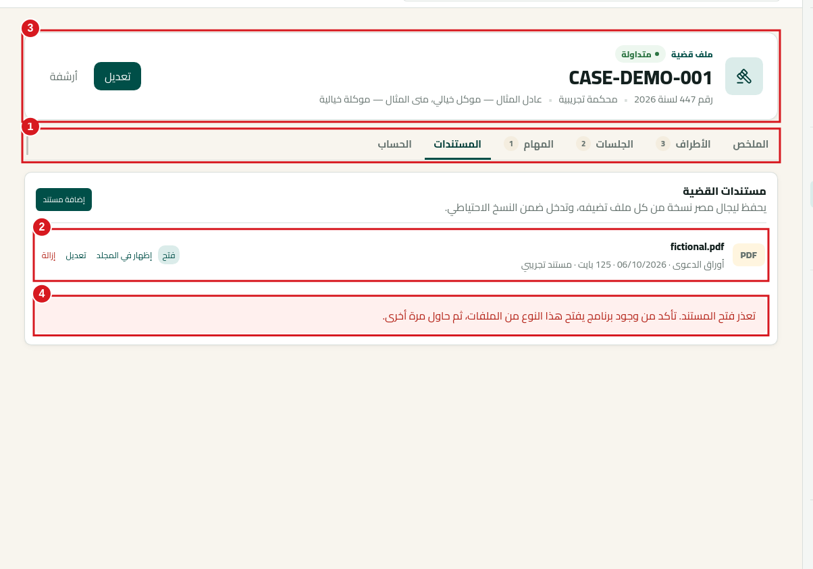

1. التبويبات والعرض: انتقل إلى القسم الذي تريد مراجعته.
2. السجلات والإجراءات: افتح السجل أو استخدم الإجراء بجواره.
3. هوية الصفحة وإجراءاتها: راجع العنوان قبل الإضافة أو التعديل.
4. رسالة الخطأ: صحح السبب الموضح ثم أعد المحاولة.

## الأتعاب والدفعات والمصروفات

### سجل الدفعات

اختر القضية والموكل للترشيح. عند تحديد قضية، يقتصر مرشح دافع الدفعة على موكليها. راجع الدفعات والحساب، وافتح الحركة لتعديلها.

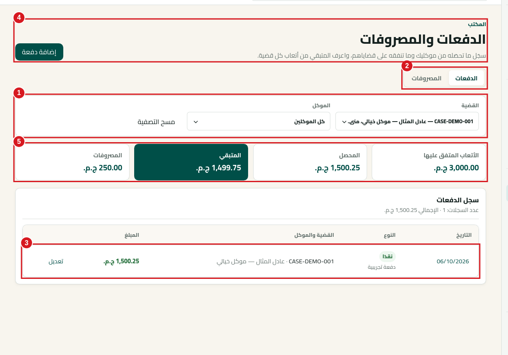

1. الترشيح: حدد شروط العرض؛ الفلاتر لا تغير السجلات.
2. التبويبات والعرض: انتقل إلى القسم الذي تريد مراجعته.
3. السجلات والإجراءات: افتح السجل أو استخدم الإجراء بجواره.
4. هوية الصفحة وإجراءاتها: راجع العنوان قبل الإضافة أو التعديل.
5. الحساب: راجع الأرقام؛ المبالغ بالجنيه المصري.

### سجل المصروفات

انتقل إلى المصروفات وراجع النوع والتاريخ والمبلغ والروابط. المصروف قد يرتبط بقضية أو موكل أو لا يرتبط بأي منهما. المصروفات لا تُحسب دفعات أتعاب.

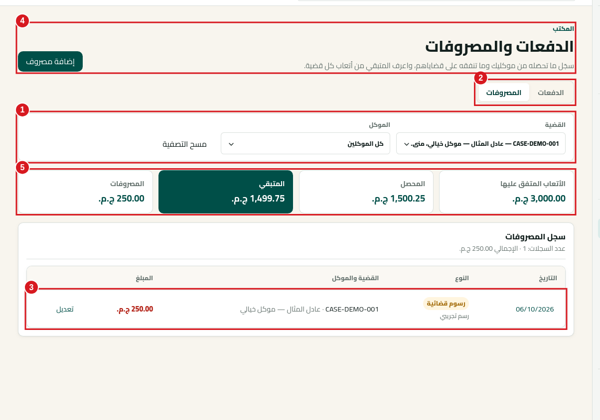

1. الترشيح: حدد شروط العرض؛ الفلاتر لا تغير السجلات.
2. التبويبات والعرض: انتقل إلى القسم الذي تريد مراجعته.
3. السجلات والإجراءات: افتح السجل أو استخدم الإجراء بجواره.
4. هوية الصفحة وإجراءاتها: راجع العنوان قبل الإضافة أو التعديل.
5. الحساب: راجع الأرقام؛ المبالغ بالجنيه المصري.

### إضافة دفعة

اختر القضية ودافع الدفعة من موكليها. أدخل مبلغًا موجبًا وتاريخ الدفع والطريقة والملاحظات ثم احفظ. يسجل المبلغ بالجنيه والقرش دون تقريب عشري غير دقيق.

1. القضية: اختر القضية المرتبطة بهذا السجل.
2. الموكل الدافع: اختر موكلًا موجودًا؛ دافع الدفعة يجب أن ينتمي للقضية.
3. المبلغ (ج.م): أدخل مبلغًا موجبًا بالجنيه المصري، حتى منزلتين للقرش.
4. تاريخ الدفعة: راجع القيمة أو أدخل البيانات المناسبة لهذا الحقل ثم احفظ النموذج.
5. طريقة الدفع: راجع القيمة أو أدخل البيانات المناسبة لهذا الحقل ثم احفظ النموذج.
6. ملاحظات: راجع القيمة أو أدخل البيانات المناسبة لهذا الحقل ثم احفظ النموذج.
7. أزرار الإجراء: احفظ أو أكد عند اكتمال البيانات؛ إلغاء يحتفظ بالحالة السابقة.

### تعديل دفعة

افتح الدفعة ثم صحح المبلغ أو التاريخ أو الطريقة والملاحظات واحفظ. يتحدث حساب القضية بعد الحفظ. لا يوجد زر حذف دفعة في الواجهة الحالية.

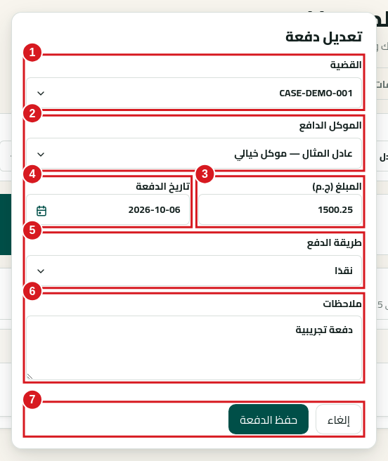

1. القضية: اختر القضية المرتبطة بهذا السجل.
2. الموكل الدافع: اختر موكلًا موجودًا؛ دافع الدفعة يجب أن ينتمي للقضية.
3. المبلغ (ج.م): أدخل مبلغًا موجبًا بالجنيه المصري، حتى منزلتين للقرش.
4. تاريخ الدفعة: راجع القيمة أو أدخل البيانات المناسبة لهذا الحقل ثم احفظ النموذج.
5. طريقة الدفع: راجع القيمة أو أدخل البيانات المناسبة لهذا الحقل ثم احفظ النموذج.
6. ملاحظات: راجع القيمة أو أدخل البيانات المناسبة لهذا الحقل ثم احفظ النموذج.
7. أزرار الإجراء: احفظ أو أكد عند اكتمال البيانات؛ إلغاء يحتفظ بالحالة السابقة.

### إضافة مصروف

أدخل مبلغًا موجبًا وتاريخًا ونوع المصروف. الربط بقضية وموكل اختياري. الأنواع: رسوم محكمة، انتقالات، أدوات مكتبية، أتعاب خبير، وأخرى. احفظ الحركة.

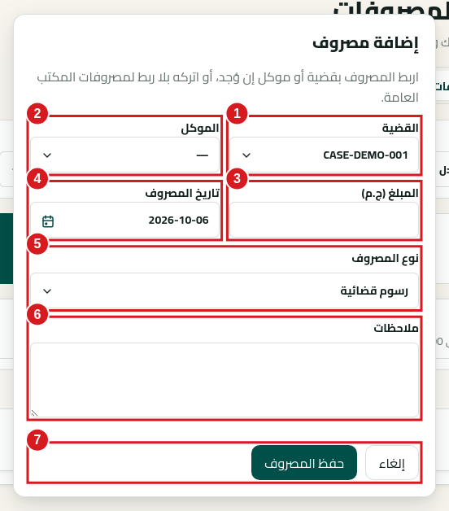

1. القضية: اختر القضية المرتبطة بهذا السجل.
2. الموكل: اختر موكلًا موجودًا؛ دافع الدفعة يجب أن ينتمي للقضية.
3. المبلغ (ج.م): أدخل مبلغًا موجبًا بالجنيه المصري، حتى منزلتين للقرش.
4. تاريخ المصروف: راجع القيمة أو أدخل البيانات المناسبة لهذا الحقل ثم احفظ النموذج.
5. نوع المصروف: راجع القيمة أو أدخل البيانات المناسبة لهذا الحقل ثم احفظ النموذج.
6. ملاحظات: راجع القيمة أو أدخل البيانات المناسبة لهذا الحقل ثم احفظ النموذج.
7. أزرار الإجراء: احفظ أو أكد عند اكتمال البيانات؛ إلغاء يحتفظ بالحالة السابقة.

### تعديل مصروف ومستنداته

افتح المصروف لتعديل البيانات واحفظ. لا يوجد زر إضافة مستند للمصروف أو حذف مصروف في الواجهة الحالية. يمكنك حفظ إيصالات القضية كمستندات للقضية.

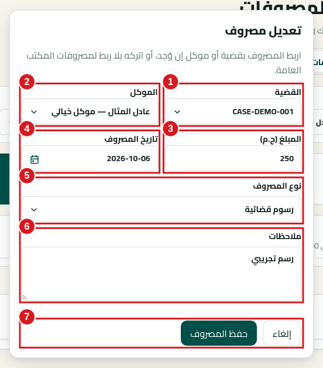

1. القضية: اختر القضية المرتبطة بهذا السجل.
2. الموكل: اختر موكلًا موجودًا؛ دافع الدفعة يجب أن ينتمي للقضية.
3. المبلغ (ج.م): أدخل مبلغًا موجبًا بالجنيه المصري، حتى منزلتين للقرش.
4. تاريخ المصروف: راجع القيمة أو أدخل البيانات المناسبة لهذا الحقل ثم احفظ النموذج.
5. نوع المصروف: راجع القيمة أو أدخل البيانات المناسبة لهذا الحقل ثم احفظ النموذج.
6. ملاحظات: راجع القيمة أو أدخل البيانات المناسبة لهذا الحقل ثم احفظ النموذج.
7. أزرار الإجراء: احفظ أو أكد عند اكتمال البيانات؛ إلغاء يحتفظ بالحالة السابقة.

### تفاصيل دفعة

اضغط تاريخ الدفعة لمراجعة التفاصيل دون تعديل. زر تعديل يفتح نموذج التعديل؛ إغلاق يعود إلى السجل.

1. التفاصيل: اقرأ بيانات هذا القسم واتبع الخطوات أعلاه.
2. أزرار الإجراء: احفظ أو أكد عند اكتمال البيانات؛ إلغاء يحتفظ بالحالة السابقة.
3. التفاصيل: اقرأ بيانات هذا القسم واتبع الخطوات أعلاه.

### تفاصيل مصروف والإيصالات

اضغط تاريخ المصروف لمراجعة البيانات دون تعديل. تعديل يفتح النموذج وإغلاق يعود إلى السجل. إضافة إيصال للمصروف غير متاحة من هذه النافذة.

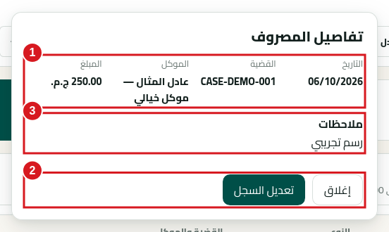

1. التفاصيل: اقرأ بيانات هذا القسم واتبع الخطوات أعلاه.
2. أزرار الإجراء: احفظ أو أكد عند اكتمال البيانات؛ إلغاء يحتفظ بالحالة السابقة.
3. التفاصيل: اقرأ بيانات هذا القسم واتبع الخطوات أعلاه.

## النسخ الاحتياطي والاستعادة

### شاشة النسخ الاحتياطي

أنشئ نسخة الآن؛ تُحفظ في مجلد Backups داخل بيانات التطبيق. آخر نسخة يعرض التاريخ والحجم وتنبيهًا إذا كانت قديمة. انسخ الأرشيف إلى وسيط آمن كإجراء يدوي. النسخ تلقائيًا أو تغيير وجهة الحفظ غير متاحين.

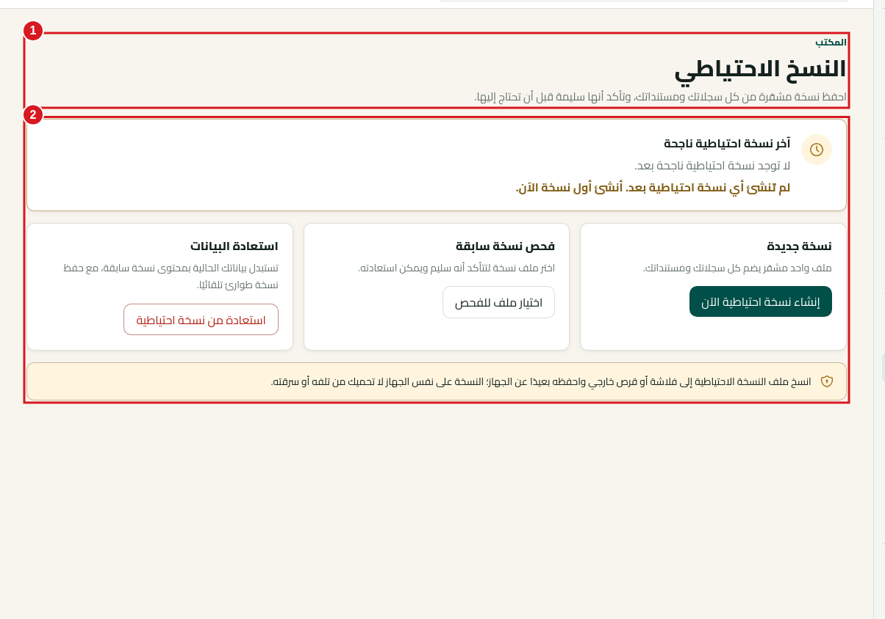

1. هوية الصفحة وإجراءاتها: راجع العنوان قبل الإضافة أو التعديل.
2. التفاصيل: اقرأ بيانات هذا القسم واتبع الخطوات أعلاه.

### نجاح إنشاء النسخة

رسالة النجاح تعني أن التطبيق أنشأ الأرشيف المشفر وفحصه. تشمل النسخة قاعدة البيانات والمستندات المدارة. تحقق من أحدث تاريخ بعد العملية.

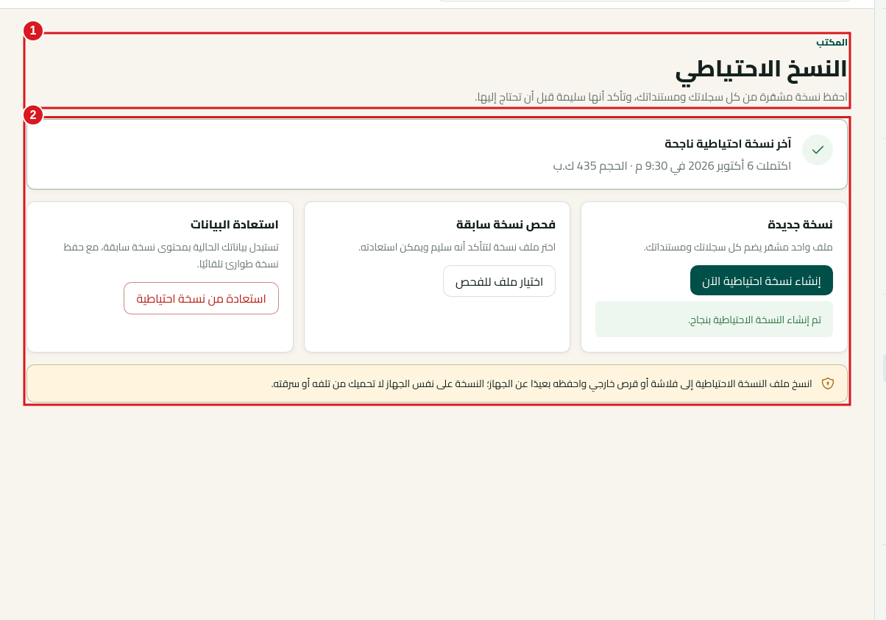

1. هوية الصفحة وإجراءاتها: راجع العنوان قبل الإضافة أو التعديل.
2. التفاصيل: اقرأ بيانات هذا القسم واتبع الخطوات أعلاه.

### فحص النسخة الاحتياطية

اضغط فحص ثم اختر الأرشيف من نافذة النظام. النجاح يثبت سلامة بنية النسخة والتحقق من محتواها في هذه المساحة؛ لا يثبت إمكانية نقلها إلى جهاز جديد.

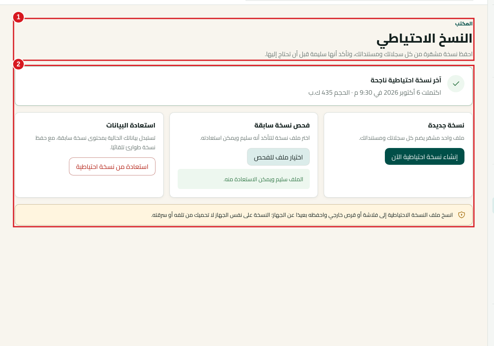

1. هوية الصفحة وإجراءاتها: راجع العنوان قبل الإضافة أو التعديل.
2. التفاصيل: اقرأ بيانات هذا القسم واتبع الخطوات أعلاه.

### تأكيد الاستعادة

الاستعادة تستبدل الحالة الحالية بحالة النسخة. احتفظ بنسخة حديثة قبلها. راجع التحذير ثم أكد أو ألغِ. لا توجد معاينة لما سيُستعاد.

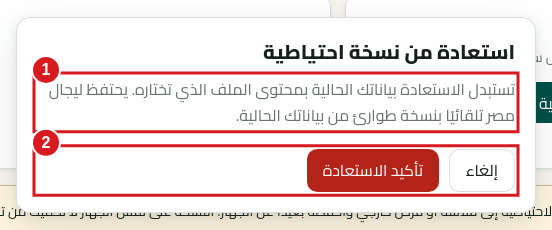

1. التأكيد: اقرأ ما سيحدث قبل الموافقة.
2. أزرار الإجراء: احفظ أو أكد عند اكتمال البيانات؛ إلغاء يحتفظ بالحالة السابقة.

### رفض نسخة تالفة

النسخة غير الصالحة تُرفض وتظل البيانات الحالية كما هي. اختر نسخة صحيحة وأعد الفحص؛ لا تغيّر محتوى الأرشيف يدويًا.

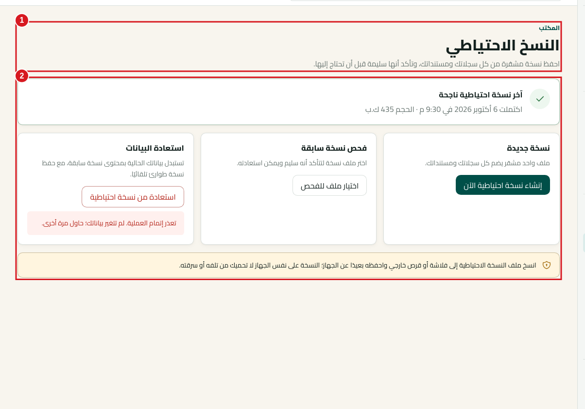

1. هوية الصفحة وإجراءاتها: راجع العنوان قبل الإضافة أو التعديل.
2. التفاصيل: اقرأ بيانات هذا القسم واتبع الخطوات أعلاه.

### القفل بعد الاستعادة

بعد استعادة ناجحة يُقفل التطبيق. افتحه بكلمة المرور وتحقق من السجلات والمستندات عند تاريخ النسخة. التغييرات التي حدثت بعدها لا توجد في الحالة المستعادة. النقل إلى مساحة جديدة بكلمة المرور وحدها غير مدعوم حاليًا.

1. كلمة المرور: استخدم 12 حرفًا على الأقل واحفظها بأمان.
2. أزرار الإجراء: احفظ أو أكد عند اكتمال البيانات؛ إلغاء يحتفظ بالحالة السابقة.

## الإعدادات

### بيانات المحامي

عدل الاسم ورقم القيد والهاتف وعنوان المكتب ثم احفظ. هذه بيانات مكتبك وليست حسابًا على الإنترنت.

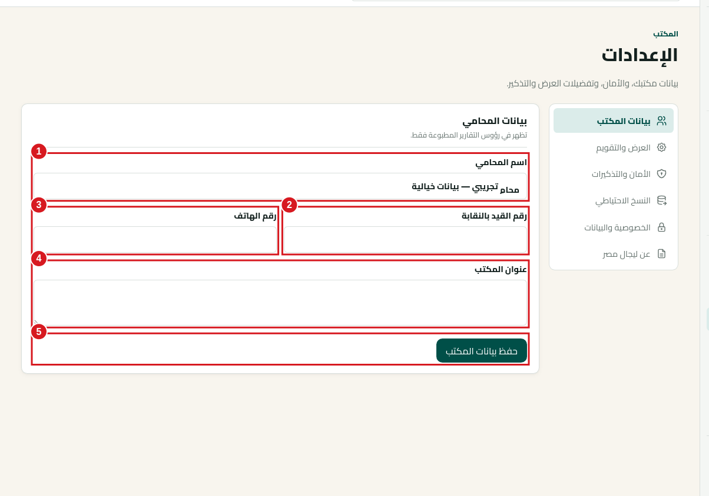

1. اسم المحامي: راجع القيمة أو أدخل البيانات المناسبة لهذا الحقل ثم احفظ النموذج.
2. رقم القيد بالنقابة: راجع القيمة أو أدخل البيانات المناسبة لهذا الحقل ثم احفظ النموذج.
3. رقم الهاتف: راجع القيمة أو أدخل البيانات المناسبة لهذا الحقل ثم احفظ النموذج.
4. عنوان المكتب: راجع القيمة أو أدخل البيانات المناسبة لهذا الحقل ثم احفظ النموذج.
5. أزرار الإجراء: احفظ أو أكد عند اكتمال البيانات؛ إلغاء يحتفظ بالحالة السابقة.

### العرض والتقويم

اختر العربية أو الإنجليزية، والمظهر الفاتح أو الداكن أو النظام، وصيغة التاريخ وبداية الأسبوع ومهلة التذكير الافتراضية ثم احفظ. لا يوجد حقل تذكير منفصل في نماذج المهام والجلسات الحالية.

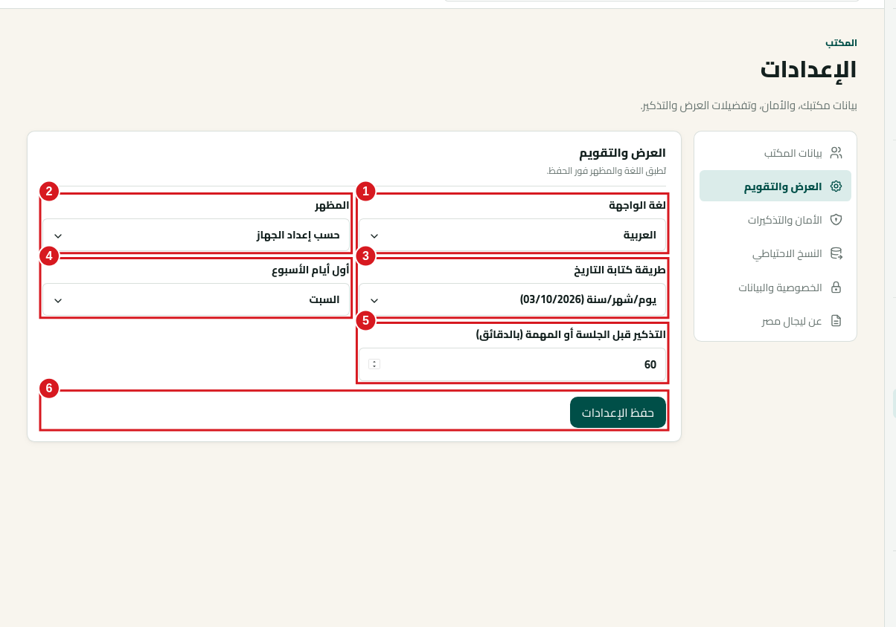

1. لغة الواجهة: راجع القيمة أو أدخل البيانات المناسبة لهذا الحقل ثم احفظ النموذج.
2. المظهر: راجع القيمة أو أدخل البيانات المناسبة لهذا الحقل ثم احفظ النموذج.
3. طريقة كتابة التاريخ: اكتب يوم/شهر/سنة أو سنة-شهر-يوم ثم انتقل لحقل آخر، أو اختر اليوم من التقويم.
4. أول أيام الأسبوع: راجع القيمة أو أدخل البيانات المناسبة لهذا الحقل ثم احفظ النموذج.
5. التذكير قبل الجلسة أو المهمة (بالدقائق): راجع القيمة أو أدخل البيانات المناسبة لهذا الحقل ثم احفظ النموذج.
6. أزرار الإجراء: احفظ أو أكد عند اكتمال البيانات؛ إلغاء يحتفظ بالحالة السابقة.

### الأمان والتنبيهات

حدد مهلة القفل واحفظ. التشغيل مع النظام اختياري؛ التنبيهات تتطلب إذن النظام وتشغيل التطبيق. تغيير كلمة المرور يتطلب الحالية والجديدة وتأكيدها. العدادات المحلية اختيارية ولا ترسل بيانات القضايا. راجع الجزء السفلي من الصفحة أيضًا.

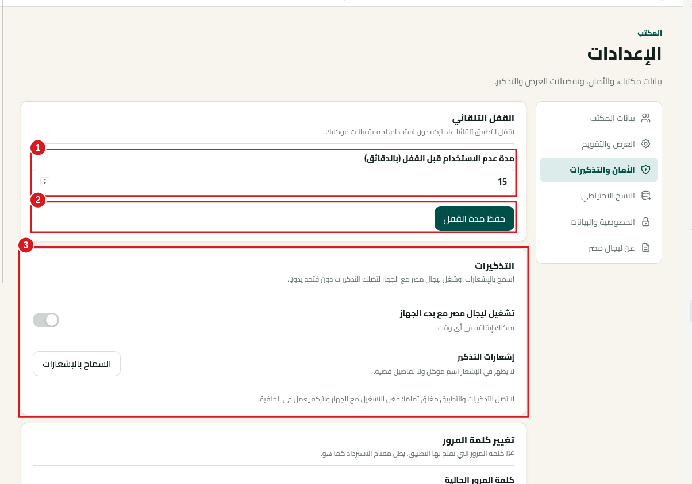

1. مدة عدم الاستخدام قبل القفل (بالدقائق): راجع القيمة أو أدخل البيانات المناسبة لهذا الحقل ثم احفظ النموذج.
2. أزرار الإجراء: احفظ أو أكد عند اكتمال البيانات؛ إلغاء يحتفظ بالحالة السابقة.
3. التفاصيل: اقرأ بيانات هذا القسم واتبع الخطوات أعلاه.

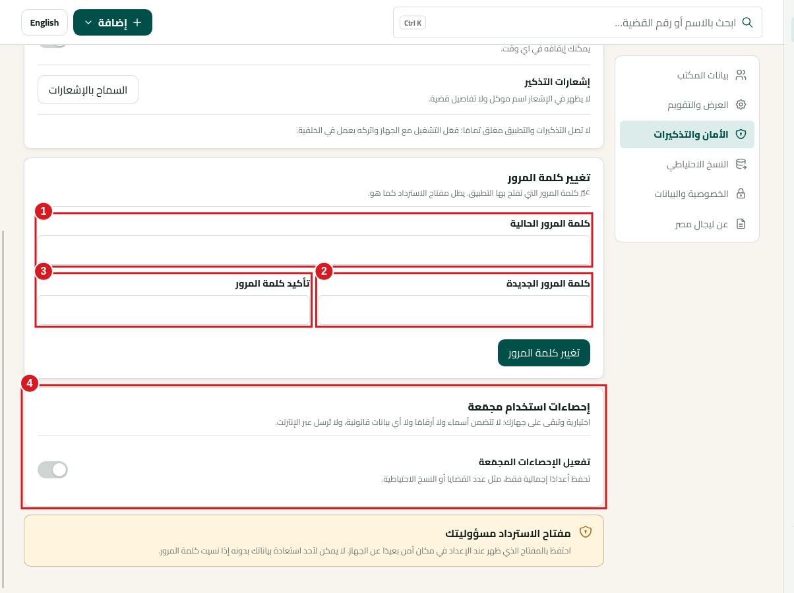

1. كلمة المرور الحالية: استخدم 12 حرفًا على الأقل واحفظها بأمان.
2. كلمة المرور الجديدة: استخدم 12 حرفًا على الأقل واحفظها بأمان.
3. تأكيد كلمة المرور: استخدم 12 حرفًا على الأقل واحفظها بأمان.
4. التفاصيل: اقرأ بيانات هذا القسم واتبع الخطوات أعلاه.

### النسخ من الإعدادات

تحتوي الإعدادات على أدوات إنشاء النسخة وفحصها واستعادتها نفسها الموجودة في قسم النسخ الاحتياطي. لا يلزم إعداد النسخ لإكمال بدء الاستخدام.

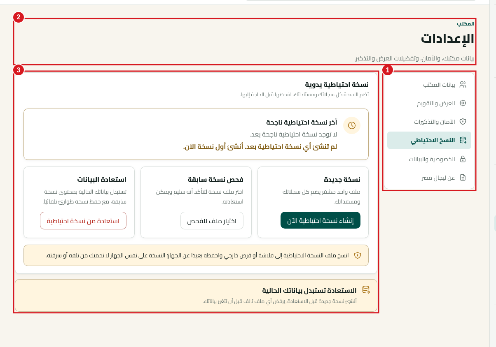

1. التبويبات والعرض: انتقل إلى القسم الذي تريد مراجعته.
2. هوية الصفحة وإجراءاتها: راجع العنوان قبل الإضافة أو التعديل.
3. التفاصيل: اقرأ بيانات هذا القسم واتبع الخطوات أعلاه.

### الخصوصية وموقع البيانات

راجع معلومات التخزين والمستندات والنسخ والاتصال بالشبكة. قاعدة البيانات مشفرة، لكن ملفات المستندات المدارة غير مشفرة كلٌ على حدة؛ استخدم حساب نظام محميًا وتشفير القرص.

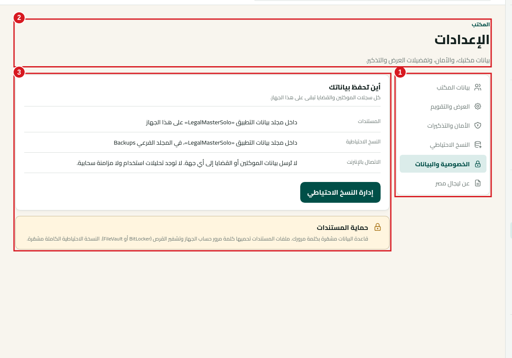

1. التبويبات والعرض: انتقل إلى القسم الذي تريد مراجعته.
2. هوية الصفحة وإجراءاتها: راجع العنوان قبل الإضافة أو التعديل.
3. التفاصيل: اقرأ بيانات هذا القسم واتبع الخطوات أعلاه.

### عن التطبيق

راجع اسم المنتج ورقم الإصدار وحالة التطبيق وروابط المعلومات المتاحة. التطبيق الحالي قبل الإصدار التجريبي؛ لا تعني نجاح اختبارات Linux اعتماد Windows أو macOS.

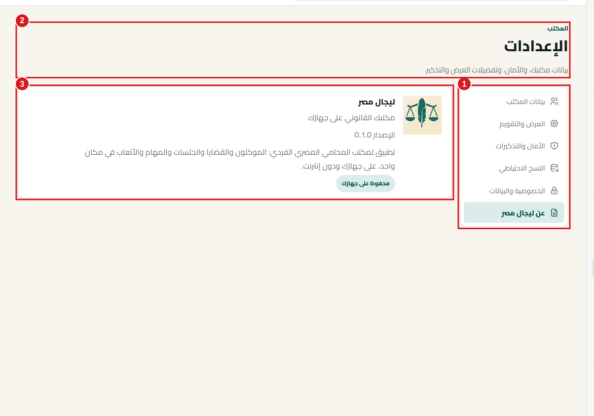

1. التبويبات والعرض: انتقل إلى القسم الذي تريد مراجعته.
2. هوية الصفحة وإجراءاتها: راجع العنوان قبل الإضافة أو التعديل.
3. التفاصيل: اقرأ بيانات هذا القسم واتبع الخطوات أعلاه.

### تصحيح تأكيد كلمة المرور

إذا لم تتطابق الجديدة وتأكيدها تظهر رسالة ويبقى التغيير غير محفوظ. أدخلهما متطابقتين؛ يجب ألا تقل الجديدة عن 12 حرفًا.

1. مدة عدم الاستخدام قبل القفل (بالدقائق): راجع القيمة أو أدخل البيانات المناسبة لهذا الحقل ثم احفظ النموذج.
2. أزرار الإجراء: احفظ أو أكد عند اكتمال البيانات؛ إلغاء يحتفظ بالحالة السابقة.
3. التفاصيل: اقرأ بيانات هذا القسم واتبع الخطوات أعلاه.

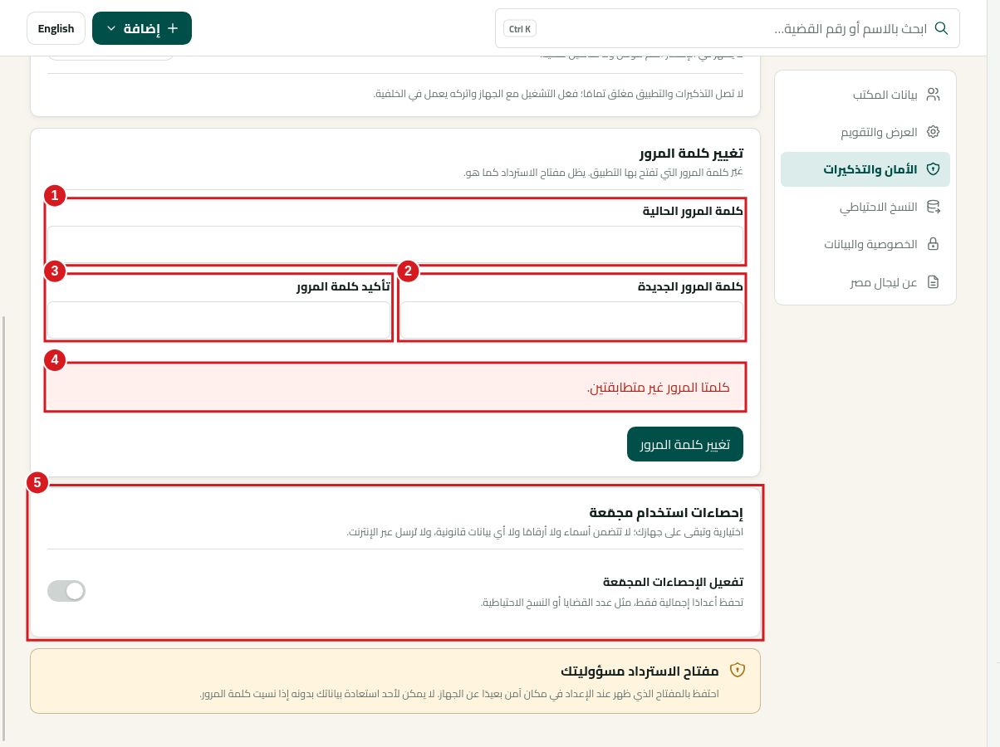

1. كلمة المرور الحالية: استخدم 12 حرفًا على الأقل واحفظها بأمان.
2. كلمة المرور الجديدة: استخدم 12 حرفًا على الأقل واحفظها بأمان.
3. تأكيد كلمة المرور: استخدم 12 حرفًا على الأقل واحفظها بأمان.
4. رسالة الخطأ: صحح السبب الموضح ثم أعد المحاولة.
5. التفاصيل: اقرأ بيانات هذا القسم واتبع الخطوات أعلاه.

## استكشاف المشكلات والحدود الحالية

| المشكلة                  | ما يمكنك فعله                                                                                     |
| ------------------------ | ------------------------------------------------------------------------------------------------- |
| رقم داخلي مستخدم         | اختر رقمًا آخر؛ الرقم الداخلي يجب أن يكون فريدًا.                                                 |
| لا يظهر الموكل أو القضية | أزل الفلاتر وجرب إظهار المؤرشف ثم ابحث بالرقم الداخلي.                                            |
| دافع الدفعة غير متاح     | يجب اختيار الموكل عند إنشاء القضية؛ تغيير روابط الموكلين بعد الإنشاء غير متاح في الواجهة الحالية. |
| تاريخ غير مقبول          | اختره من التقويم أو اكتب تاريخًا حقيقيًا بصيغة يوم/شهر/سنة.                                       |
| ملف مستند مفقود          | تحقق من النسخة المدارة أو استعد نسخة سليمة في مساحة البيانات الأصلية.                             |
| تنبيه لا يظهر            | تحقق من إذن النظام ومن تشغيل التطبيق؛ تحقق المنصات الفعلي ما زال معلقًا.                          |
| نسخة احتياطية تالفة      | لا تُستبدل البيانات الحالية؛ جرب أرشيفًا صحيحًا.                                                  |
| نسيان كلمة المرور        | استخدم مفتاح الاسترداد؛ لا يوجد استرداد عبر البريد أو الدعم.                                      |

**حدود مهمة:** لا يدعم الإصدار الحالي نقل نسخة إلى مساحة جديدة بكلمة المرور وحدها، أو النسخ التلقائي أو الاحتفاظ المجدول، أو معاينة الاستعادة، أو تصدير كامل للبيانات أو للقضية، أو حذفًا نهائيًا للموكلين والقضايا. التطبيق لمكتب فردي وليس نظام محاسبة أو تعاون متعدد المستخدمين.

## حول هذا الدليل

الصور مأخوذة من تطبيق Tauri الحقيقي على Linux، باستخدام مساحة بيانات مؤقتة خيالية وعمليات حفظ فعلية. اختيار الملفات في الاختبارات يستخدم بديلًا محددًا مسبقًا؛ نوافذ النظام والتثبيت والتنبيهات على Windows وmacOS لم تُعتمد بهذه الصور. مفتاح الاسترداد محجوب عمدًا.

Source revision: 93433d750482f2f11a8168d31abaf5e75644a85a. Working-tree changes included. Capture date: 2026-10-06.
