# Legal Masr user guide

A desktop organizer for Egyptian solo lawyers: clients, cases, powers of attorney, hearings, tasks, documents, and finances on your computer. Daily use needs no internet or account. This guide documents pre-beta version 0.1.0. All pictured records and files are fictional.

Numbers inside red marks correspond to explanations below each screenshot. Long pages are split into successive screenshots. Open full-size images from HTML or the image folder. Instructions describe the current interface and do not promise future features.

**Suggested daily flow:** add a client → record a power of attorney if needed → create a case and link clients → add hearings and tasks → attach documents → record fees and payments → create a backup.

## Getting started and protecting access

### First-run setup

Enter the lawyer’s name and a password of at least 12 characters, confirm it, and choose Start using the app. No online account is needed. You can edit the name later. Keep the password safe.

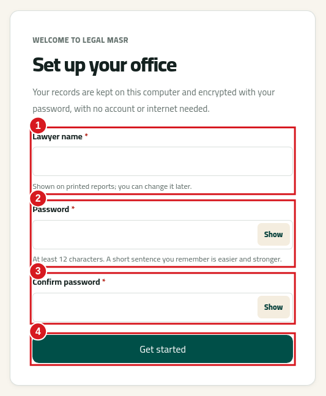

1. Lawyer name: Enter the full name so you can locate the record.
2. Password: Use at least 12 characters and keep it safe.
3. Confirm password: Use at least 12 characters and keep it safe.
4. Action buttons: save or confirm when ready; Cancel keeps the previous state.

### Correcting setup details

Leaving required fields empty shows messages beside them. Complete the name, password, and confirmation, then retry. Setup does not create a vault until it succeeds.

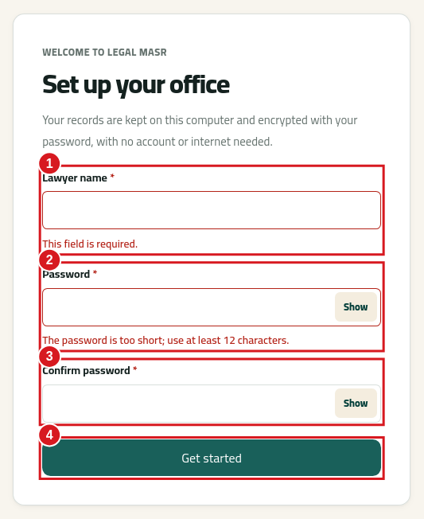

1. Lawyer name: Enter the full name so you can locate the record.
2. Password: Use at least 12 characters and keep it safe.
3. Confirm password: Use at least 12 characters and keep it safe.
4. Action buttons: save or confirm when ready; Cancel keeps the previous state.

### Saving the recovery key

The recovery key appears once after setup. Write it down and store it separately from the computer; do not send it to support. Its value is intentionally hidden in this screenshot. Confirm you saved it, then continue. The key recovers access to this vault; a backup preserves records and files.

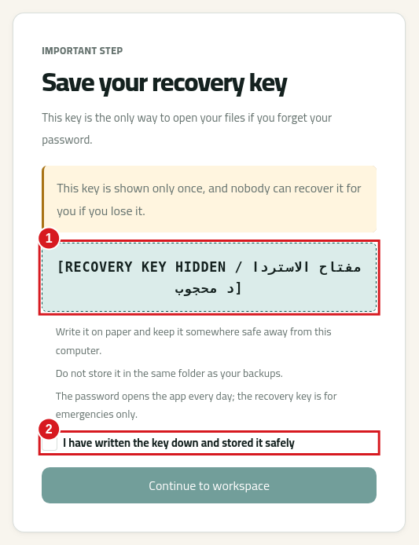

1. Recovery key: hidden in the guide; save your real key separately from the computer.
2. Saved-key confirmation: continue only after safely storing your key.

### Unlocking the vault

Enter your password and choose Unlock. This screen appears after locking or restarting the app. The password visibility control is optional; use it only when nobody can see the screen.

1. Password: Use at least 12 characters and keep it safe.
2. Action buttons: save or confirm when ready; Cancel keeps the previous state.

### Incorrect password

An incorrect password is refused and records remain locked. Check keyboard language and letter case, then retry. If you forgot it, use the recovery-key link.

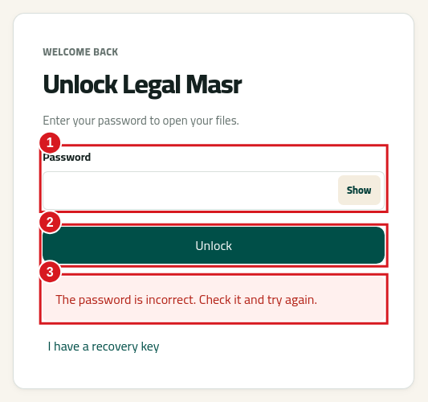

1. Password: Use at least 12 characters and keep it safe.
2. Action buttons: save or confirm when ready; Cancel keeps the previous state.
3. Error: correct the stated cause, then retry.

### Recovering access

From Unlock, choose the recovery-key link. Enter your saved key and a new password of at least 12 characters, confirm it, and choose Recover access. Back returns to Unlock. Email recovery is unavailable.

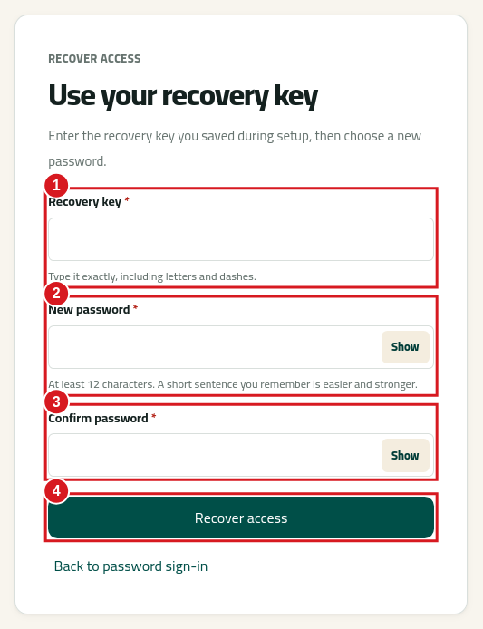

1. Recovery key: review the value or enter the relevant information, then save the form.
2. New password: Use at least 12 characters and keep it safe.
3. Confirm password: Use at least 12 characters and keep it safe.
4. Action buttons: save or confirm when ready; Cancel keeps the previous state.

## Workspace and your day

### Navigation, search, and locking

Choose a section in the sidebar. Header search finds clients, cases, and powers of attorney. Add provides shortcuts to a new client, case, hearing, or task. Lock immediately hides records; returning requires the password. العربية and English switch interface language.

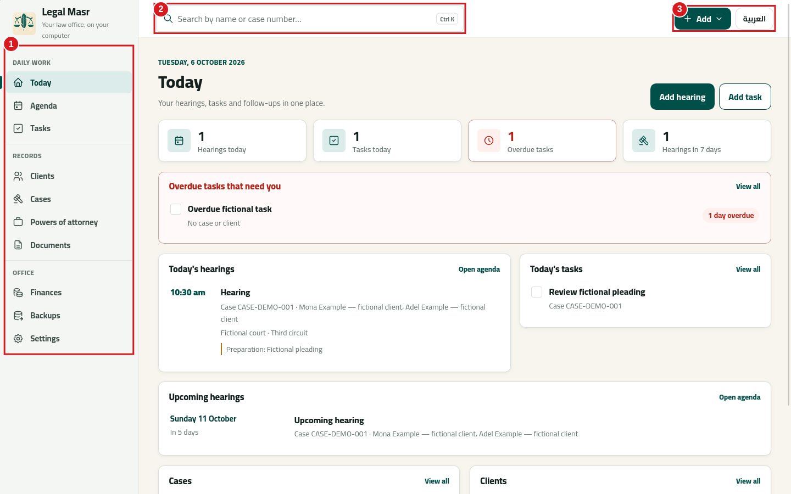

1. Sections: select one to open its page.
2. Search: type a name or number and choose a result.
3. Add, language, and lock: workspace shortcuts.

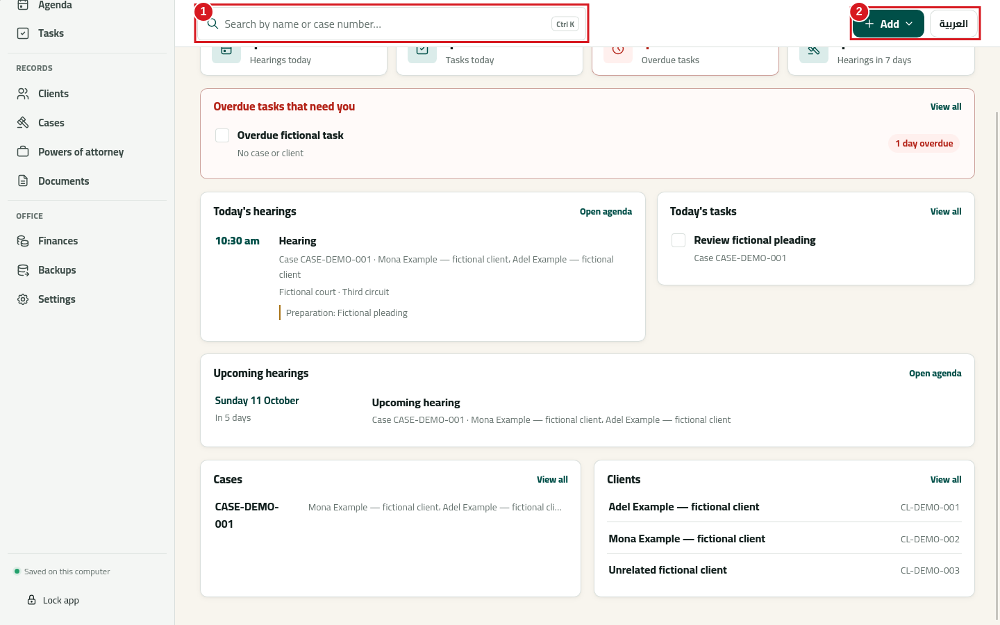

1. Search: type a name or number and choose a result.
2. Add, language, and lock: workspace shortcuts.

### Quick-add menu

Open Add and choose the record type. The app opens the corresponding form; selecting a shortcut alone does not save a record. Add documents from their owning record.

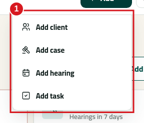

1. Records and actions: open a record or use its adjacent action.

### Today dashboard

Start by reviewing today’s hearings, due and overdue tasks, and upcoming hearings. Open the linked record for details or to record a decision. Language and date preferences affect presentation; legal dates do not shift with time zones.

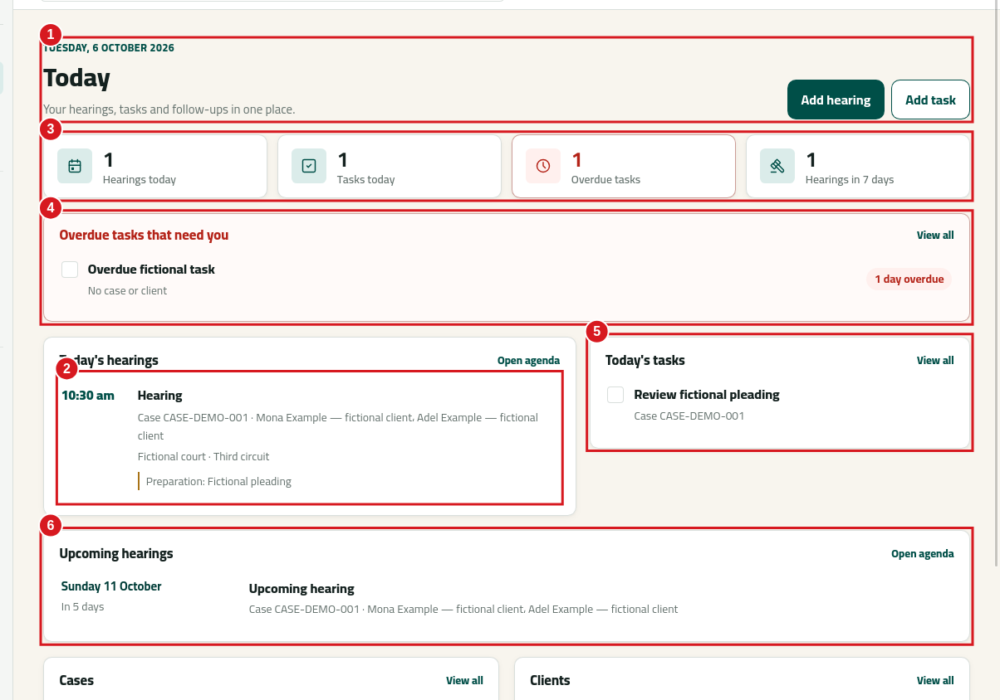

1. Page identity and actions: check the heading before adding or editing.
2. Schedule: review dates, links, and preparation details.
3. Details: review this section and follow the instructions above.
4. Schedule: review dates, links, and preparation details.
5. Schedule: review dates, links, and preparation details.
6. Schedule: review dates, links, and preparation details.

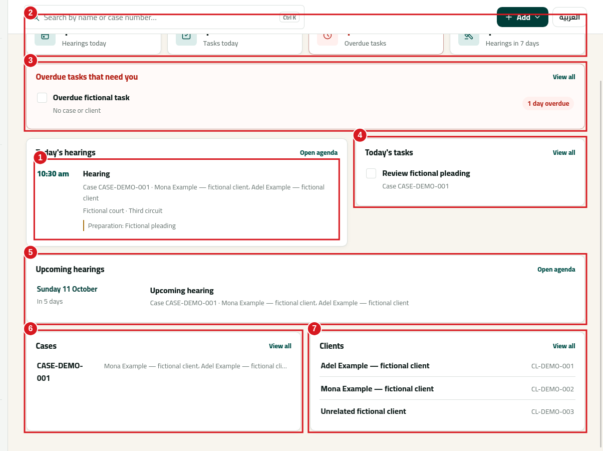

1. Schedule: review dates, links, and preparation details.
2. Details: review this section and follow the instructions above.
3. Schedule: review dates, links, and preparation details.
4. Schedule: review dates, links, and preparation details.
5. Schedule: review dates, links, and preparation details.
6. Schedule: review dates, links, and preparation details.
7. Schedule: review dates, links, and preparation details.

### Global search results

Type a name or number into search. Results are grouped by record type. Select a result to open its file. Search normalizes Arabic letters and digits; it does not search document contents.

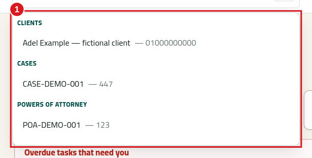

1. Records and actions: open a record or use its adjacent action.

### Keyboard search

Press Ctrl+K or Command+K to open search. Type your query, use Up/Down arrows and Enter to choose a result. Escape closes the window.

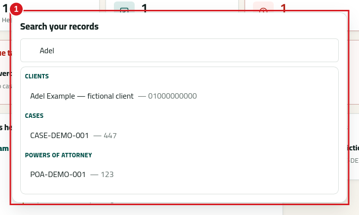

1. Records and actions: open a record or use its adjacent action.

## Clients

### Client list

Search by name or number, then open a file from its row. Show archived includes archived clients. Choose Add client to start a new record.

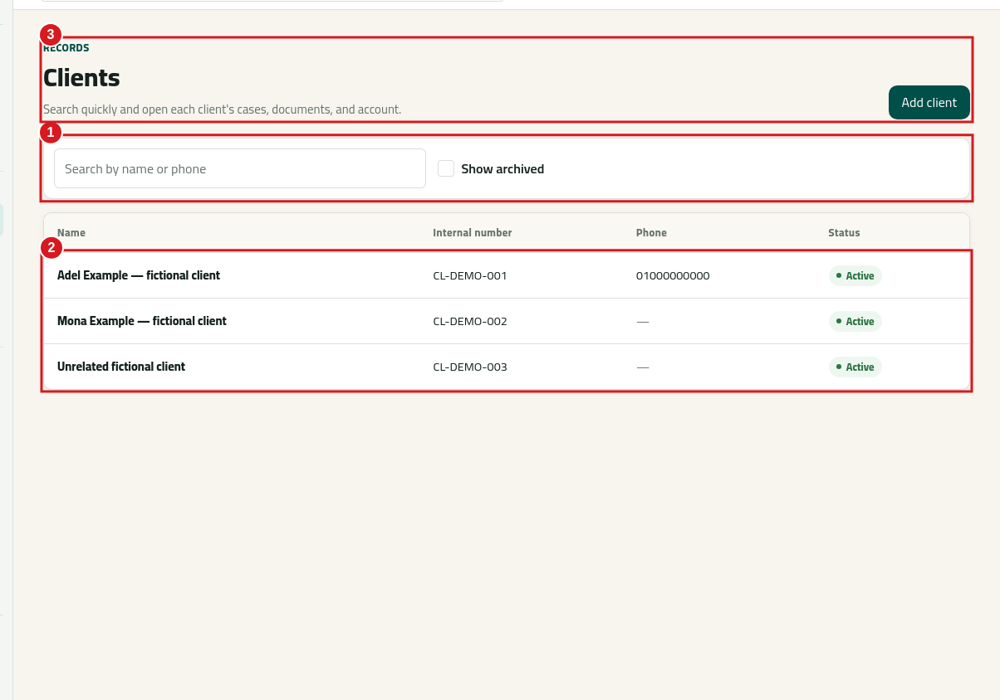

1. Filters: choose what to display; filters do not change records.
2. Records and actions: open a record or use its adjacent action.
3. Page identity and actions: check the heading before adding or editing.

### Adding a client

Internal client number and full name are required. Add phone, email, address, national ID, and notes as needed. Use a unique internal number, then save; the client file opens after saving.

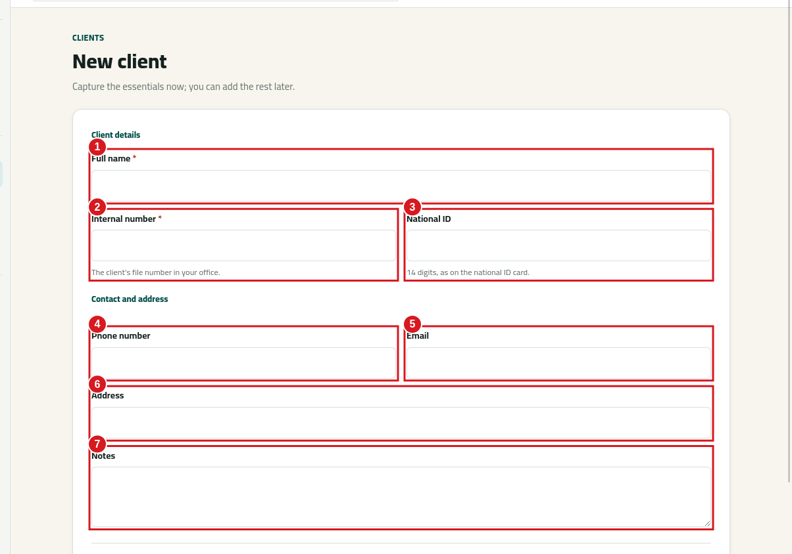

1. Full name: Enter the full name so you can locate the record.
2. Internal number: Unique office identifier; separate from the official reference.
3. National ID: review the value or enter the relevant information, then save the form.
4. Phone number: review the value or enter the relevant information, then save the form.
5. Email: review the value or enter the relevant information, then save the form.
6. Address: review the value or enter the relevant information, then save the form.
7. Notes: Optional additional information saved with the record.

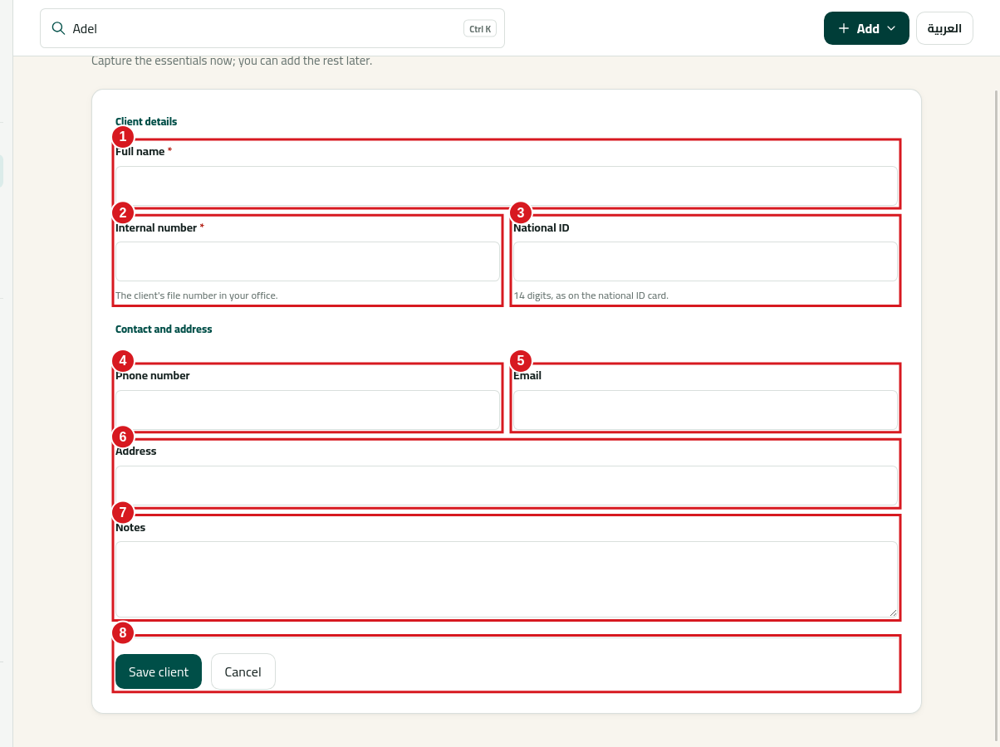

1. Full name: Enter the full name so you can locate the record.
2. Internal number: Unique office identifier; separate from the official reference.
3. National ID: review the value or enter the relevant information, then save the form.
4. Phone number: review the value or enter the relevant information, then save the form.
5. Email: review the value or enter the relevant information, then save the form.
6. Address: review the value or enter the relevant information, then save the form.
7. Notes: Optional additional information saved with the record.
8. Action buttons: save or confirm when ready; Cancel keeps the previous state.

### Required client fields

Saving an empty form shows required-field errors. Correct the internal number and name, then save. Do not invent values just to bypass validation in real records.

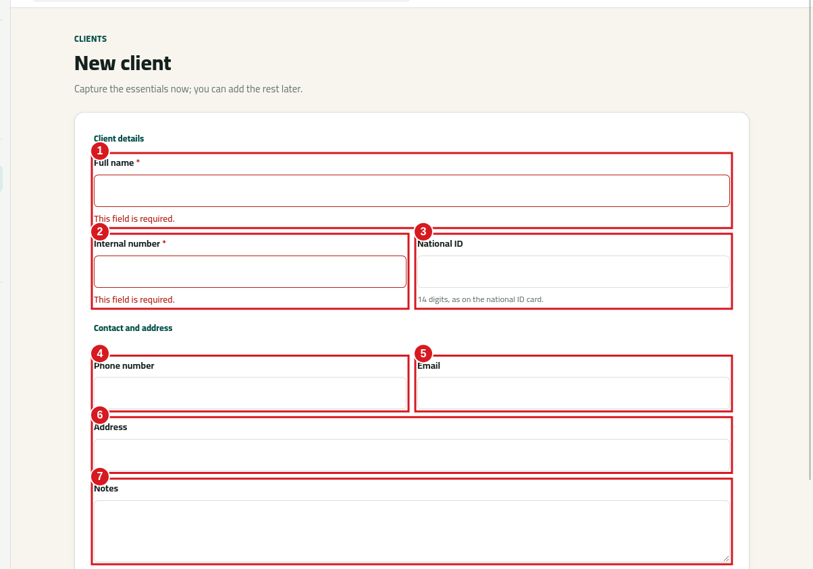

1. Full name: Enter the full name so you can locate the record.
2. Internal number: Unique office identifier; separate from the official reference.
3. National ID: review the value or enter the relevant information, then save the form.
4. Phone number: review the value or enter the relevant information, then save the form.
5. Email: review the value or enter the relevant information, then save the form.
6. Address: review the value or enter the relevant information, then save the form.
7. Notes: Optional additional information saved with the record.

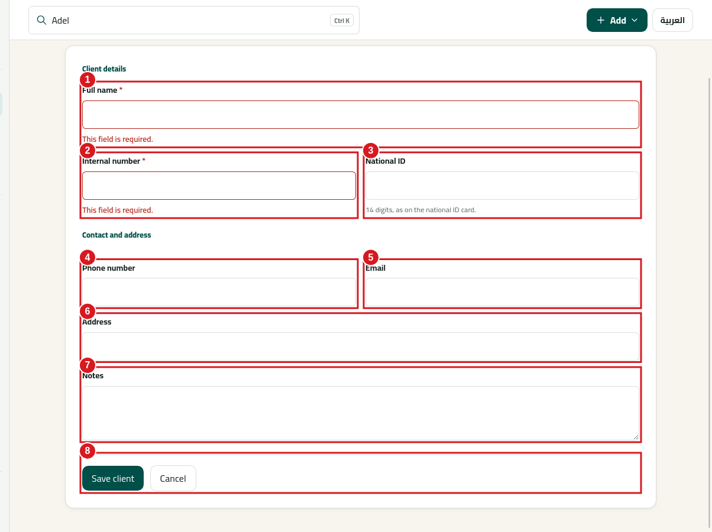

1. Full name: Enter the full name so you can locate the record.
2. Internal number: Unique office identifier; separate from the official reference.
3. National ID: review the value or enter the relevant information, then save the form.
4. Phone number: review the value or enter the relevant information, then save the form.
5. Email: review the value or enter the relevant information, then save the form.
6. Address: review the value or enter the relevant information, then save the form.
7. Notes: Optional additional information saved with the record.
8. Action buttons: save or confirm when ready; Cancel keeps the previous state.

### Possible duplicate warning

When client details resemble an existing record, review the displayed candidates first. Correct the details or open the existing file; confirm a separate client only if it is a different person. The warning does not automatically merge records.

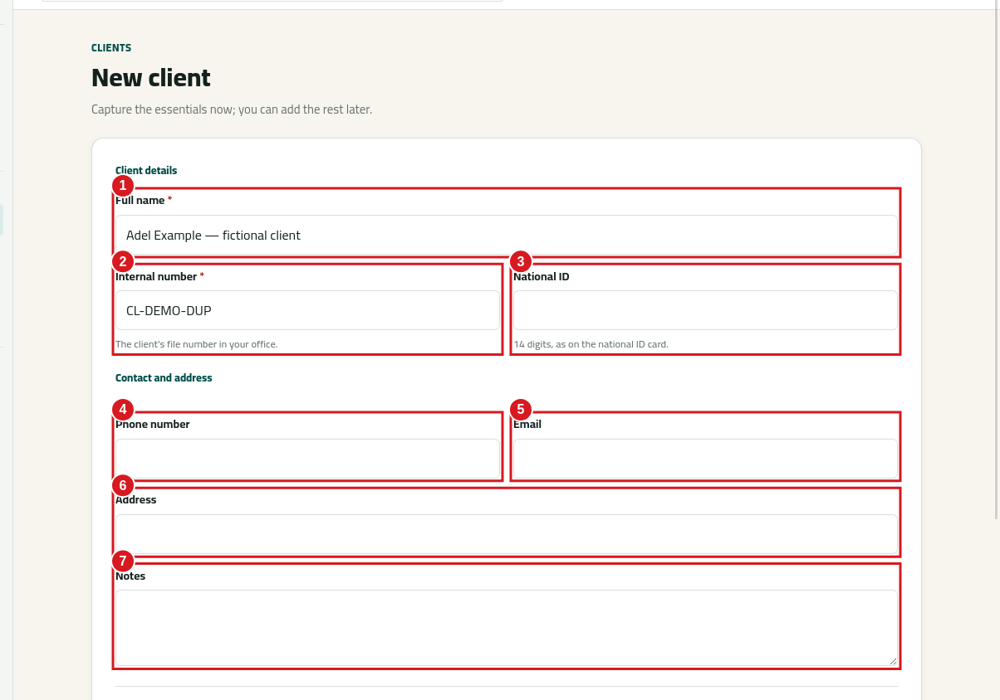

1. Full name: Enter the full name so you can locate the record.
2. Internal number: Unique office identifier; separate from the official reference.
3. National ID: review the value or enter the relevant information, then save the form.
4. Phone number: review the value or enter the relevant information, then save the form.
5. Email: review the value or enter the relevant information, then save the form.
6. Address: review the value or enter the relevant information, then save the form.
7. Notes: Optional additional information saved with the record.

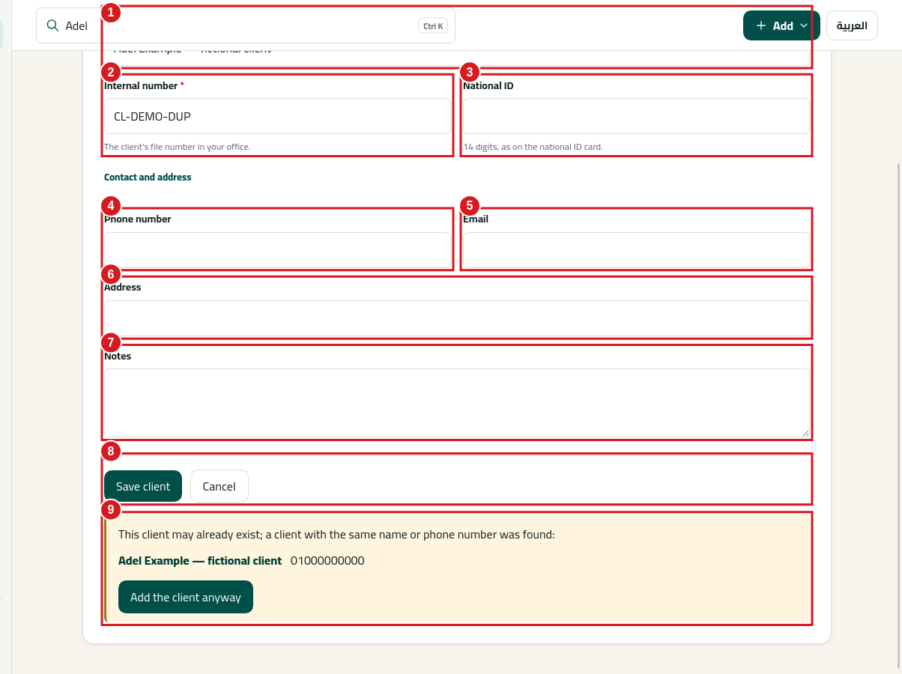

1. Full name: Enter the full name so you can locate the record.
2. Internal number: Unique office identifier; separate from the official reference.
3. National ID: review the value or enter the relevant information, then save the form.
4. Phone number: review the value or enter the relevant information, then save the form.
5. Email: review the value or enter the relevant information, then save the form.
6. Address: review the value or enter the relevant information, then save the form.
7. Notes: Optional additional information saved with the record.
8. Action buttons: save or confirm when ready; Cancel keeps the previous state.
9. Error: correct the stated cause, then retry.

### Client summary

Review contact details, internal number, and linked cases. A dash means the field was not recorded.

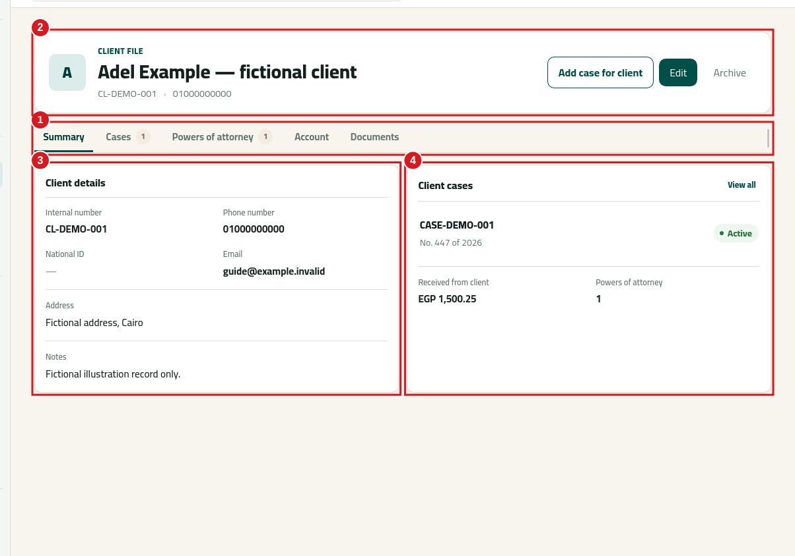

1. Tabs and views: switch to the section you want to review.
2. Page identity and actions: check the heading before adding or editing.
3. Details: review this section and follow the instructions above.
4. Details: review this section and follow the instructions above.

### Client cases

Open a linked case or choose Add case for client to start a case with this client already selected.

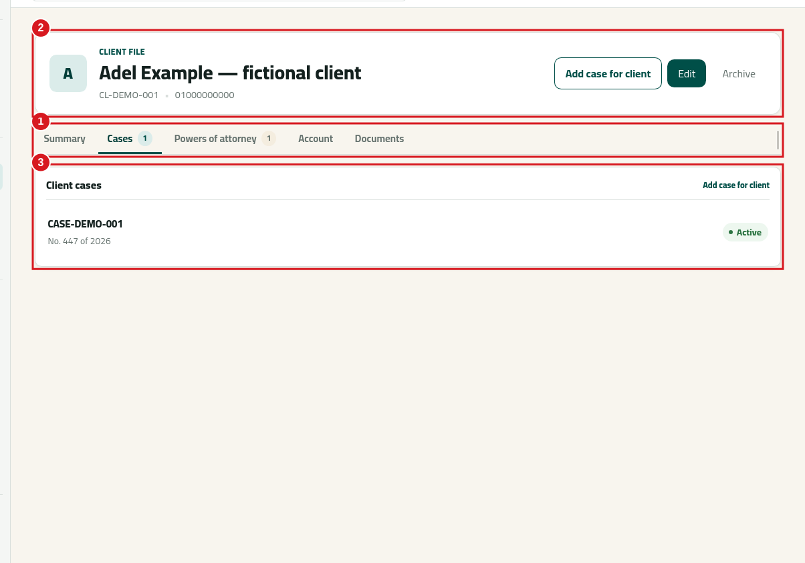

1. Tabs and views: switch to the section you want to review.
2. Page identity and actions: check the heading before adding or editing.
3. Details: review this section and follow the instructions above.

### Client powers of attorney

Open a linked power of attorney to inspect it. Manage powers of attorney returns to the list.

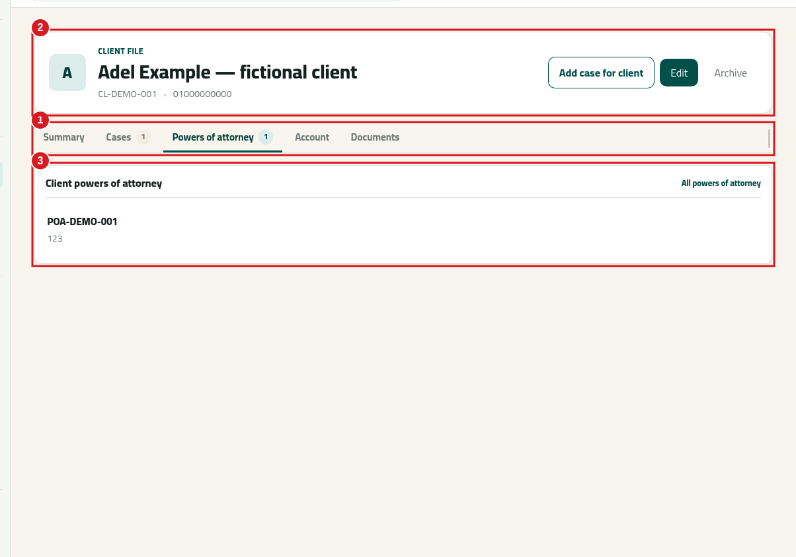

1. Tabs and views: switch to the section you want to review.
2. Page identity and actions: check the heading before adding or editing.
3. Details: review this section and follow the instructions above.

### Client account

Review received payments, linked expenses, and net cash. Open the finance ledger for transactions. This view does not allocate shared case fees among clients.

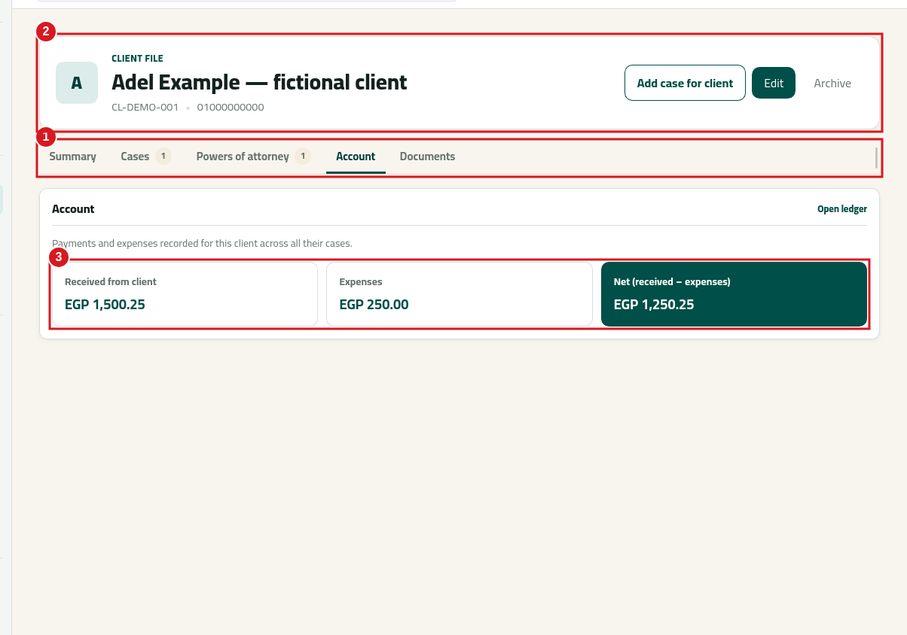

1. Tabs and views: switch to the section you want to review.
2. Page identity and actions: check the heading before adding or editing.
3. Account: review the totals; amounts are in EGP.

### Client documents

Add copies of identification or other documents from this tab. Each attachment here belongs to this client alone.

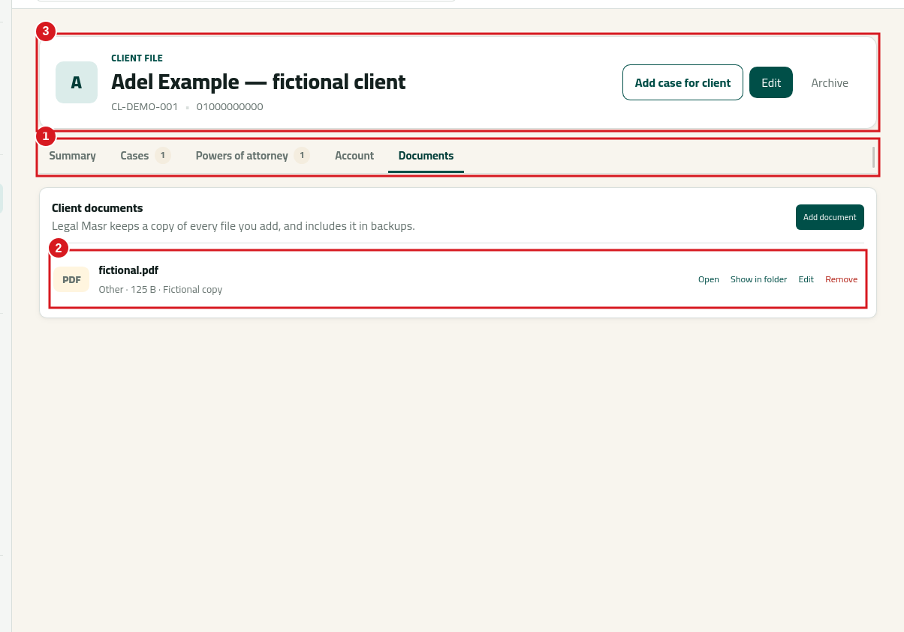

1. Tabs and views: switch to the section you want to review.
2. Records and actions: open a record or use its adjacent action.
3. Page identity and actions: check the heading before adding or editing.

### Editing a client

Choose Edit in the file, change details, and save edits. Cancel closes the form without saving the draft.

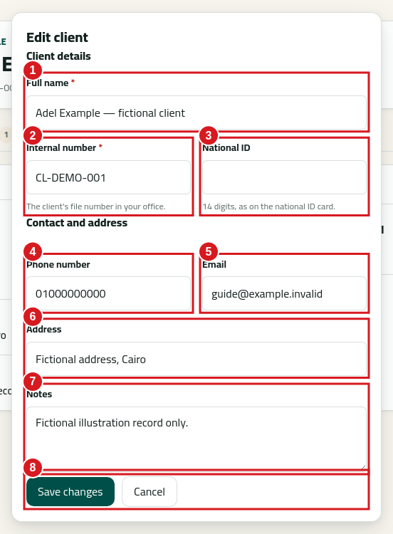

1. Full name: Enter the full name so you can locate the record.
2. Internal number: Unique office identifier; separate from the official reference.
3. National ID: review the value or enter the relevant information, then save the form.
4. Phone number: review the value or enter the relevant information, then save the form.
5. Email: review the value or enter the relevant information, then save the form.
6. Address: review the value or enter the relevant information, then save the form.
7. Notes: Optional additional information saved with the record.
8. Action buttons: save or confirm when ready; Cancel keeps the previous state.

### Archiving a client

Choose Archive and review the confirmation. Archiving hides the client from the usual list without deleting its files. To restore: show archived, open the file, and choose Restore.

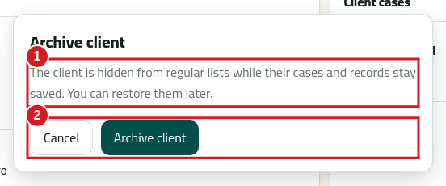

1. Confirmation: read what will happen before proceeding.
2. Action buttons: save or confirm when ready; Cancel keeps the previous state.

### Restoring an archived client

Open the archived client and choose Restore to include it in active lists again. Permanent client deletion is unavailable in the interface.

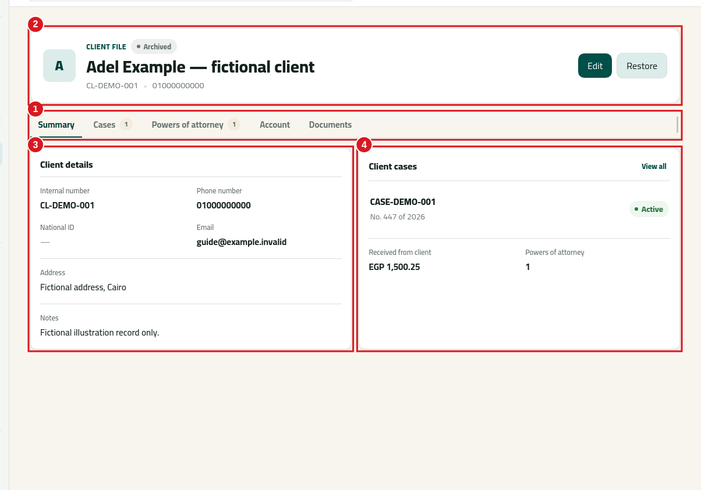

1. Tabs and views: switch to the section you want to review.
2. Page identity and actions: check the heading before adding or editing.
3. Details: review this section and follow the instructions above.
4. Details: review this section and follow the instructions above.

## Powers of attorney

### Power-of-attorney list

Search by power-of-attorney number or details and open it from the row. Show archived includes archived records. Official numbers may repeat; internal sequences must be unique.

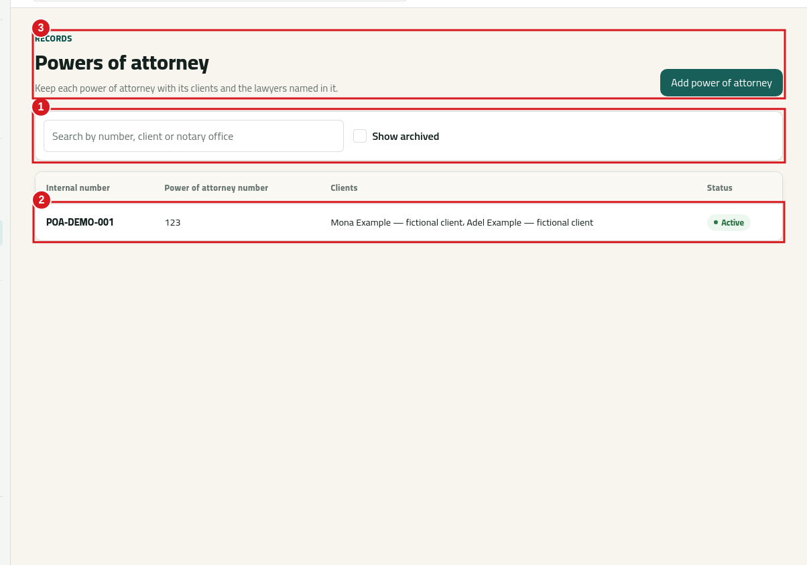

1. Filters: choose what to display; filters do not change records.
2. Records and actions: open a record or use its adjacent action.
3. Page identity and actions: check the heading before adding or editing.

### Adding a power of attorney

Enter the internal sequence, official number, issue date, and notary office. Select clients and add named lawyers and bar numbers as needed. Add lawyer adds an entry to the draft; Save power of attorney saves the full record.

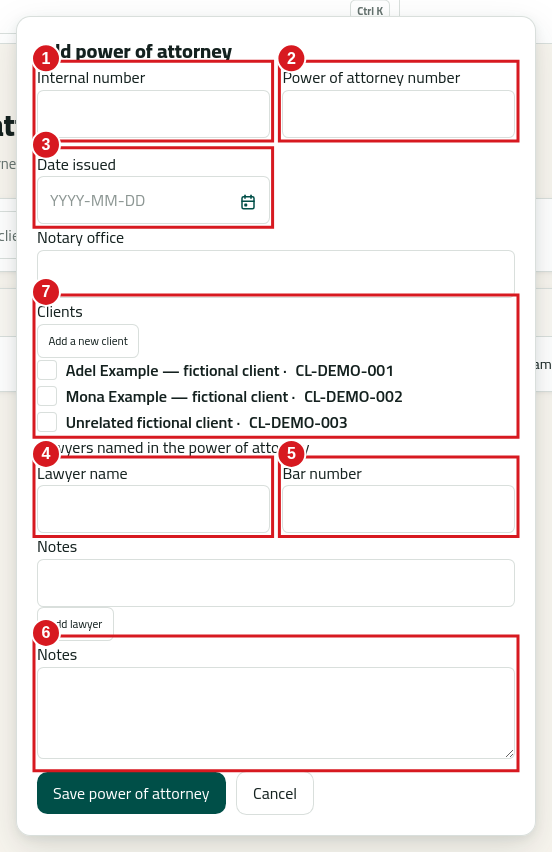

1. Internal number: Unique office identifier; separate from the official reference.
2. Power of attorney number: review the value or enter the relevant information, then save the form.
3. Date issued: Type day/month/year or year-month-day, then leave the field, or choose a day from the calendar.
4. Lawyer name: Enter the full name so you can locate the record.
5. Bar number: review the value or enter the relevant information, then save the form.
6. Notes: Optional additional information saved with the record.
7. Clients: Choose an existing client; payment payers must belong to the case.

### Adding a client inside a power of attorney

Inside the power-of-attorney form, choose Add client. Save the new client; it is automatically selected in the power-of-attorney draft. Saving the client does not also save the power of attorney.

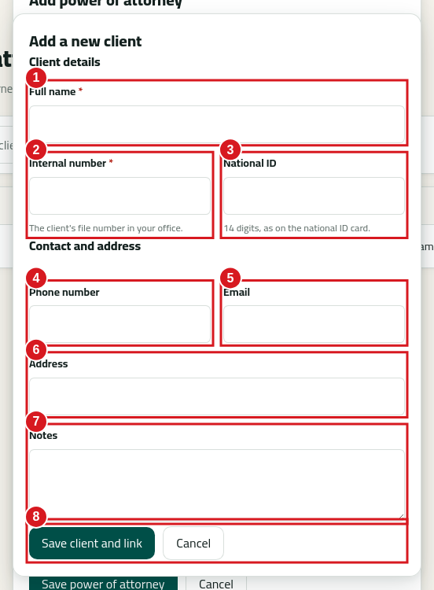

1. Full name: Enter the full name so you can locate the record.
2. Internal number: Unique office identifier; separate from the official reference.
3. National ID: review the value or enter the relevant information, then save the form.
4. Phone number: review the value or enter the relevant information, then save the form.
5. Email: review the value or enter the relevant information, then save the form.
6. Address: review the value or enter the relevant information, then save the form.
7. Notes: Optional additional information saved with the record.
8. Action buttons: save or confirm when ready; Cancel keeps the previous state.

### Power-of-attorney summary

Review the official number, issue date, notary office, and clients.

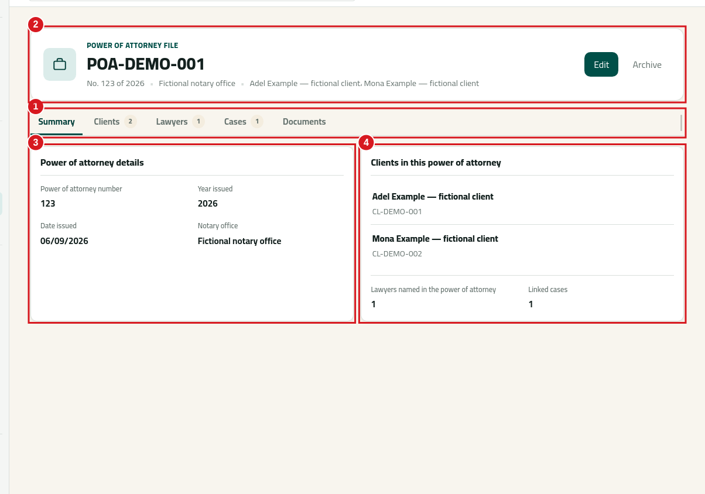

1. Tabs and views: switch to the section you want to review.
2. Page identity and actions: check the heading before adding or editing.
3. Details: review this section and follow the instructions above.
4. Details: review this section and follow the instructions above.

### Power-of-attorney clients

Open linked client files. Edit the power of attorney to change selections.

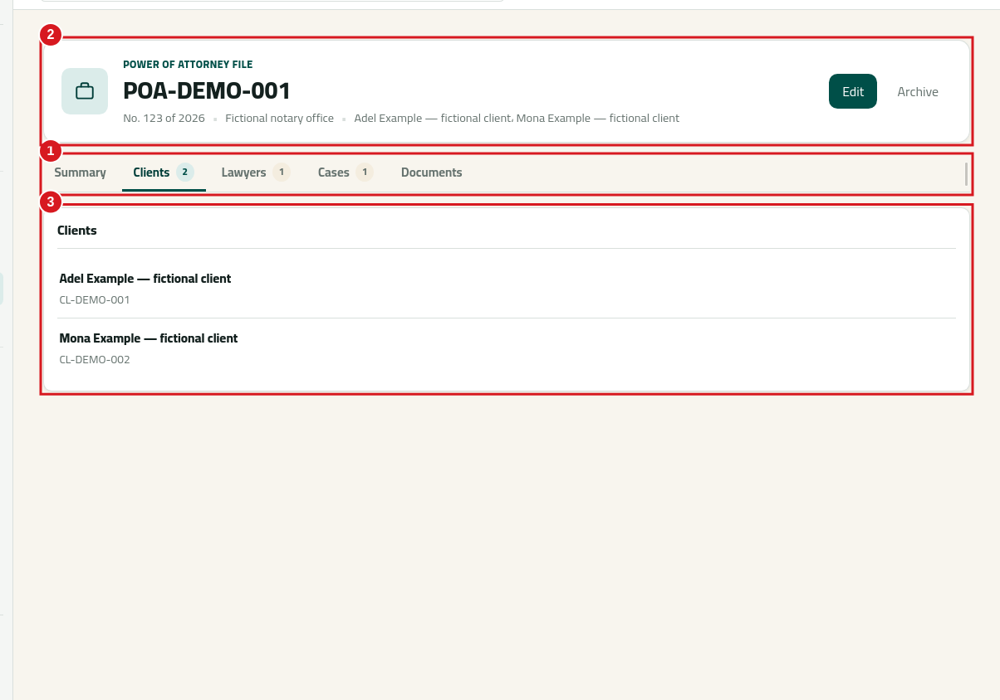

1. Tabs and views: switch to the section you want to review.
2. Page identity and actions: check the heading before adding or editing.
3. Details: review this section and follow the instructions above.

### Named lawyers

The list shows named lawyers, bar numbers, and notes. These are descriptive entries, not user accounts or permissions.

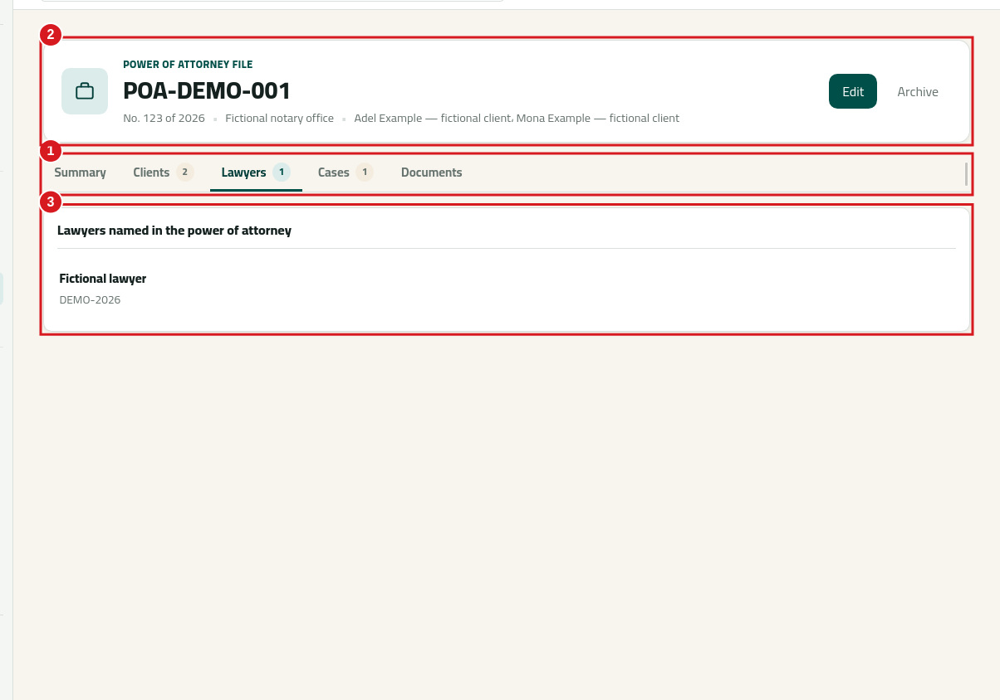

1. Tabs and views: switch to the section you want to review.
2. Page identity and actions: check the heading before adding or editing.
3. Details: review this section and follow the instructions above.

### Cases using this power of attorney

Cases with recorded links to this power of attorney appear here. Open the case from the list; creating or changing these links is unavailable in the current interface.

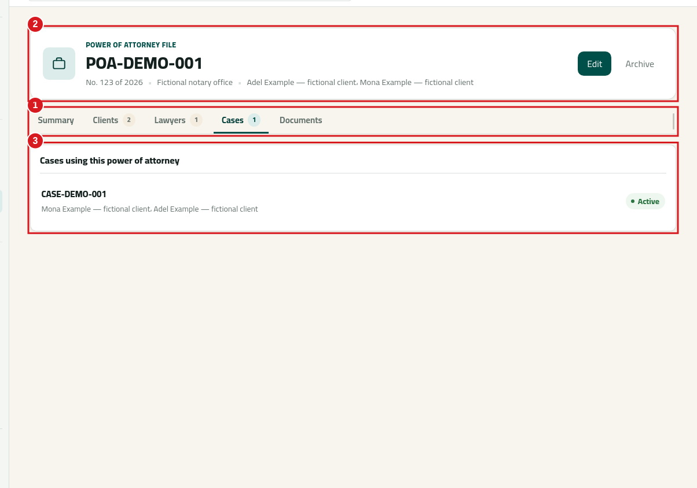

1. Tabs and views: switch to the section you want to review.
2. Page identity and actions: check the heading before adding or editing.
3. Details: review this section and follow the instructions above.

### Power-of-attorney documents

Add a copy of the power of attorney from this tab, then open it or edit its description as needed.

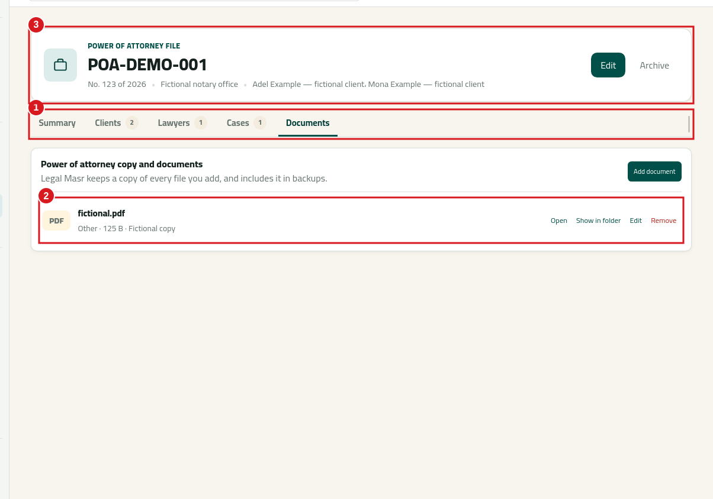

1. Tabs and views: switch to the section you want to review.
2. Records and actions: open a record or use its adjacent action.
3. Page identity and actions: check the heading before adding or editing.

### Editing a power of attorney

Choose Edit, change the power-of-attorney details, clients, and lawyers, then save. The form derives the year from the issue date.

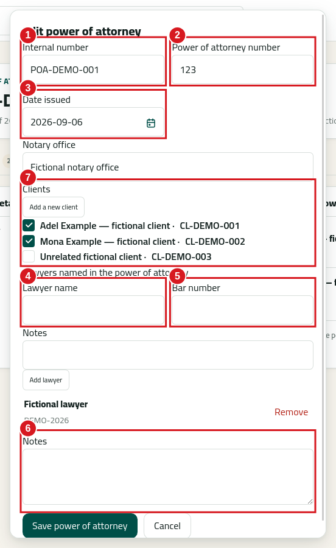

1. Internal number: Unique office identifier; separate from the official reference.
2. Power of attorney number: review the value or enter the relevant information, then save the form.
3. Date issued: Type day/month/year or year-month-day, then leave the field, or choose a day from the calendar.
4. Lawyer name: Enter the full name so you can locate the record.
5. Bar number: review the value or enter the relevant information, then save the form.
6. Notes: Optional additional information saved with the record.
7. Clients: Choose an existing client; payment payers must belong to the case.

### Archiving a power of attorney

Review the confirmation before archiving. To restore it, show archived records in the list, open it, and choose Restore.

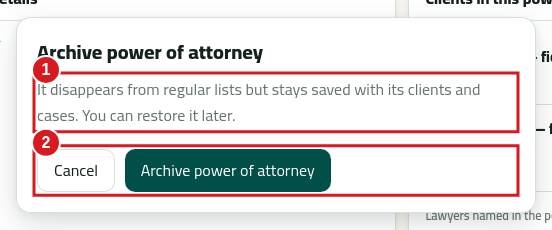

1. Confirmation: read what will happen before proceeding.
2. Action buttons: save or confirm when ready; Cancel keeps the previous state.

### Restoring an archived power of attorney

Restore returns the power of attorney to the active list. Archiving does not erase its attachments.

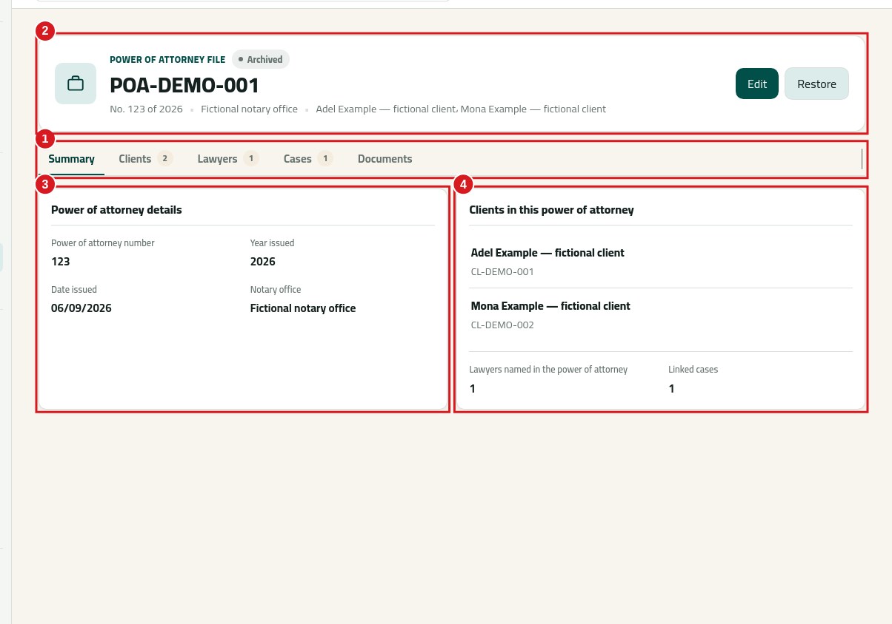

1. Tabs and views: switch to the section you want to review.
2. Page identity and actions: check the heading before adding or editing.
3. Details: review this section and follow the instructions above.
4. Details: review this section and follow the instructions above.

## Cases

### Case list

Search by number or case details, or filter by status. Open a row to inspect its file. Show archived includes archived files.

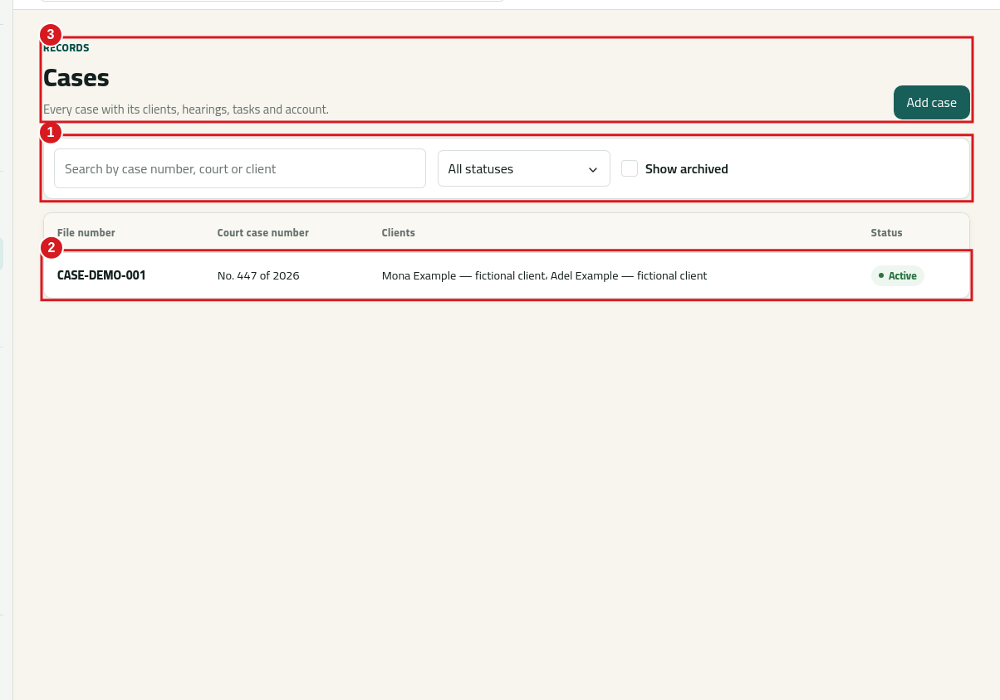

1. Filters: choose what to display; filters do not change records.
2. Records and actions: open a record or use its adjacent action.
3. Page identity and actions: check the heading before adding or editing.

### Adding a case

An internal number and at least one client are required. The official number and year are separate from your file number. Record court, circuit, type, litigation degree, status, dates, and subject. Select clients, then save.

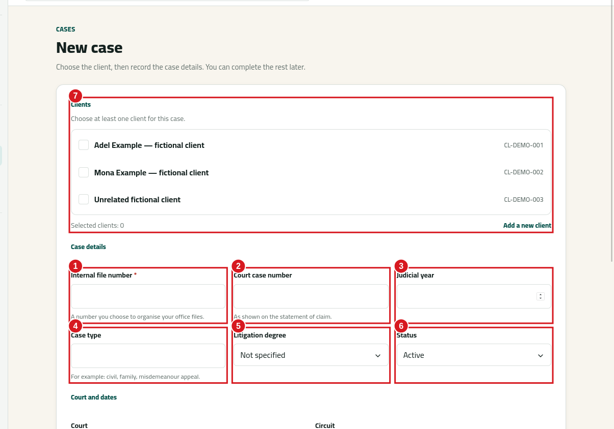

1. Internal file number: Unique office identifier; separate from the official reference.
2. Court case number: Choose the case related to this record.
3. Judicial year: review the value or enter the relevant information, then save the form.
4. Case type: Choose the case related to this record.
5. Litigation degree: review the value or enter the relevant information, then save the form.
6. Status: review the value or enter the relevant information, then save the form.
7. Clients: Choose an existing client; payment payers must belong to the case.

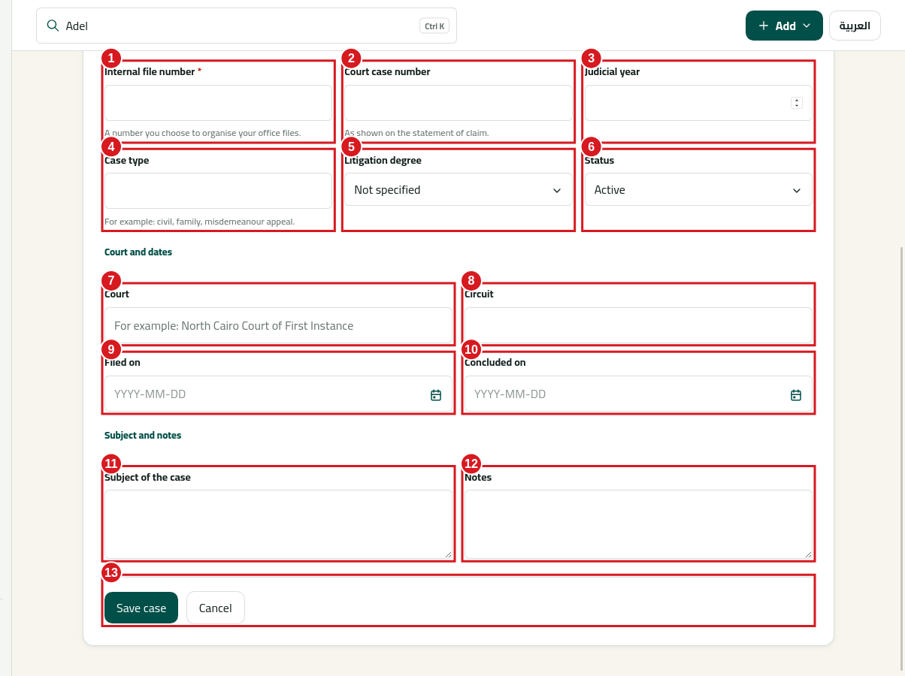

1. Internal file number: Unique office identifier; separate from the official reference.
2. Court case number: Choose the case related to this record.
3. Judicial year: review the value or enter the relevant information, then save the form.
4. Case type: Choose the case related to this record.
5. Litigation degree: review the value or enter the relevant information, then save the form.
6. Status: review the value or enter the relevant information, then save the form.
7. Court: review the value or enter the relevant information, then save the form.
8. Circuit: review the value or enter the relevant information, then save the form.
9. Filed on: review the value or enter the relevant information, then save the form.
10. Concluded on: review the value or enter the relevant information, then save the form.
11. Subject of the case: Choose the case related to this record.
12. Notes: Optional additional information saved with the record.
13. Action buttons: save or confirm when ready; Cancel keeps the previous state.

### Case summary

Review case identity, next hearing, latest decision, and open tasks. Detail links open the corresponding tab.

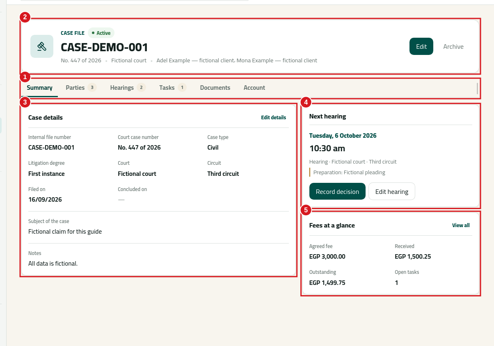

1. Tabs and views: switch to the section you want to review.
2. Page identity and actions: check the heading before adding or editing.
3. Details: review this section and follow the instructions above.
4. Details: review this section and follow the instructions above.
5. Details: review this section and follow the instructions above.

### Clients and opponents

This section displays case clients, capacities, and any recorded power-of-attorney links. These relationships are currently read-only: the edit form cannot change clients, capacities, or powers of attorney. You can add and edit opponents.

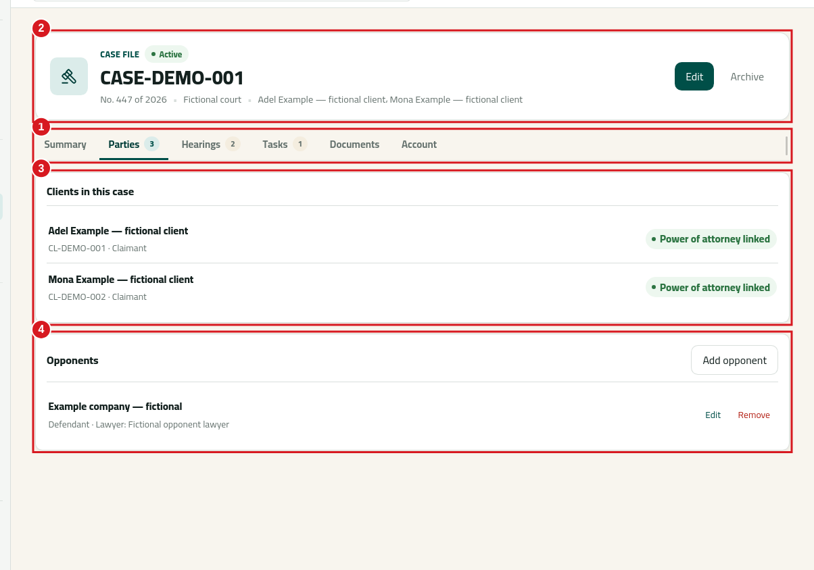

1. Tabs and views: switch to the section you want to review.
2. Page identity and actions: check the heading before adding or editing.
3. Details: review this section and follow the instructions above.
4. Details: review this section and follow the instructions above.

### Case hearings

Add a hearing or open an existing hearing to edit it. Recording a decision can create a linked next hearing in one step.

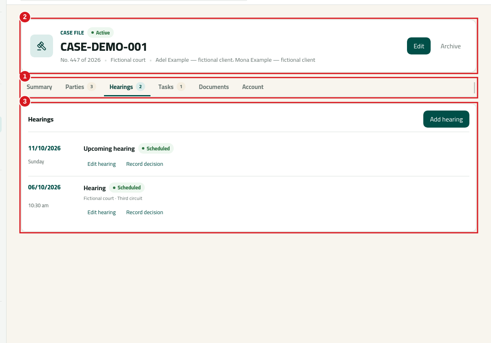

1. Tabs and views: switch to the section you want to review.
2. Page identity and actions: check the heading before adding or editing.
3. Details: review this section and follow the instructions above.

### Case tasks

Add a task for the case or open it to edit details. The completion checkbox completes it; you can reopen it.

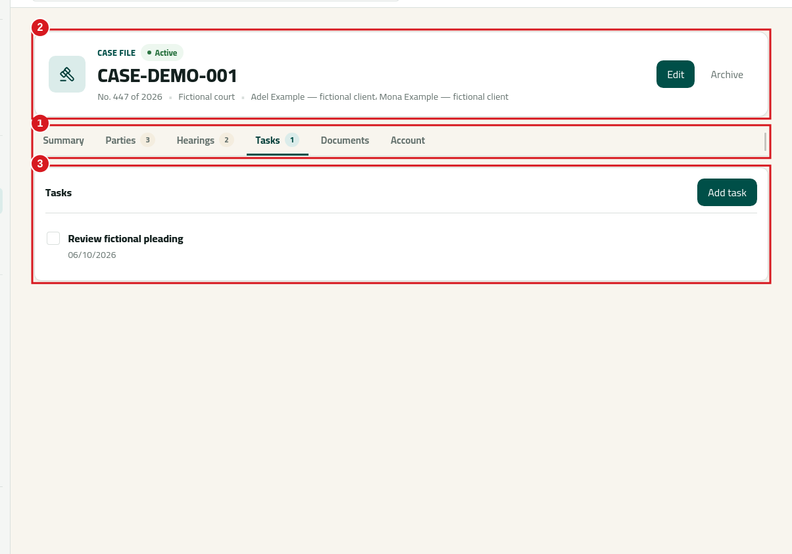

1. Tabs and views: switch to the section you want to review.
2. Page identity and actions: check the heading before adding or editing.
3. Details: review this section and follow the instructions above.

### Case documents

Add pleadings, decisions, and evidence to the case file. An attachment is an application-managed copy, not a link to the source file.

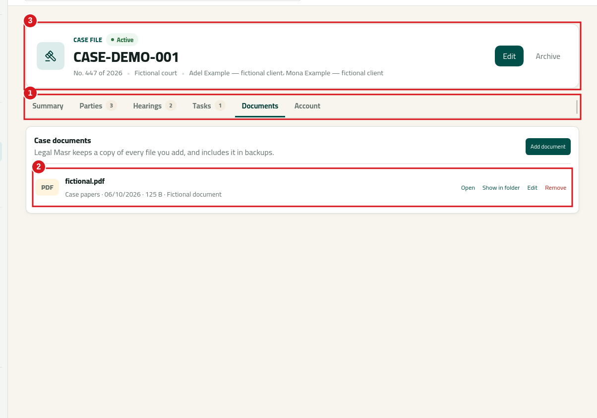

1. Tabs and views: switch to the section you want to review.
2. Records and actions: open a record or use its adjacent action.
3. Page identity and actions: check the heading before adding or editing.

### Case account and fees

Enter and save agreed fees. The account shows agreed, received, outstanding, expenses, and net cash. Payments are separate from expenses; all amounts are in Egyptian pounds.

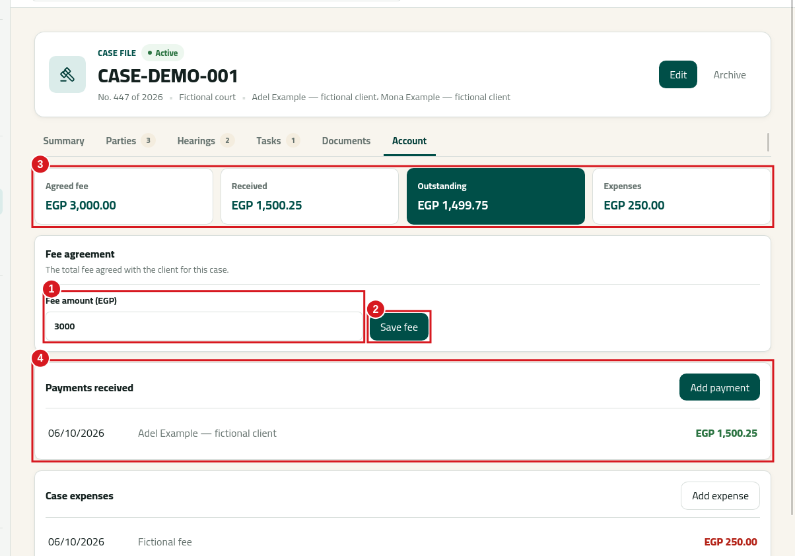

1. Fee amount (EGP): Enter a positive EGP amount, with up to two piastre digits.
2. Action buttons: save or confirm when ready; Cancel keeps the previous state.
3. Account: review the totals; amounts are in EGP.
4. Details: review this section and follow the instructions above.

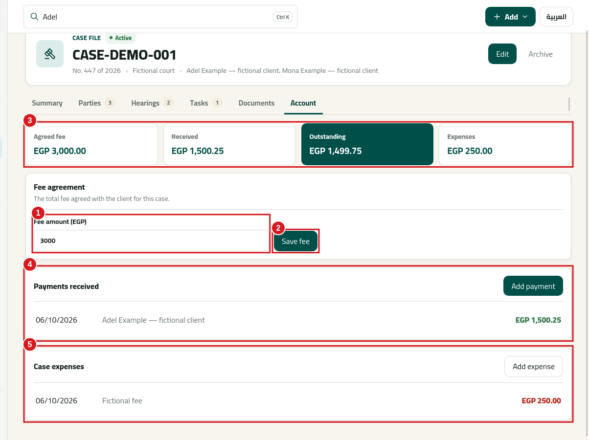

1. Fee amount (EGP): Enter a positive EGP amount, with up to two piastre digits.
2. Action buttons: save or confirm when ready; Cancel keeps the previous state.
3. Account: review the totals; amounts are in EGP.
4. Details: review this section and follow the instructions above.
5. Details: review this section and follow the instructions above.

### Editing a case and client relationships

Edit case details, court, status, dates, and subject, then save. Client relationships remain unchanged and cannot be edited in this form. Closing the case does not automatically change hearing or task dates.

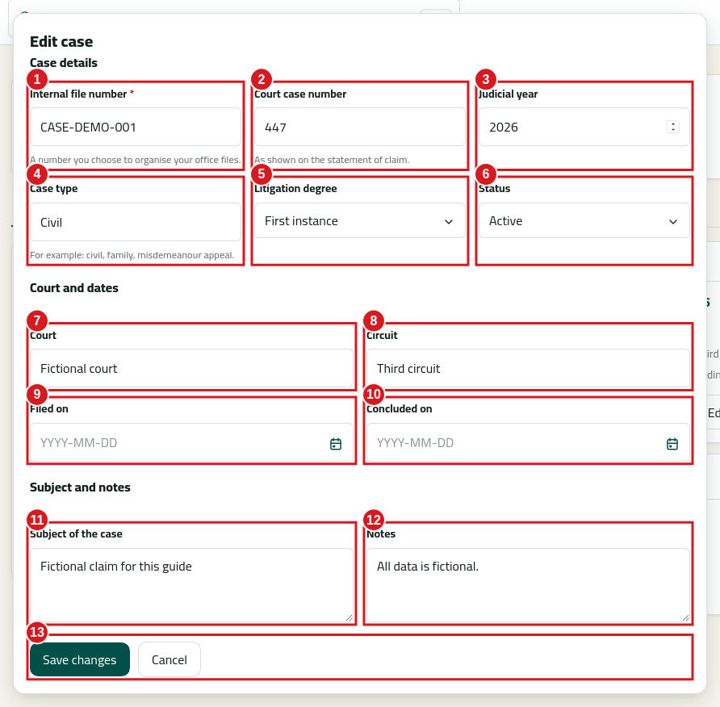

1. Internal file number: Unique office identifier; separate from the official reference.
2. Court case number: Choose the case related to this record.
3. Judicial year: review the value or enter the relevant information, then save the form.
4. Case type: Choose the case related to this record.
5. Litigation degree: review the value or enter the relevant information, then save the form.
6. Status: review the value or enter the relevant information, then save the form.
7. Court: review the value or enter the relevant information, then save the form.
8. Circuit: review the value or enter the relevant information, then save the form.
9. Filed on: review the value or enter the relevant information, then save the form.
10. Concluded on: review the value or enter the relevant information, then save the form.
11. Subject of the case: Choose the case related to this record.
12. Notes: Optional additional information saved with the record.
13. Action buttons: save or confirm when ready; Cancel keeps the previous state.

### Adding an opponent

From Clients and opponents, choose Add opponent. Name is required; legal capacity, opponent lawyer, phone, address, and notes are optional. Save to add it to this case.

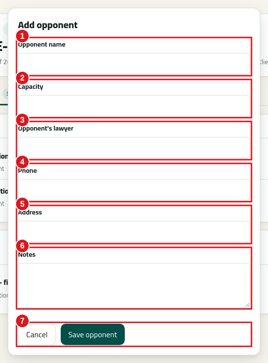

1. Opponent name: Enter the full name so you can locate the record.
2. Capacity: review the value or enter the relevant information, then save the form.
3. Opponent's lawyer: review the value or enter the relevant information, then save the form.
4. Phone: review the value or enter the relevant information, then save the form.
5. Address: review the value or enter the relevant information, then save the form.
6. Notes: Optional additional information saved with the record.
7. Action buttons: save or confirm when ready; Cancel keeps the previous state.

### Editing an opponent

Choose Edit beside the opponent, update details, and save. This updates the opponent in this case.

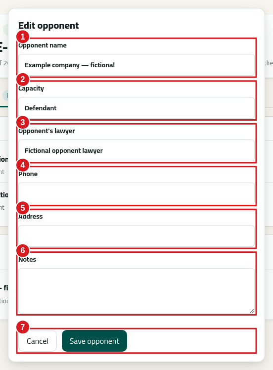

1. Opponent name: Enter the full name so you can locate the record.
2. Capacity: review the value or enter the relevant information, then save the form.
3. Opponent's lawyer: review the value or enter the relevant information, then save the form.
4. Phone: review the value or enter the relevant information, then save the form.
5. Address: review the value or enter the relevant information, then save the form.
6. Notes: Optional additional information saved with the record.
7. Action buttons: save or confirm when ready; Cancel keeps the previous state.

### Removing an opponent

Review the confirmation before removing the opponent from the case. Cancel leaves the relationship unchanged.

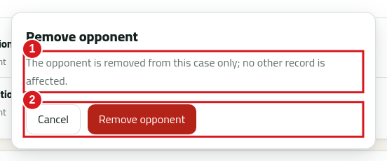

1. Confirmation: read what will happen before proceeding.
2. Action buttons: save or confirm when ready; Cancel keeps the previous state.

### Archived case

Archive in the file header hides the case from ordinary lists. Open the archived file and choose Restore to return it. Archiving is separate from Closed status and does not delete the case.

1. Tabs and views: switch to the section you want to review.
2. Page identity and actions: check the heading before adding or editing.
3. Details: review this section and follow the instructions above.
4. Details: review this section and follow the instructions above.
5. Details: review this section and follow the instructions above.

## Agenda and hearings

### Month view

Choose the view, then navigate dates. Hearings and tasks appear together by day. Selecting a day displays its details and hearing actions. The week start follows Settings.

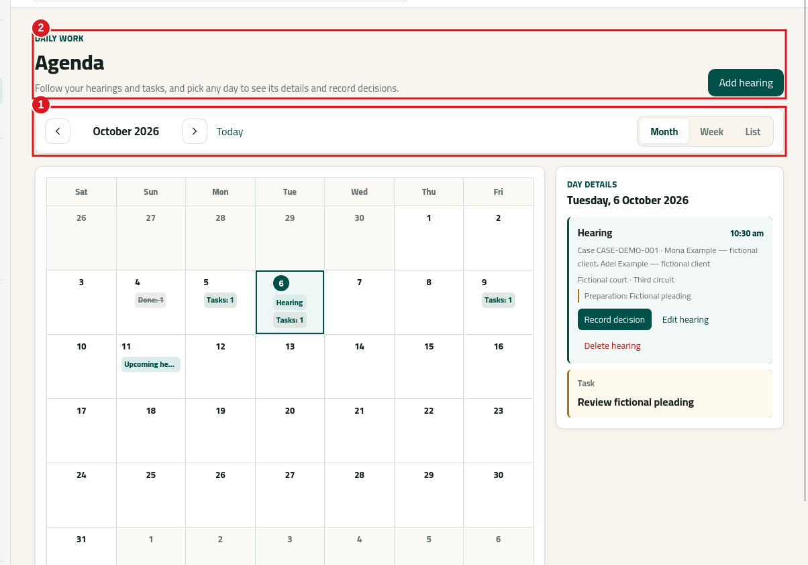

1. Tabs and views: switch to the section you want to review.
2. Page identity and actions: check the heading before adding or editing.

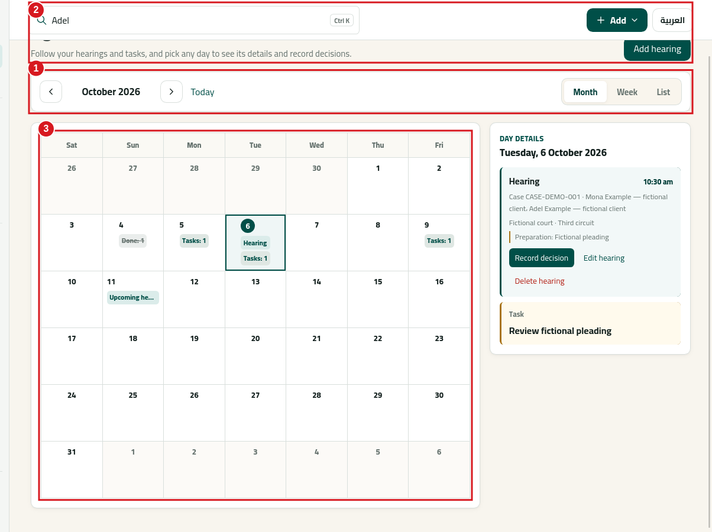

1. Tabs and views: switch to the section you want to review.
2. Page identity and actions: check the heading before adding or editing.
3. Schedule: review dates, links, and preparation details.

### Week view

Choose the view, then navigate dates. Hearings and tasks appear together by day. Selecting a day displays its details and hearing actions. The week start follows Settings.

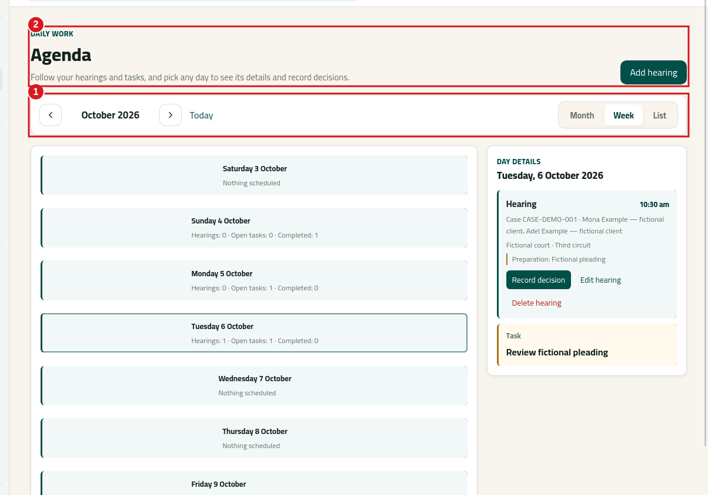

1. Tabs and views: switch to the section you want to review.
2. Page identity and actions: check the heading before adding or editing.

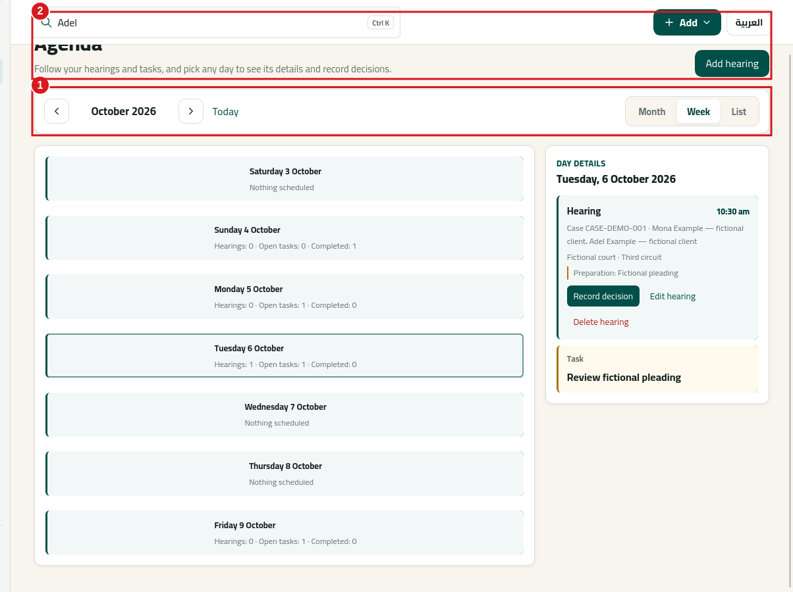

1. Tabs and views: switch to the section you want to review.
2. Page identity and actions: check the heading before adding or editing.

### List view

Choose the view, then navigate dates. Hearings and tasks appear together by day. Selecting a day displays its details and hearing actions. The week start follows Settings.

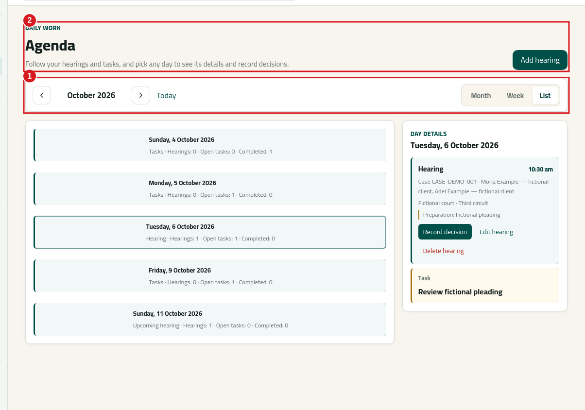

1. Tabs and views: switch to the section you want to review.
2. Page identity and actions: check the heading before adding or editing.

### Adding a hearing

Choose the case and date, then add time, type, location, circuit, required documents, and notes as needed. Save to show the hearing in the agenda and case file.

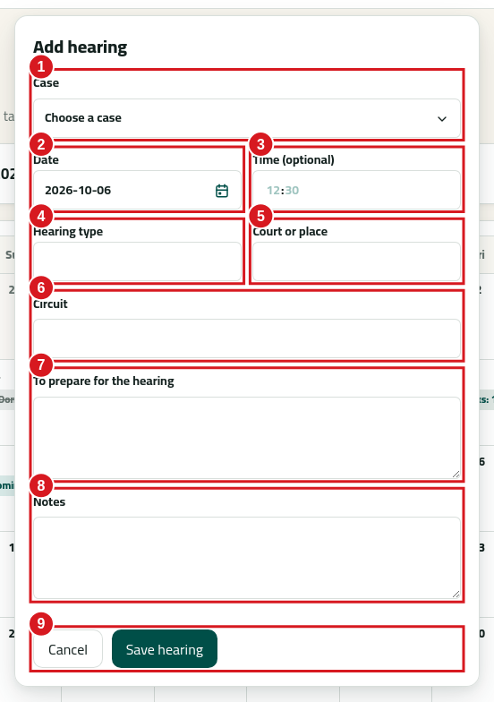

1. Case: Choose the case related to this record.
2. Date: Type day/month/year or year-month-day, then leave the field, or choose a day from the calendar.
3. Time (optional): review the value or enter the relevant information, then save the form.
4. Hearing type: review the value or enter the relevant information, then save the form.
5. Court or place: review the value or enter the relevant information, then save the form.
6. Circuit: review the value or enter the relevant information, then save the form.
7. To prepare for the hearing: review the value or enter the relevant information, then save the form.
8. Notes: Optional additional information saved with the record.
9. Action buttons: save or confirm when ready; Cancel keeps the previous state.

### Editing a hearing

Open hearing details, correct them, and save. Editing a follow-up hearing does not change its previous hearing.

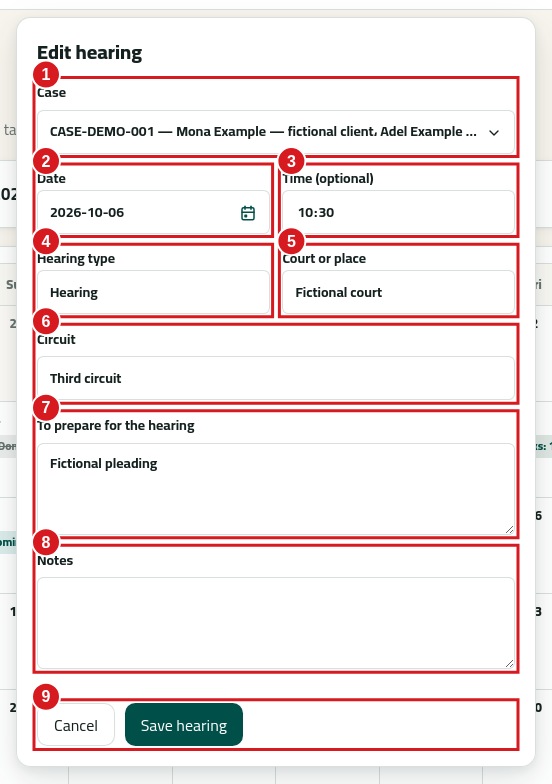

1. Case: Choose the case related to this record.
2. Date: Type day/month/year or year-month-day, then leave the field, or choose a day from the calendar.
3. Time (optional): review the value or enter the relevant information, then save the form.
4. Hearing type: review the value or enter the relevant information, then save the form.
5. Court or place: review the value or enter the relevant information, then save the form.
6. Circuit: review the value or enter the relevant information, then save the form.
7. To prepare for the hearing: review the value or enter the relevant information, then save the form.
8. Notes: Optional additional information saved with the record.
9. Action buttons: save or confirm when ready; Cancel keeps the previous state.

### Recording a decision and next hearing

Enter the decision and a next-hearing date if one exists, then record the decision. The current hearing completes and the next one is linked to it. Leave the date empty if no next hearing was set; edit the follow-up later as needed.

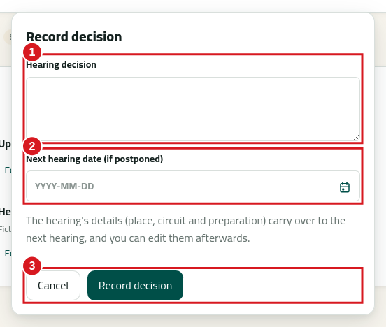

1. Hearing decision: review the value or enter the relevant information, then save the form.
2. Next hearing date (if postponed): Type day/month/year or year-month-day, then leave the field, or choose a day from the calendar.
3. Action buttons: save or confirm when ready; Cancel keeps the previous state.

### Deleting a hearing

From the day’s details, choose Delete hearing and review the confirmation. Cancel to keep it. Deleting a hearing is different from recording its decision.

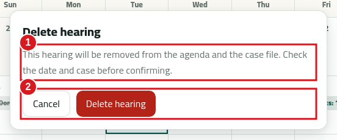

1. Confirmation: read what will happen before proceeding.
2. Action buttons: save or confirm when ready; Cancel keeps the previous state.

### Choosing a date

Type a date such as 03/10/2026 or 2026-10-03, then leave the field, or open the calendar button and choose a day. Arabic digits are accepted. After normalization the field shows year-month-day. The value remains a date without a time zone.

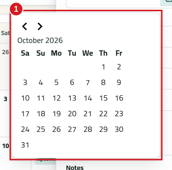

1. Schedule: review dates, links, and preparation details.

## Tasks and deadlines

### Today’s tasks

Choose the relevant tab and filter by case or client as needed. Open a task title to edit it. The checkbox changes completion status; Clear filters removes case/client restrictions.

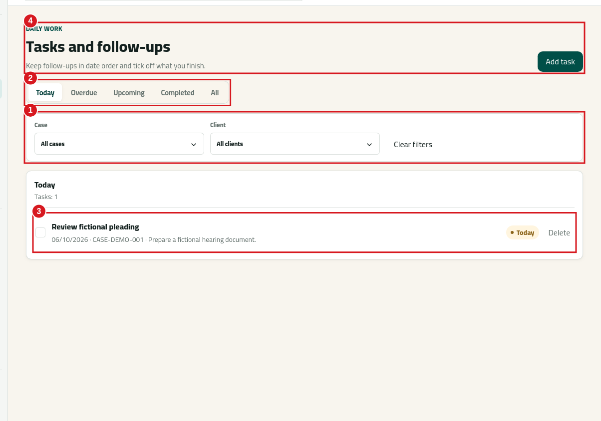

1. Filters: choose what to display; filters do not change records.
2. Tabs and views: switch to the section you want to review.
3. Records and actions: open a record or use its adjacent action.
4. Page identity and actions: check the heading before adding or editing.

### Overdue tasks

Choose the relevant tab and filter by case or client as needed. Open a task title to edit it. The checkbox changes completion status; Clear filters removes case/client restrictions.

1. Filters: choose what to display; filters do not change records.
2. Tabs and views: switch to the section you want to review.
3. Records and actions: open a record or use its adjacent action.
4. Page identity and actions: check the heading before adding or editing.

### Upcoming tasks

Choose the relevant tab and filter by case or client as needed. Open a task title to edit it. The checkbox changes completion status; Clear filters removes case/client restrictions.

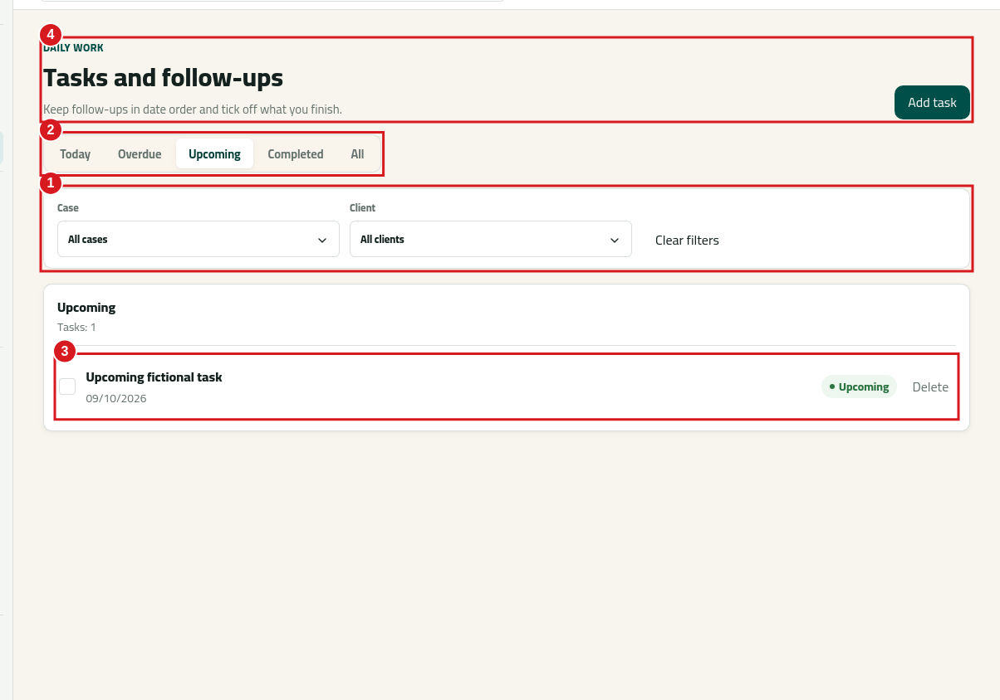

1. Filters: choose what to display; filters do not change records.
2. Tabs and views: switch to the section you want to review.
3. Records and actions: open a record or use its adjacent action.
4. Page identity and actions: check the heading before adding or editing.

### Completed tasks

Choose the relevant tab and filter by case or client as needed. Open a task title to edit it. The checkbox changes completion status; Clear filters removes case/client restrictions.

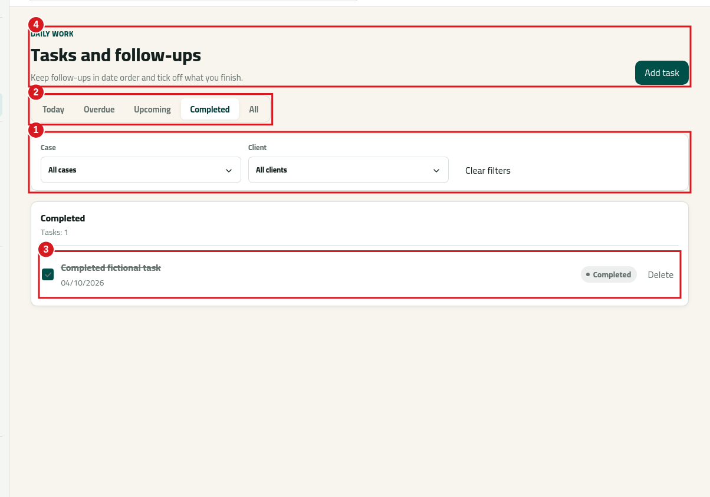

1. Filters: choose what to display; filters do not change records.
2. Tabs and views: switch to the section you want to review.
3. Records and actions: open a record or use its adjacent action.
4. Page identity and actions: check the heading before adding or editing.

### All tasks

Choose the relevant tab and filter by case or client as needed. Open a task title to edit it. The checkbox changes completion status; Clear filters removes case/client restrictions.

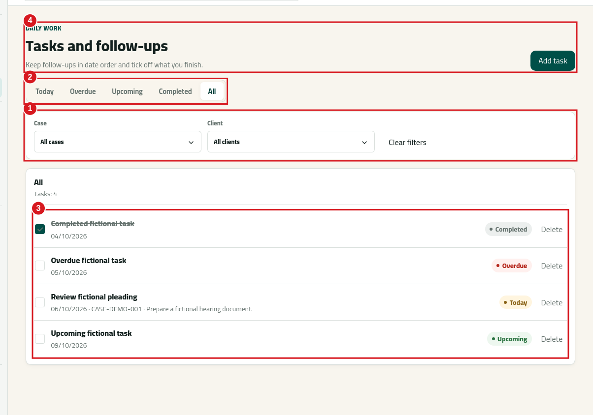

1. Filters: choose what to display; filters do not change records.
2. Tabs and views: switch to the section you want to review.
3. Records and actions: open a record or use its adjacent action.
4. Page identity and actions: check the heading before adding or editing.

### Adding a task

Enter a title and due date. Optionally link a case or client and add details and notes. There is no priority, employee assignment, or due time; this is a solo-lawyer application.

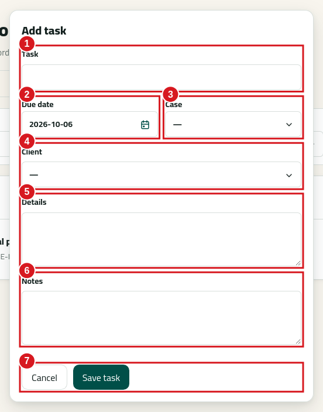

1. Task: review the value or enter the relevant information, then save the form.
2. Due date: Type day/month/year or year-month-day, then leave the field, or choose a day from the calendar.
3. Case: Choose the case related to this record.
4. Client: Choose an existing client; payment payers must belong to the case.
5. Details: review the value or enter the relevant information, then save the form.
6. Notes: Optional additional information saved with the record.
7. Action buttons: save or confirm when ready; Cancel keeps the previous state.

### Editing and completing a task

Open a task, update its details, and save. Complete task or Reopen changes status directly. Completing a task does not require changing its due date.

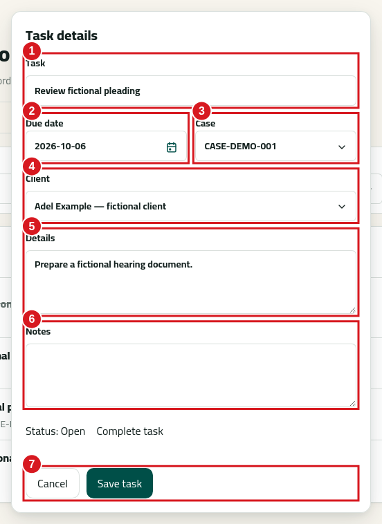

1. Task: review the value or enter the relevant information, then save the form.
2. Due date: Type day/month/year or year-month-day, then leave the field, or choose a day from the calendar.
3. Case: Choose the case related to this record.
4. Client: Choose an existing client; payment payers must belong to the case.
5. Details: review the value or enter the relevant information, then save the form.
6. Notes: Optional additional information saved with the record.
7. Action buttons: save or confirm when ready; Cancel keeps the previous state.

### Deleting a task

Choose Delete beside the task and confirm. Cancel keeps it. Use completion rather than deletion when you want to retain the completed-work record.

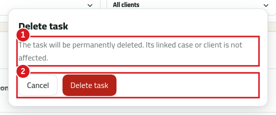

1. Confirmation: read what will happen before proceeding.
2. Action buttons: save or confirm when ready; Cancel keeps the previous state.

## Documents

### All documents

This is the global document list. Review filename, category, date, and owner. To add a document, open its client, case, or power-of-attorney file. Adding is unavailable from the global list.

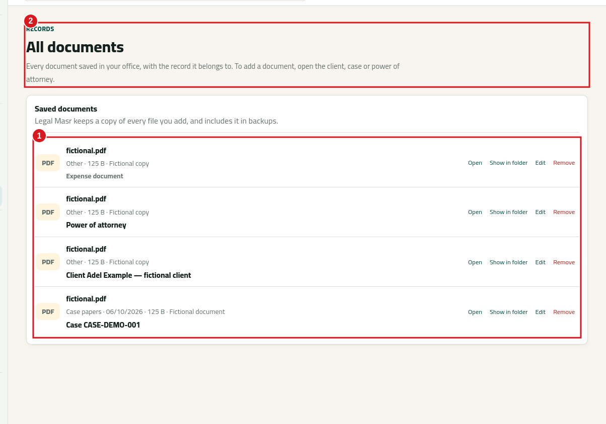

1. Records and actions: open a record or use its adjacent action.
2. Page identity and actions: check the heading before adding or editing.

### Adding a document copy

From the owner’s documents tab, choose Add document, then Choose file. Select a file in the system dialog, add category, description, and date, and save. The app keeps a copy without changing the source. Canceling selection creates no attachment.

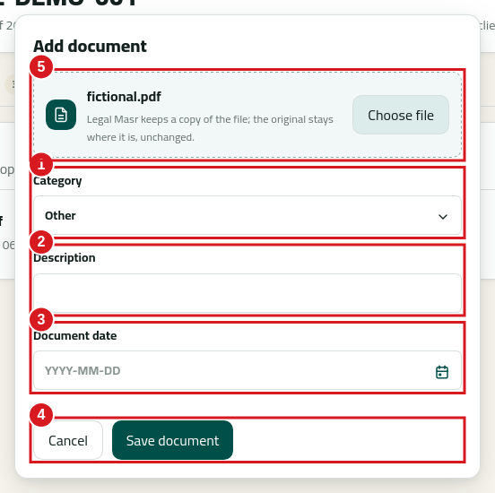

1. Category: review the value or enter the relevant information, then save the form.
2. Description: review the value or enter the relevant information, then save the form.
3. Document date: Type day/month/year or year-month-day, then leave the field, or choose a day from the calendar.
4. Action buttons: save or confirm when ready; Cancel keeps the previous state.
5. File selection: choose a document; the app keeps a managed copy and leaves the original in place.

### Editing document metadata

Choose Edit beside a document to change category, description, and document date. This form does not replace file contents. Open uses the appropriate system application; Reveal opens the managed copy’s location.

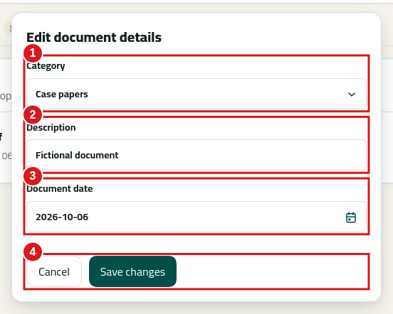

1. Category: review the value or enter the relevant information, then save the form.
2. Description: review the value or enter the relevant information, then save the form.
3. Document date: Type day/month/year or year-month-day, then leave the field, or choose a day from the calendar.
4. Action buttons: save or confirm when ready; Cancel keeps the previous state.

### Removing a document

Review the confirmation before removing the managed copy and its metadata. The originally selected source file is not deleted. Cancel keeps the attachment.

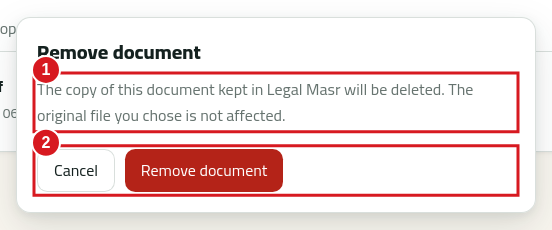

1. Confirmation: read what will happen before proceeding.
2. Action buttons: save or confirm when ready; Cancel keeps the previous state.

### Document could not be opened

A missing managed file or failed open shows an error. Check file availability and system configuration; do not manually move files inside the app’s data folder. Keep backups that include documents.

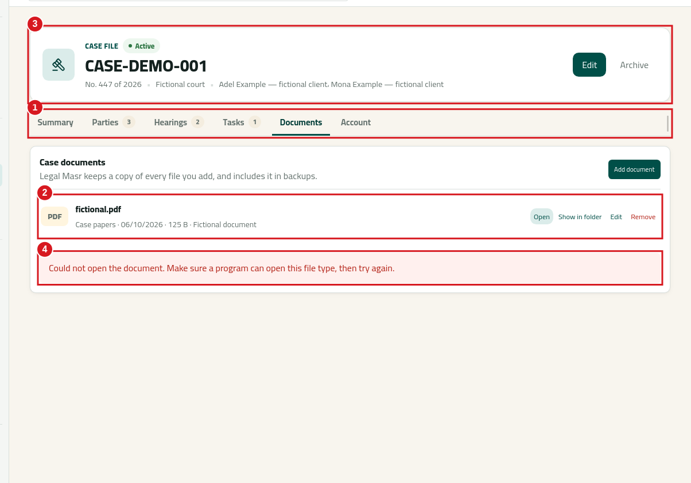

1. Tabs and views: switch to the section you want to review.
2. Records and actions: open a record or use its adjacent action.
3. Page identity and actions: check the heading before adding or editing.
4. Error: correct the stated cause, then retry.

## Fees, payments, and expenses

### Payment register

Filter by case and client. With a case selected, payer filtering is limited to its clients. Review payments and the account, and open a transaction to edit it.

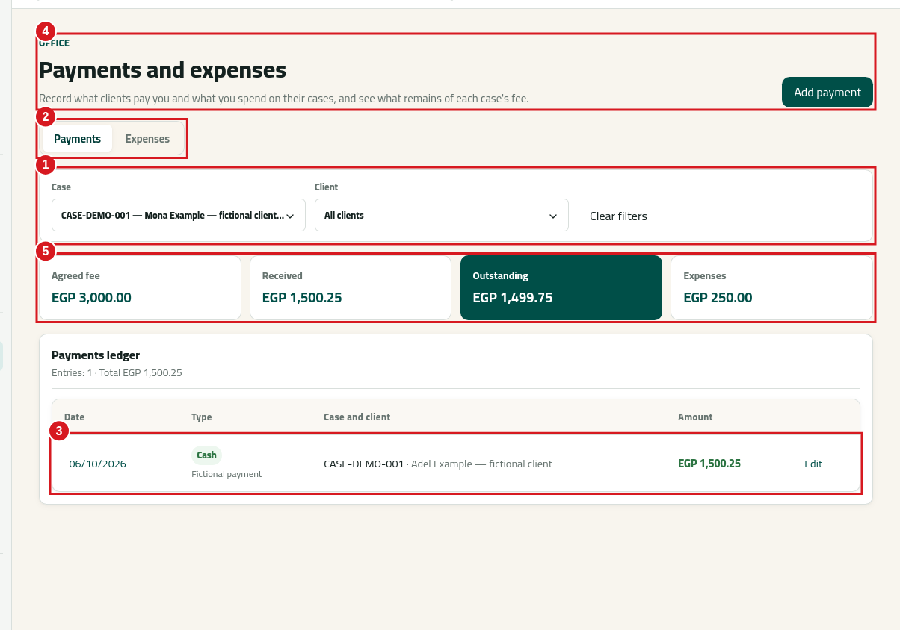

1. Filters: choose what to display; filters do not change records.
2. Tabs and views: switch to the section you want to review.
3. Records and actions: open a record or use its adjacent action.
4. Page identity and actions: check the heading before adding or editing.
5. Account: review the totals; amounts are in EGP.

### Expense register

Switch to Expenses and review type, date, amount, and links. An expense may link to a case, a client, or neither. Expenses do not count as fee payments.

1. Filters: choose what to display; filters do not change records.
2. Tabs and views: switch to the section you want to review.
3. Records and actions: open a record or use its adjacent action.
4. Page identity and actions: check the heading before adding or editing.
5. Account: review the totals; amounts are in EGP.

### Adding a payment

Choose a case and a payer from its linked clients. Enter a positive amount, payment date, method, and notes, then save. Amounts use Egyptian pounds and piastres with exact minor-unit storage.

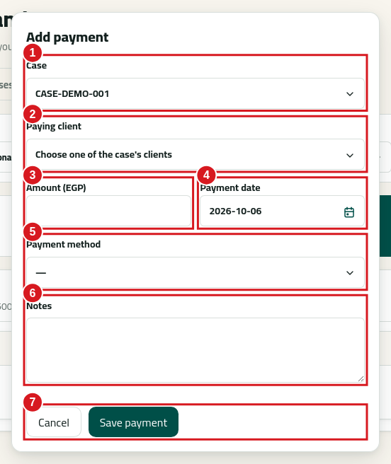

1. Case: Choose the case related to this record.
2. Paying client: Choose an existing client; payment payers must belong to the case.
3. Amount (EGP): Enter a positive EGP amount, with up to two piastre digits.
4. Payment date: Type day/month/year or year-month-day, then leave the field, or choose a day from the calendar.
5. Payment method: review the value or enter the relevant information, then save the form.
6. Notes: Optional additional information saved with the record.
7. Action buttons: save or confirm when ready; Cancel keeps the previous state.

### Editing a payment

Open a payment, correct amount, date, method, or notes, and save. The case account updates after saving. The current interface has no payment-delete control.

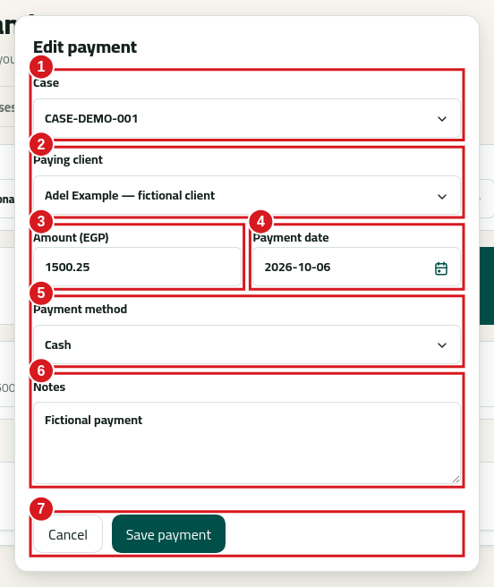

1. Case: Choose the case related to this record.
2. Paying client: Choose an existing client; payment payers must belong to the case.
3. Amount (EGP): Enter a positive EGP amount, with up to two piastre digits.
4. Payment date: Type day/month/year or year-month-day, then leave the field, or choose a day from the calendar.
5. Payment method: review the value or enter the relevant information, then save the form.
6. Notes: Optional additional information saved with the record.
7. Action buttons: save or confirm when ready; Cancel keeps the previous state.

### Adding an expense

Enter a positive amount, date, and expense type. Case and client links are optional. Types are court fees, transport, office supplies, expert fees, and other. Save the transaction.

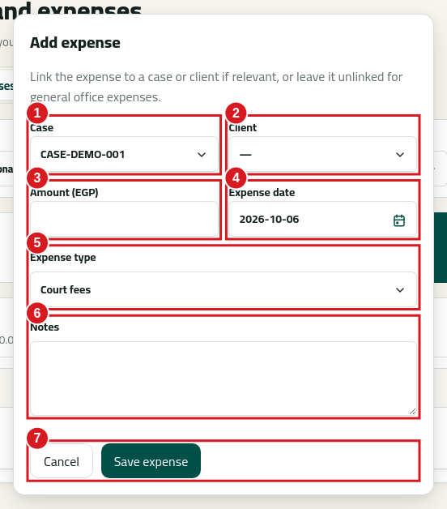

1. Case: Choose the case related to this record.
2. Client: Choose an existing client; payment payers must belong to the case.
3. Amount (EGP): Enter a positive EGP amount, with up to two piastre digits.
4. Expense date: Type day/month/year or year-month-day, then leave the field, or choose a day from the calendar.
5. Expense type: review the value or enter the relevant information, then save the form.
6. Notes: Optional additional information saved with the record.
7. Action buttons: save or confirm when ready; Cancel keeps the previous state.

### Editing an expense and its documents

Open an expense to edit details and save. The current interface has no expense attachment-upload or expense-delete control. You can keep case receipts as case documents.

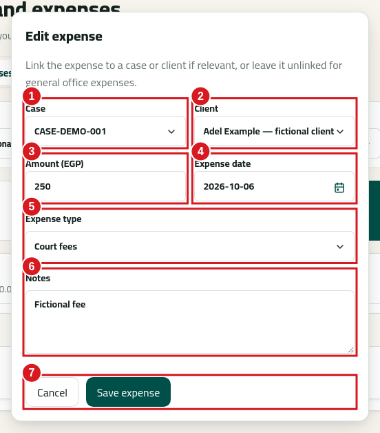

1. Case: Choose the case related to this record.
2. Client: Choose an existing client; payment payers must belong to the case.
3. Amount (EGP): Enter a positive EGP amount, with up to two piastre digits.
4. Expense date: Type day/month/year or year-month-day, then leave the field, or choose a day from the calendar.
5. Expense type: review the value or enter the relevant information, then save the form.
6. Notes: Optional additional information saved with the record.
7. Action buttons: save or confirm when ready; Cancel keeps the previous state.

### Payment details

Choose the payment date to inspect details without editing. Edit opens the editing form; Close returns to the register.

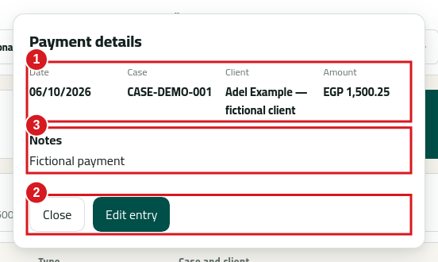

1. Details: review this section and follow the instructions above.
2. Action buttons: save or confirm when ready; Cancel keeps the previous state.
3. Details: review this section and follow the instructions above.

### Expense details and receipts

Choose the expense date to inspect details without editing. Edit opens the form and Close returns to the register. Attaching receipts to an expense is unavailable in this dialog.

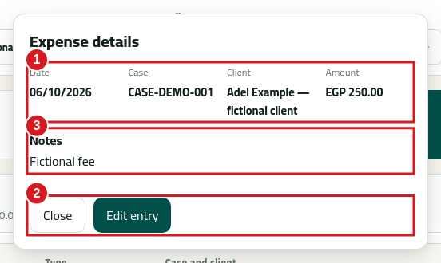

1. Details: review this section and follow the instructions above.
2. Action buttons: save or confirm when ready; Cancel keeps the previous state.
3. Details: review this section and follow the instructions above.

## Backup and restore

### Backup page

Create a backup now; it is saved in Backups inside application data. Latest backup shows date, size, and advice when stale. Manually copy the archive to safe storage. Automatic backups and changing the destination are unavailable.

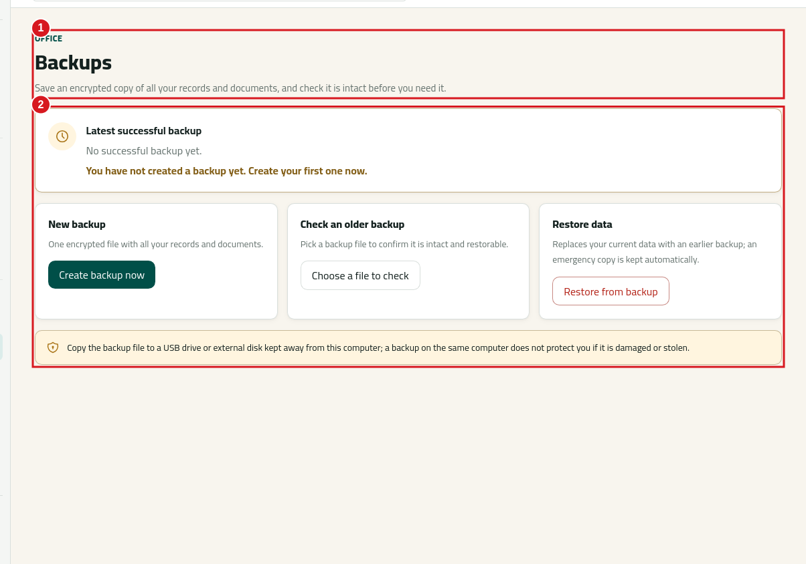

1. Page identity and actions: check the heading before adding or editing.
2. Details: review this section and follow the instructions above.

### Backup created successfully

Success means the app created and checked the encrypted archive. It includes the database and managed documents. Check the latest timestamp afterward.

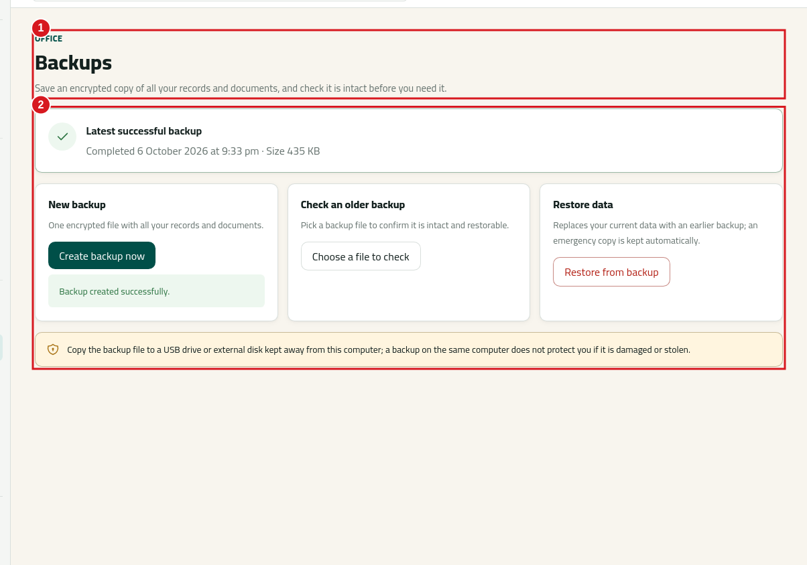

1. Page identity and actions: check the heading before adding or editing.
2. Details: review this section and follow the instructions above.

### Validating a backup

Choose Validate and select the archive in the system dialog. Success establishes archive structure and content integrity in this vault; it does not establish portability to a new computer.

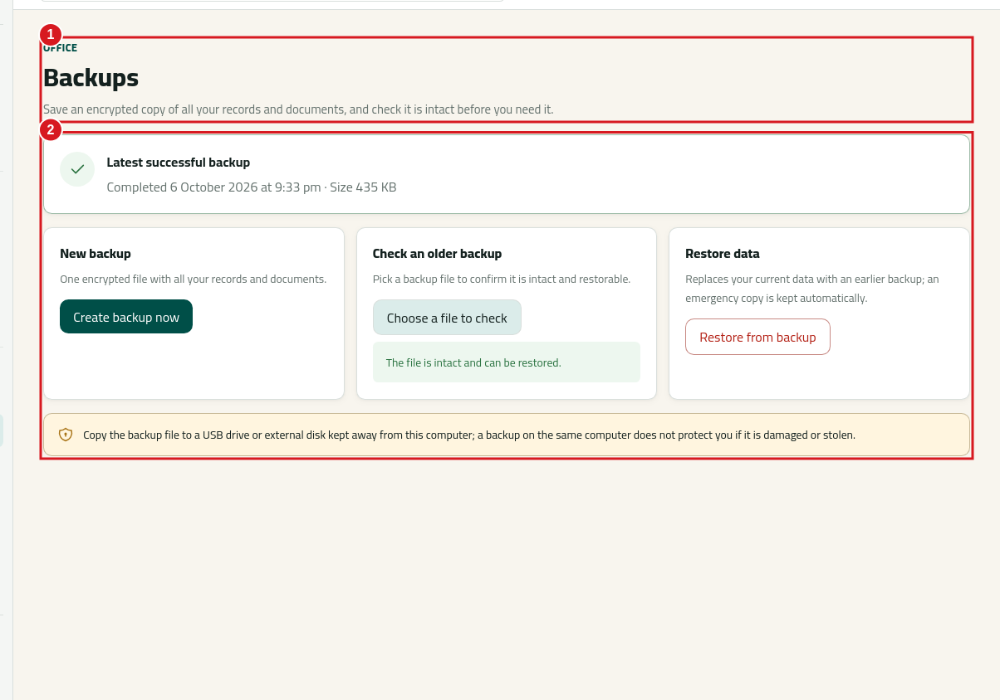

1. Page identity and actions: check the heading before adding or editing.
2. Details: review this section and follow the instructions above.

### Restore confirmation

Restore replaces current state with the snapshot. Make a current backup first. Review the warning and confirm or cancel. There is no restore preview.

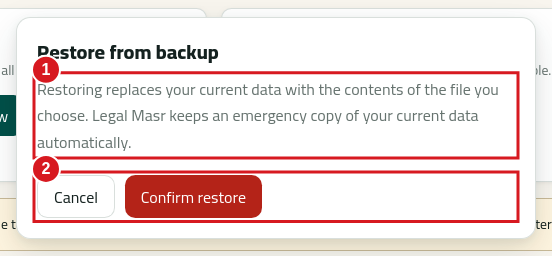

1. Confirmation: read what will happen before proceeding.
2. Action buttons: save or confirm when ready; Cancel keeps the previous state.

### Corrupt backup refused

An invalid archive is refused and current data remains intact. Choose a valid backup and validate again; do not manually alter the archive contents.

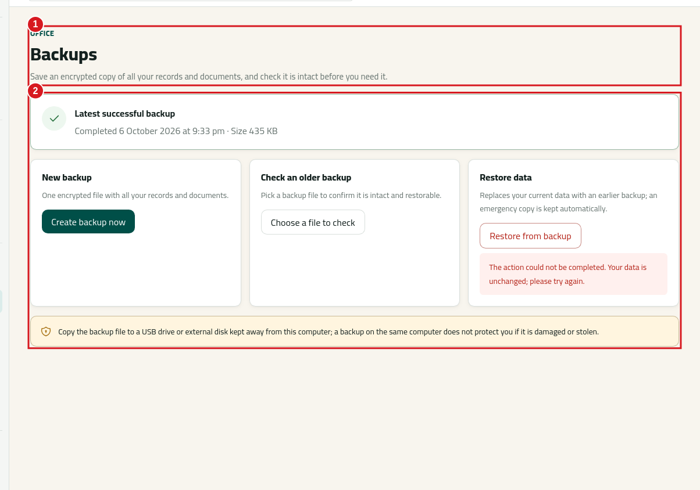

1. Page identity and actions: check the heading before adding or editing.
2. Details: review this section and follow the instructions above.

### Lock after restore

Successful restore locks the app. Unlock and verify records and documents as of the snapshot. Changes made afterward are absent from restored state. Restoring into a new vault with only the original password is currently unsupported.

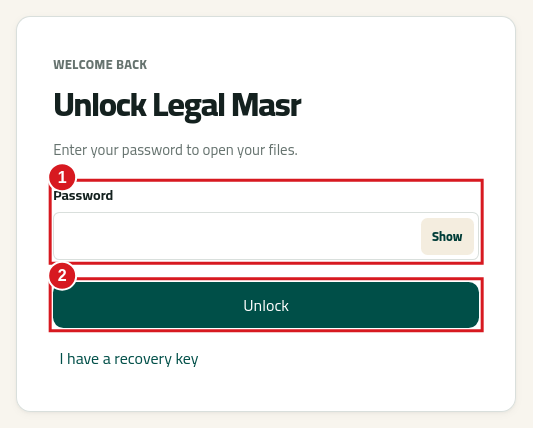

1. Password: Use at least 12 characters and keep it safe.
2. Action buttons: save or confirm when ready; Cancel keeps the previous state.

## Settings

### Lawyer profile

Edit name, bar number, phone, and office address, then save. These are your office details, not an online account.

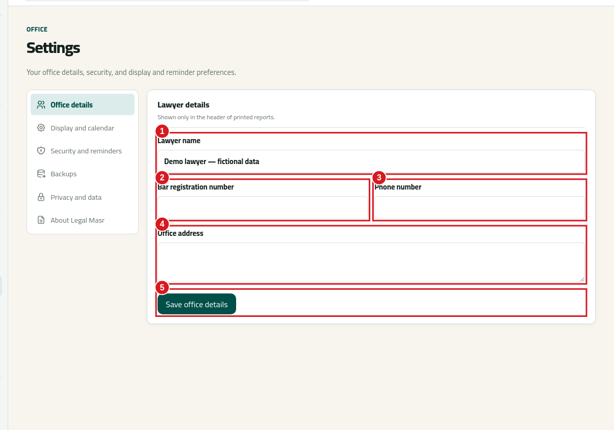

1. Lawyer name: Enter the full name so you can locate the record.
2. Bar registration number: review the value or enter the relevant information, then save the form.
3. Phone number: review the value or enter the relevant information, then save the form.
4. Office address: review the value or enter the relevant information, then save the form.
5. Action buttons: save or confirm when ready; Cancel keeps the previous state.

### Display and calendar

Choose Arabic or English, light/dark/system appearance, date format, week start, and default reminder lead time, then save. Current task and hearing forms have no separate reminder field.

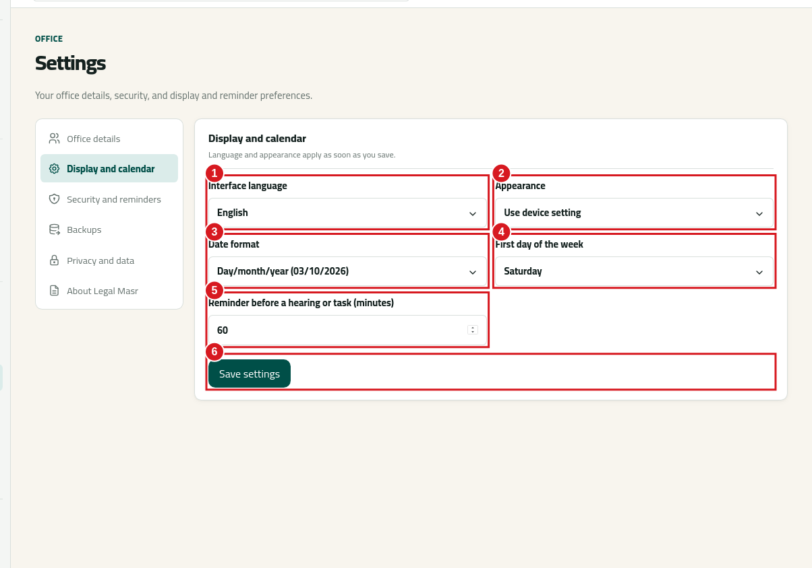

1. Interface language: review the value or enter the relevant information, then save the form.
2. Appearance: review the value or enter the relevant information, then save the form.
3. Date format: Type day/month/year or year-month-day, then leave the field, or choose a day from the calendar.
4. First day of the week: review the value or enter the relevant information, then save the form.
5. Reminder before a hearing or task (minutes): review the value or enter the relevant information, then save the form.
6. Action buttons: save or confirm when ready; Cancel keeps the previous state.

### Security and notifications

Set and save the lock timeout. Autostart is optional; notifications require system permission and the app running. Password change requires the current password, a new one, and confirmation. Local counters are optional and do not transmit case data. Also review the lower part of the page.

1. Minutes of inactivity before locking: review the value or enter the relevant information, then save the form.
2. Action buttons: save or confirm when ready; Cancel keeps the previous state.
3. Details: review this section and follow the instructions above.

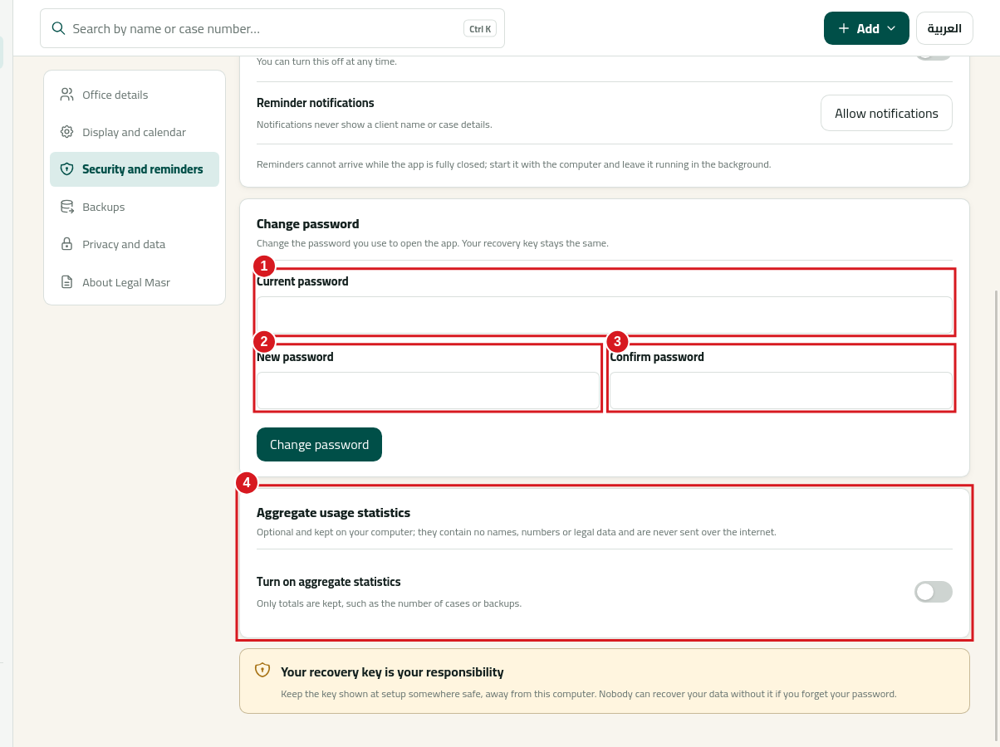

1. Current password: Use at least 12 characters and keep it safe.
2. New password: Use at least 12 characters and keep it safe.
3. Confirm password: Use at least 12 characters and keep it safe.
4. Details: review this section and follow the instructions above.

### Backups in Settings

Settings contains the same create, validate, and restore tools as the Backup section. Backup setup is not required to finish onboarding.

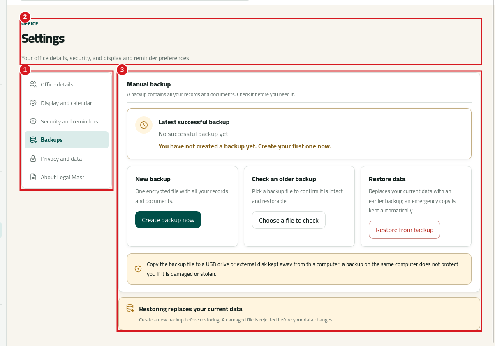

1. Tabs and views: switch to the section you want to review.
2. Page identity and actions: check the heading before adding or editing.
3. Details: review this section and follow the instructions above.

### Privacy and data location

Review storage, document, backup, and network information. The database is encrypted, but managed documents are not individually encrypted; use a protected OS account and disk encryption.

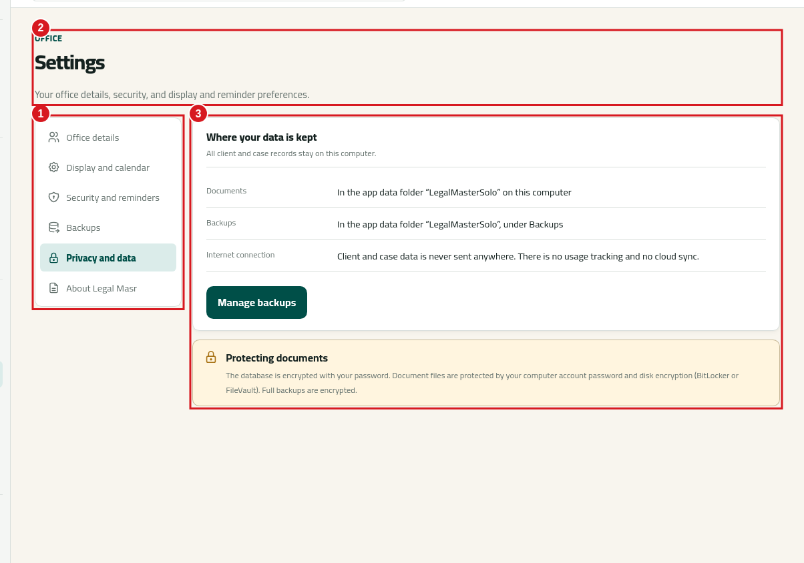

1. Tabs and views: switch to the section you want to review.
2. Page identity and actions: check the heading before adding or editing.
3. Details: review this section and follow the instructions above.

### About the app

Review product name, version, application status, and available information links. This application is pre-beta; passing Linux tests does not validate Windows or macOS.

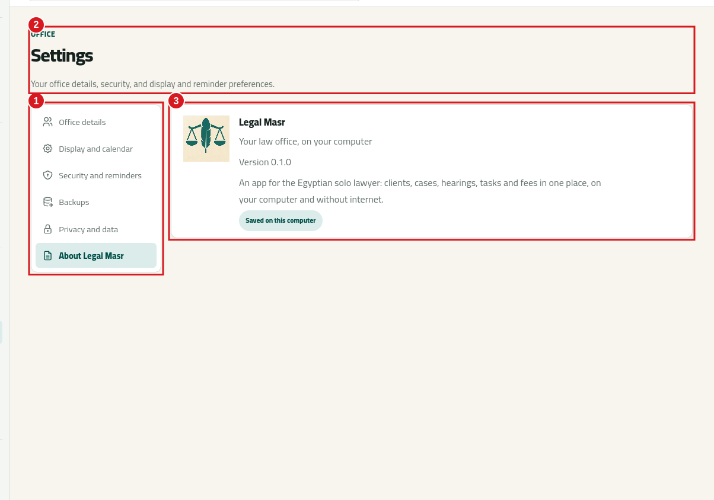

1. Tabs and views: switch to the section you want to review.
2. Page identity and actions: check the heading before adding or editing.
3. Details: review this section and follow the instructions above.

### Correcting password confirmation

A mismatch between the new password and confirmation shows a message and does not save the change. Enter matching values; the new password must have at least 12 characters.

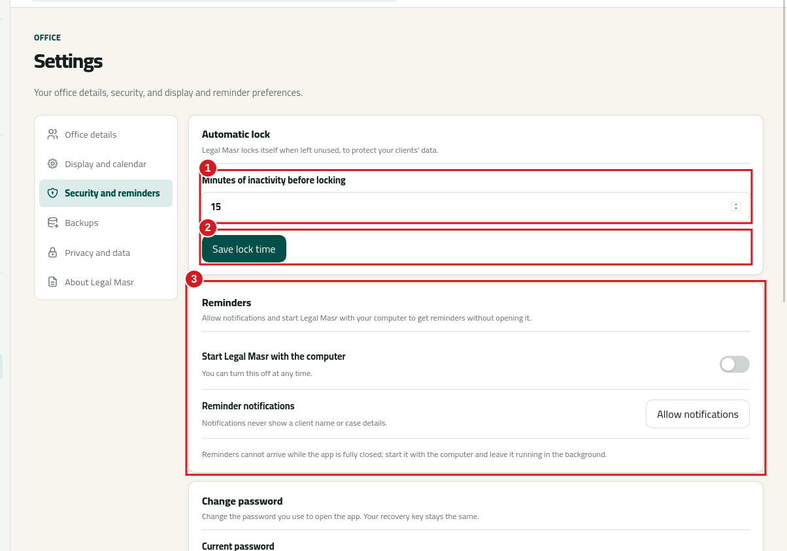

1. Minutes of inactivity before locking: review the value or enter the relevant information, then save the form.
2. Action buttons: save or confirm when ready; Cancel keeps the previous state.
3. Details: review this section and follow the instructions above.

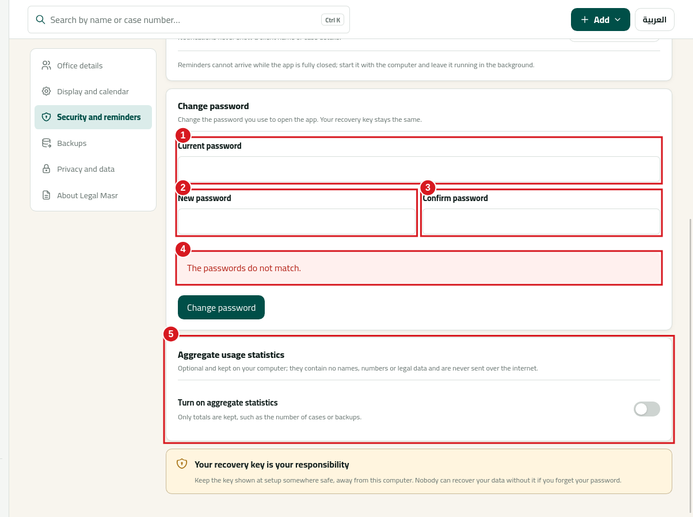

1. Current password: Use at least 12 characters and keep it safe.
2. New password: Use at least 12 characters and keep it safe.
3. Confirm password: Use at least 12 characters and keep it safe.
4. Error: correct the stated cause, then retry.
5. Details: review this section and follow the instructions above.

## Troubleshooting and current limitations

| Problem                      | What to do                                                                                                         |
| ---------------------------- | ------------------------------------------------------------------------------------------------------------------ |
| Internal number already used | Choose another number; internal identifiers must be unique.                                                        |
| Client or case missing       | Clear filters, include archived records, and search by internal number.                                            |
| Payment payer unavailable    | Select the client when creating the case; changing client links afterward is unavailable in the current interface. |
| Date rejected                | Choose it from the calendar or enter a real day/month/year date.                                                   |
| Document file missing        | Check the managed copy or restore an intact snapshot in the original vault.                                        |
| Notification missing         | Check OS permission and that the app is running; physical platform validation remains pending.                     |
| Corrupt backup               | Current data is preserved; try a valid archive.                                                                    |
| Forgotten password           | Use the recovery key; email/support password recovery is unavailable.                                              |

**Important limits:** the current version cannot restore into an independently initialized vault with only the original password, schedule backups/retention, preview restores, export a complete installation/case, or permanently delete clients/cases. It is a solo-lawyer organizer, not an accounting or multi-user collaboration system.

## About this guide

Screenshots come from the real Tauri application on Linux using a temporary fictional vault and actual persistence. Test file selection uses an allowlisted substitute; these screenshots do not validate OS dialogs, installation, or notifications on Windows/macOS. The recovery key is intentionally hidden.

Source revision: 93433d750482f2f11a8168d31abaf5e75644a85a. Working-tree changes included. Capture date: 2026-10-06.
